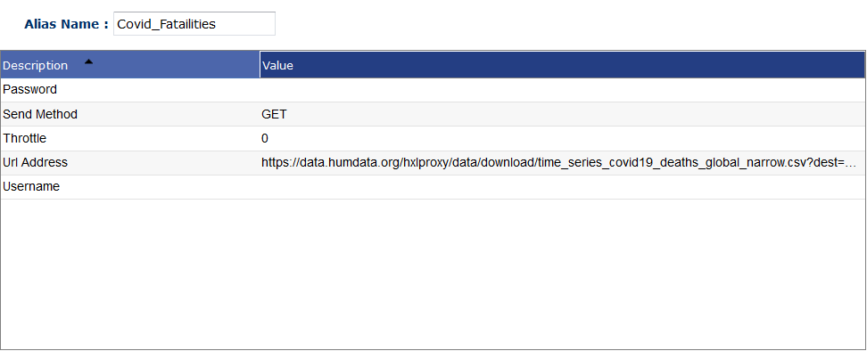

#Alias Descriptions

##Configuration
Alias used to describe HTTP Pneuron action

###_Config Options_
- **Description:** Description.
- **Throttle:** Determines if alias should be throttled or not.
___
##DB Source
Alias for JDBC/ODBC connections

### _Config Options_
- **Database Properties:** Default
- **Driver:** Which database you want to use. Custom Driver is for unsupported drivers.
- **Driver Class:** The class used in the jdbc connection. Only needed in Custom Driver
- **Driver URL:** The connection string used to connect to the database. Only needed in Custom Driver.
- **Host:** Host URL name.
- **Instance:** Database name you want to connect to.
- **Password:** Password of user you connect with. May not be needed based on database settings.
- **Port:** Port number of database.
- **Schema:** URL Schema.
- **Throttle:** Determines if connection should be throttled or not.
- **Username:** Username of user you connect with.

####_Qubz Example_

**Instance:** Project Name within Qubz

####_Hive Example_

___
##Directory
Alias for directory on the local machine. Allows Pneurons to access file system. This alias can only be created in the Administration platform.

###_Config Options_
- **Delete Permission:** Does this alias allow for deletion? `Yes` or `No`.
- **Directory File Path:** File path to directory for used by the alias.
- **Directory Host:** Host the directory is on.
- **Maximum Available Space:** Max file space allowed to be used in directory.
- **Subfolder Max Depth:** Max subfolders allows to be made by Alias
- **Throttle:** Determines if alias should be throttled or not.
- **Write Permission:** Does this alias allow for writing? `Yes` or `No`.
___
##Event Hubs

###_Config Options_
- **Consumer Group:** Consumer group set in Azure portal. Default option is $Default
- **Container Name:** Container name set in Azure portal.
- **Event Hub Connection String:** Event hub connection string available in event hub options menu in Azure portal
- **Storage Account Connection String:** Storage account connection string available in storage account menu in Azure portal.
- **Throttle:** Determines if alias should be throttled or not.
___
##FTP
Alias for FTP and SFTP connections. Used in FTP Pneuron.

###_Config Options_
- **Data Timeout:** Timeout for actions on FTP server in seconds.
- **Debug:** Debug messages enabled? `Yes` or `No`
- **Delete Permission:** Does this alias have delete permission? `Yes` or `No`
- **Driver:** What driver to use in connection. Either `FTP` or `SFTP`.
- **Host:** Host string of FTP connection.
- **Password:** Password needed to connect to FTP server
- **Port:** Port needed to connect to FTP server. Usually `20` or `21`.
- **Throttle:** Determines if alias should be throttled or not.
- **Username:** Username needed to connect to FTP server.
- **Working FTP Directory:** Directory you want alias to work out of.
- **Write Permission:** Does this alias have write permission? `Yes` or `No`.
___
##HTTP
Alias for HTTP and Service Pneurons. Allows for connections to REST and SOAP APIs.

###_Config Options_
- **Password:** Password of user you connect with. May not be needed.
- **Send Method:** Method used to iteract with API. Either `Get` or `Post`.
- **Throttle:** Determines if connection should be throttled or not.
- **URL Address:** URL of the API. Must include scheme and swagger.
- **Username:** Username of user you connect with.
___
##JMS

Alias use to connect with JMS Queues. Used in JMS Listener and JMS Publisher Pneurons.

###_Config Options_
- **JMS Client Type:** Type of client for JMS Queue. Currently Supports three types: `ActiveMQ`, `ActiveMQFailover`, `Kafka`.
- **JMS Context/Queue Manager Name:** JMS Context string.
- **JMS Topic/Queue:** Which topic and queue that you want messages read and written to.
- **JMS URL:** URL of the JMS queue.
- **Throttle:** Determines if connection should be throttled.
___
##Kafka

Alias for Kafka listeners and publishers

###_Config Options_
- **Consumer Group**: The consumer group name for listeners. All listeners with the same consumer group will share the same offset.
- **Host**: Host for the Kafka server.
- **Port**: Port for the Kafka server. Defaults to 9092.
- **Topic**: The topic this alias listens/writes to.
- **Throttle:** Determines if connection should be throttled.
___
##Mail

Mail alias used to send and read emails. Used in Mail and Mail Reader Pneurons.

###_Config Options_
- **Domain Patterns:** Any domain patterns needed to connect to mail server.
- **Enable Session Debug:** Debug enable.
- **Host:** Host string for connection.
- **Password:** password used to connect to mail server.
- **Port:** Port used to connect to mail server.
- **Protocol:** Which mail protocol your server is useing. `SMTP`, `IMAPS`, and `POP3`
- **SSL/TLS:** Are you using TLS or SSL? `YES` or `NO`.
- **StartTLS:** Are you using StartTLS? `YES` or `NO`.
- **Throttle:** Determines if connection should be throttled.
- **Username:** Username used to connect to mail server.
___
##NoSQL

Alias used to connect to NoSQL data source. Used in NoSQL Pneuron.

###_Config Options_
- **Additional Configuration:** Any additional configuration needed.
- **Custom Driver:** Custom Driver used to connect to unsupported NoSQL database.
- **Database:** Name of database you want to use with this alias.
- **Driver:** Driver used to connect to certian database. `MongoDB`, `CouchDB`, or `Cassandra`.
- **Host:** Host of the NoSQL database.
- **Password:** Password used to connect to database
- **Port:** Port of database.
- **Throttle:** Determines if connection should be throttled.
- **URL:** URL of database. Only used with Custom Driver.
- **Username:** Username user to connect to database.
___

##Spark
Alias for Spark Pneuron

###_Config Options_
- **Deployment Mode:** There are two deploy modes that can be used to launch Spark applications on YARN. In cluster mode, the Spark driver runs inside an application master process which is managed by YARN on the cluster, and the client can go away after initiating the application. In client mode, the driver runs in the client process, and the application master is only used for requesting resources from YARN. If you are not using Yarn leave as Client.
- **Java Installation Path:** Path to java installation path. If a environmental variable is setlike JAVA_HOME you do not need to fill this in.
- **Master:** What is the master node. To use yarn as the master enter `yarn` for spark standalone enter the URL of the master node for example `spark://127.0.0.1:7070`.
- **Properties File Path:** File path to any properties needed.
- **Spark Arguments:** A comma delimited list of arguments you want to enter into Spark.
- **Spark Configuration:** Any Spark config options.
- **Spark Installation Path:** Sparks installation Path on the machine. You do not need to set this if you do not have a environmental variable set such as SPARK_HOME.
- **Spark Working Directory:** Directory that contains working items.
- **Throttle:** Determines if connection should be throttled.
___

##Setup new alias types in existing databases
To add new alias types into older databases, re-run the Pneuron setup script after installing the latest build:

`>bin/setup`

Select `Update privileges on existing databases`

`>8`

`>sos-legacy`

Select `Generate Aliases for the new added drivers`

`>2`
