#Durable Message Management Overview
Durable Message Management is where administrators can filter, view and remove messages that have been stored in the pneuron_config database in the durable_msg table. Messages are stored in this table when using some Pneurons such as the Persist Pneuron.

To access the **Durable Message Management** option, choose Durable Message Management from the **Data Management** menu. The screen will be displayed as below.

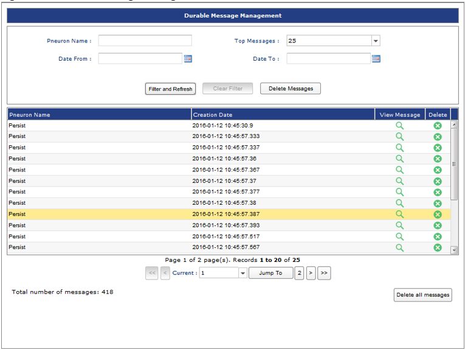

The Durable Message Management screen has the following components:

| **Function** | **Description** |
|--|--|
| **Pneuron Name**| Enter a Pneuron name to filter the list of messages. |
| **Top Messages** | The number of messages to display. Choose a value from the dropdown from 25 to 250. |
| **Date From** | Filter based on creation date by entering a Date value. |
| **Date To** | Filter based on creation date by entering a Date value. |
| **Filter and Refresh** | Click to filter the message list based on the filter criteria entered in the fields above. |
| **Clear Filter** | Clears the filter conditions in the fields above. |
| **Delete Message** | Deletes all messages in the durable_msg table in the pneuron_config database. |

Individual message contents can be viewed by clicking the magnifying glass icon on the message row.

Individual messages can be deleted from the durable_msg table by clicking the X icon.

##Durable Message Transfer Management
Durable Message Transfer Management enables administrators to filter, view and remove messages that have been stored in the pneuron_config database in the durable_transfer_msg table. Messages are stored in this table when messages are unable to be delivered to a Pneuron server because the server has become unavailable during processing.

To access the **Durable Message Transfer Management** screen, choose **Durable Message Transfer Management** from the **Data Management** menu. The screen below will be displayed.

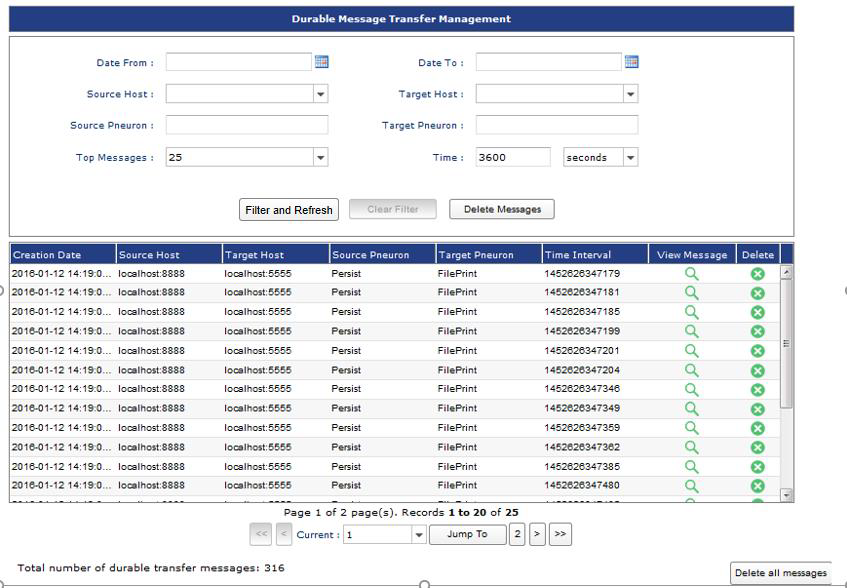

The Durable Message Management screen has the following components:

| **Function** | **Description** |
|--|--|
| **Date From** | Filter based on creation date by entering a Date value. |
| **Date To** | Filter based on creation date by entering a Date value. |
| **Source Host** | Filter based on the host of the sending Pneuron. |
| **Target Host** | Filter based on the target host where messages were to be delivered and the host is unavailable. |
| **Source Pneuron** | Enter a Pneuron name to filter the list of messages. |
| **Target Pneuron** | Filter based on the name of the Pneuron where the messages were to be delivered when the host was down. |
| **Top Messages** | The number of messages to display. Choose a value from the dropdown from 25 to 250. |
| **Time** | Filter based on the created date of the messages. |
| **Filter and Refresh** | Click to filter the message list based on the filter criteria entered in the fields above. |
| **Clear Filter** | Clears the filter conditions in the fields above. |
| **Delete Messages** | Deletes all messages in the durable_msg table in the pneuron_config database. |

##Notification Management Overview
Notification Management enables administrators to view, activate and deactivate the available event notifications for the Pneuron Server environment. Notification events that are active and are triggered by the system are recorded in the notification_events table in the pneuron_config database. Optionally, notification events can be written to another database. This is recommended when Administrators activate many events in the Notification Management system.

To access the **Notification Management** screen, choose **Notification Management** from the **Data Management** menu. The screen below will be displayed.

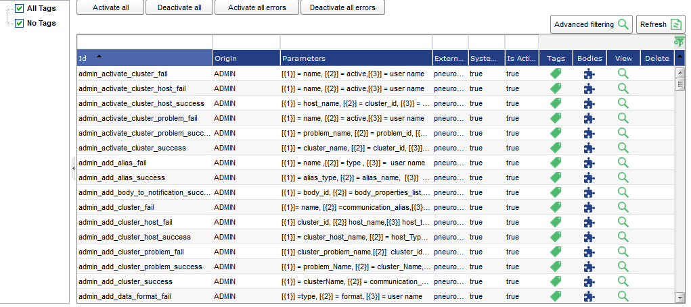

The Notification Management screen lists the available notification events for the Pneuron system. The events can be filtered using the available fields in the filter controls. Administrators can activate and deactivate all events in the system, or individual events by clicking the **Is Active** column value for an event in the grid.

| **Filter** | **Description** |
|--|--|
| **ID** | Filter based on event ID value. |
| **Origin** | Filter based on event Origin value.|
| **Parameters** | Template of the notification message |
| **External Reference** | Filter based on event External reference value. |
| **System Defined** | Filter based on the system defined attributes of the event. |
| **Is Active** | Filter based on event state of Is Active = True or False. |
| **Advanced Filtering** | Click to apply the filter criteria. |
| **Activate All** | Click to set all events to True or Active. |
| **Deactivate All** | Click to set all events to False or Not Active. |
| **Activate All Errors** | Click to set all error notifications on. |
| **Deactivate Al Errors** | Click to set all error notifications off. |

Once the Administrator has selected which system events to activate, the Pneuron Server needs to be restarted. Once restarted, any triggered events will be recorded in the notification_events table in the pneuron_config database. Events can be viewed using a database client, Enterprise Control Manger dashboard report, or other reporting tool as desired.

The notification_events table will need to be managed externally by a database system administrator. Events should be purged on a periodic basis so that the size of the table does not grow too large over time.

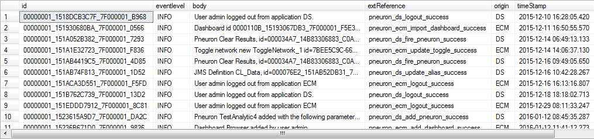

###Associating Tags With Events
Event entries can be categorized by the Administrator, if desired, by associating Tags with the events in the system. Events which have associated tags will log the tag information in the notification_events database table where they can by searched and filtered by System Administrators.

To associate a tag or category with an event:

1. Click on the tag icon on the event in which you want to associate a tag in the events list grid.

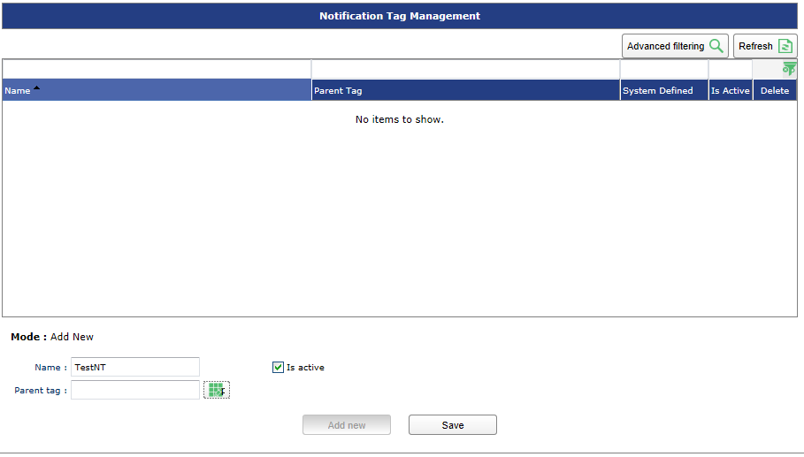

2. Choose the tag from the available tags in the list. For information on creating tags, see Notification Tag Management section of this document.
3. Click OK to return to the event grid.

###Storing Events In Another Location
To record the system events to another database other than the pneuron_config database:

1. Create an empty database where you want to record the events created by the Pneuron Notification System.
2. Copy the notification_events table from the pneuron_config datasource to the new database location
3. Create a Data Source Alias in Pneuron to the new database.
4. Associate each event to record in the new database within Notification Management using the Bodies link on the event:

    1. Select an event in the grid.
    2. Click the Bodies icon
    3. In the Bodies grid, select the Drivers icon
    4. Select the correct alias to the new database in the Driver Name dropdown list:
    5. Click **Submit**.

##Notification Tag Management Overview
Notification Tag Management enables Administrators to create event tags, or categorizations, for the events in the system.

To access the Notification Tag Management option, choose Notification Tag Management from the **Data Management** menu. The screen below will be displayed.

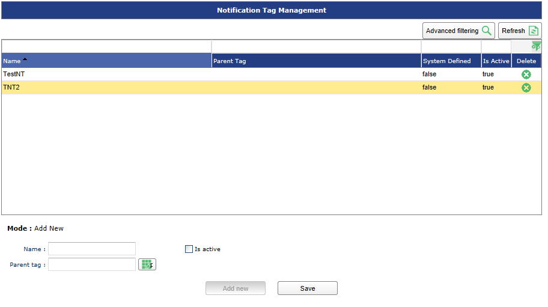

The controls at the top of the screen allow you to filter the list of created tags in the system.

| **Function** | **Description** |
|--|--|
| **Name** | Filter based on tag name |
| **System Defined** | Filter based on event system defined state of the tag |
| **Parent Name** | Filter based on the Parent Name of the Tag |
| **Is Active** | Filter based in the active state of the tag |
| **Delete** | Deletes the tag |

When you view the screen, the default mode is the Add New mode which allows you to create new tags. To modify an existing tag, click on a tag in the grid.

| **Function** | **Description** |
|--|--|
| **Name** | Filter based on the event ID value |
| **Is Active** | Filter base on event state of Is Active |
| **Parent Tag** | Allows creation of parent/child relations among tags. (Optional) |

###Creating Tags
To create new tags for use in association of system events:

1. In Add New Mode of the Notification Tag Management screen,
a. Enter a value in the Name field.
b. Select True or False in the Is Active drop down.
c. Enter optional Parent Tag value.
d. Click Save.
e. Repeat steps A-D to add additional tags.

The new tag(s) are now available to associate with events as outlined in the Notification Management section above.

##Cluster Management Overview
Cluster Management is where administrators create and configure Pneuron clusters. A Pneuron Cluster is a group of Pneuron Servers that have been configured to work together to process data from a JMS message queue into a Pneuron Network.

In order to utilize clusters in Pneuron:

- Two or more Pneuron Servers must be installed and configured to use the same pneuron_config configuration database
- One or more JMS messaging servers must be available to the Pneuron environment (e.g. Active MQ)

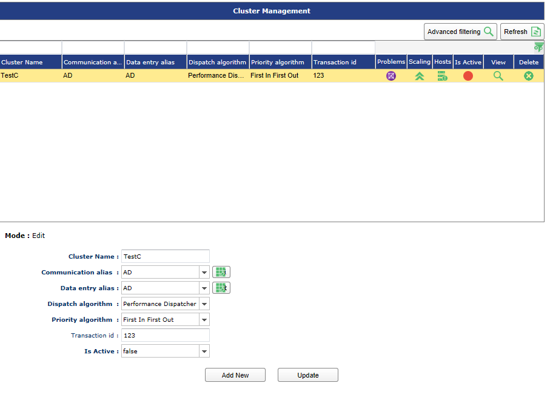

###Creating New Cluster
When you access the Cluster Management screen, you will be in the Add New mode as shown.

Complete the entries as outlined in the following steps to create a Cluster:

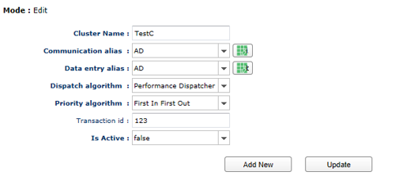

1. Enter a **Cluster Name**. This should reflect the purpose of the cluster. Cluster names must be unique.
2. Choose a Communication alias. See the Alias Management section of the guide for configuring a JMS Data Source. The Communication alias acts as a ‘Heartbeat’ for the cluster members to communicate. Multiple clusters can use the same Communication Alias if desired.
3. Choose a Data Entry Alias. See the Alias Management section of the guide for configuring a JMS Data Source. The Data Entry Alias is the ActiveMQ Queue where the cluster will retrieve or post messages.
4. Choose a Dispatch Algorithm. The available choices are **Performance Dispatcher** and **Shortest Queue**.
**a.** Shortest Queue selection will send the messages to the worker server that is the least busy processing messages
**b**. Performance Dispatcher will only send messages to worker configured machines so the dispatcher process has the maximum available resources.
5. Choose a Priority Algorithm. The default choice is First In First Out and will process messages from the queue in the order they were published into the JMS system.
6. Enter a Transaction ID, if desired. This is optional. It will add the entered value into the messages in the <TransactionIdentifier>entered value</TransactionIdentifier> tag which can be utilized in downstream processing if desired.
7. Choose whether or not the Cluster is active as soon as it is created by choosing **True** or **False** in the **Is Active** dropdown.
8. Click the **Save** button. An entry for this cluster will be created in the list above.

###Updating An Existing Cluster
Once a cluster has been created by following the instructions in the Creating a New Cluster section above, an entry will be created in the Cluster grid. A user can change any of the elements of a cluster by following these steps:

Updating an Existing Cluster:

1. Click on an existing cluster in the list. The cluster’s information will be populated in the text boxes on the bottom half of the screen.
2. Make any changes desired to the existing fields.
3. Click the **Update** button.

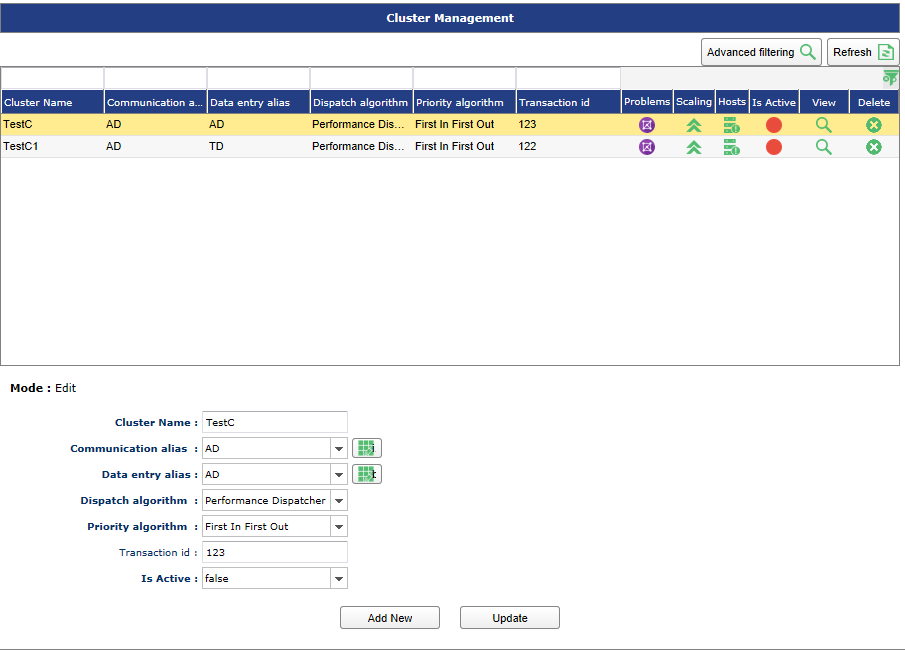

###Configuring A Cluster
The high-level steps to establish and configure a Cluster are:

- Create the Cluster
- Associate Hosts to the Cluster
- Associate Problems (Pneuron Projects/Networks) to the cluster
-  Configure host dispatchers and workers to the Problem

Once a cluster has been created, Pneuron Networks are associated with the Cluster so that it may be used to distribute work across the servers in the cluster. A cluster can be used for multiple problems simultaneously, if needed. Different Pneuron servers can also be assigned to the cluster to act as dispatchers or workers (or both). This is done by using the configuration tools displayed in the Cluster List (shown above).

The Cluster Name, Communications Alias, Data Entry Alias, Dispatch Algorithm, Priority Algorithm, and Transaction ID will all be populated with the choices made during Cluster Creation.

The **Problems** column is used to associate a Pneuron Project or Network with the cluster.

The **Hosts** column is used for assigning available Pneuron servers for use in the cluster.

The **Is Active** column displays toggles that be used to turn the cluster to an Active or Inactive state.

The **View** column can be used to view the currently configured problems and available hosts for the cluster.

A cluster can be deleted by clicking the green for the desired Cluster.

###Assigning Hosts To Cluster
The user must assign available Pneuron servers to the cluster. These servers will act as dispatchers, workers, or both, and are available to associate with the configured Problems.

In order to configure Hosts within a cluster, the host server(s) must have already been created and configured to point to the correct pneuron_config database.

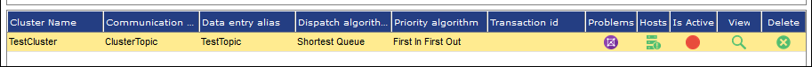

1. Click the icon below the Hosts column for the desired cluster. A Cluster Host Menu window appears.

    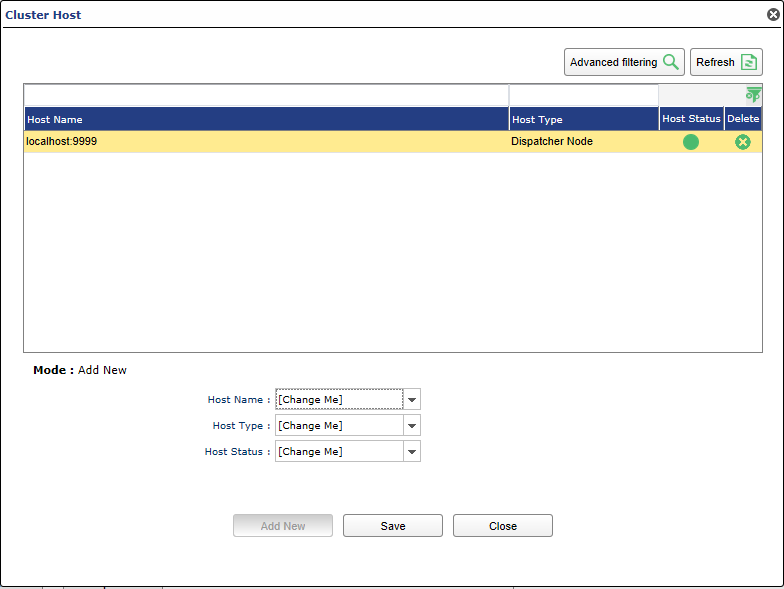

2. Choose a Host Name from the drop down of available configured Hosts (See the Host Management section to configure hosts.)
3. Choose a Host Type from the dropdown. A Host can be a dispatcher and/or a worker. If you would like the server to act as both a dispatcher and a worker, two entries must be made (see image above)
4. Choose the starting Host Status. Status can be **Active**, **Not active** or **Suspended**.
5. Click **Save**.

###Assigning Pneuron Networks To A Cluster
The Cluster is configured to “listen” to a configured queue within the JMS system. Messages retrieved by the cluster can then be sent to be processed by a Pneuron Network.

To define the Problem (Project) to which the JMS messages will be sent:

1. Click on the icon under the **Problems** column for the desired cluster. A Cluster Problems menu will appear.

  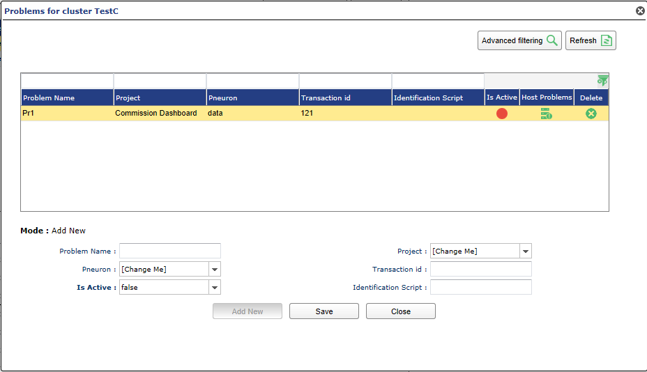

2. A Problem is created to define a Project and Pneuron to receive messages from a configured JMS Queue. In the **Problem Name** text box, create an appropriate alias for this use of the cluster.
3. Select the Pneuron Project where the desired “receiver” Pneuron is located.
4. Select the name of the Pneuron that you want to receive messages from the configured JMS Queue.
5. Optional: Enter a transaction ID. This will add the entered value into the messages in the <TransactionIdentifier>entered value</TransactionIdentifier> tag, which can be utilized in downstream processing, if desired.
6. Set whether or not the Problem should be Active once it is created. The available values are **True** or **False**.
7. Optional: Enter Identification Script. This allows the filtering of messages at the problem level. It is a filtering criterion for a unit of work. It determines the problem to be executed.
8. Click **Save**. The Problem will be added to the list above.
9. Click on the icon below Host Problems to set the hosts that will be made available to the cluster. A Host Problems menu will appear.

    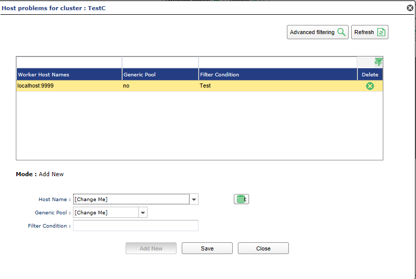

10. Choose a Host Name from the list of available Hosts. (See Host Management for steps on how to configure hosts.)
11. Choose if the host will be added to the Generic Pool. Selecting Yes will allow the host to process any messages that are passed to it. Select No if you want the host to ONLY process messages that meet the filter condition.
12. Optional: Enter a Filter Condition. Filter condition can be used to prioritize messages processed by the selected Host.
13. Click Save.
14. Repeat this process to add as many hosts as desired. Close the Host Problems menu when you have finished associating hosts to the Problem.
15. Returning to the Cluster Problems menu, the user can click the colored button under the Is Active column to toggle the active state of the Problem.
16. The user can delete a Problem by clicking the green X for the desired Problem.

After completing the steps required to created and configure the Cluster, Problems and associated Hosts, the cluster should form and display its status on the Pneuron Server Console screen, and the server log:

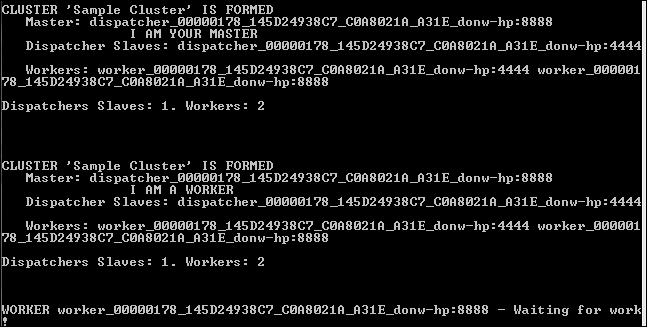
