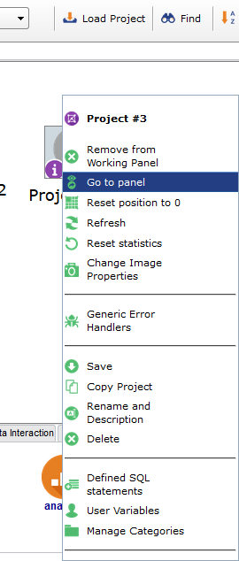
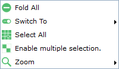

#Pneuron Design Studio Basic Navigation
___
Opening the Pneuron Design Studio

1. To access the Pneuron Design Studio application:

2. Open a web browser (e.g., Internet Explorer, Firefox).

3. In the address field, type the hostname of the web server and port, followed by the name of the Pneuron Design Studio directory created during the installation process (such as “/ds”). If the web server is installed on another machine, enter the IP address or hostname of the web server port, such as http://192.168.10.197:8080/ds. If the web server is installed on the local machine, enter localhost:port number and the name of the Pneuron Design Studio directory created during installation, such as http://localhost:8080/ds. The Pneuron Design Studio Login screen appears.

4. Enter your **Username**, **Password**, and **Host** location for Pneuron Design Studio in the respective fields. Then click **Login**. The Pneuron Design Studio main page appears.

##Top Navigation Functions
The following graphics and tables explain the top navigation functions of Pneuron Design Studio.
The main, open area of the screen is called the Canvas.

###Actions Tab

| Menu Name | Description |
|--|--|
| **Alias Management** | Shows a list of all the aliases for data sources, directories, indexes and more used within networks. You can add, edit, and delete aliases for the networks. |
| **User Variables** | Shows a list of all the user variables used within networks. You can add, edit, and delete user variables for the network. |
| **Defined SQL Statements** | Shows a list of all the predefined SQL queries used within the network. You can add, edit, and delete queries for the network. |
| **Panel Management** | Shows a list of available canvas panels and allows users to create additional panels. |
| **Firing Projects** | Shows a list of Projects which are scheduled to fire on a regular frequency. |
| **Debugging Projects** | Launches the Configure Debug user interface. |
|  **Debug** | Launches the Debug Utility console |
| **Kill Inflight Messages** | Shows a list of projects that are currently running and have messages in process. Allows the designer to stop the network processing. |
| **Hide Zoom Eye** | Hides or shows the Zoom Eye control on the Canvas.|
| **Show Connection Tool** | Shows or hides the Connection Tool control on the canvas. |

###Top Bar Buttons

|**Button Name**| Description |
|--|--|
| **Load Project** | Allows the designer to load projects that have been saved /exported to an XML file. |
| **Find** | Allows the designer to search for Projects or Pneurons within the system. |
| **Tags Sorted…** | Toggles the sorting of tags shown between Pneurons alphabetically or sequentially. |
| **Multiple Selection** | Allows the designer to drag a box over Pneurons to select more than one. |
| **Background Image** | Toggles the background color. |

___
##Actions Menu Commands

###Alias Management
Alias Management is used by designers and administrators to create aliases of different types for use in Pneuron solutions. For example, after you create a project, you must define all data sources used by the network. Data source aliases tell the Pneuron applications from which databases to retrieve the data. As the Pneuron network evolves, additional aliases may be created at any time.
Data source configuration in the Pneuron Design Studio is identical to Pneuron Administration. Data sources configured in either module appear in both applications.
To configure data source aliases:

1. Select Alias Management from the Actions menu.
2. Enter an Alias Name.
3. Select Data Source Definition or any other required.
4. Enter the appropriate data source credentials in the following fields corresponding to the table below.
5. Click **Save**. The new data source and its properties will appear in the Data Source window. Repeat Steps 2 - 4 to add additional data sources for the network within the project. When you are done, click **Close**.

| **Alias Name** | Enter the name of this data source. |
|--|--|
| **Alias Type** | The type of Alias (Data Source Definition, Directory Definition etc.) |
| **Host** | If the database server is running on the local machine, enter localhost. If the database server is running on a remote machine, enter the IP address or hostname of that machine. |
| **Username** | Enter the user name for logging in to the database server (such as “root”).  |
| **Database Properties** |  |
| **Driver Class** |  |
| **Driver** | Select the type of database for this data source (such as “MSSQLServer” or “Oracle”).  |
| **Driver URL** |  |
| **Instance** | Enter the name of the database containing the data to be queried.  |
| **Port** | Enter the port number the database server is using. |
| **Password** | Enter the password (associated with the Username property) used for logging in to the database.  |
| **Schema** | Optional – The schema within the selected Instance. |
| **Throttle** | Enter the number of concurrent database connections the alias should use. Default is ‘0’ which will allow the Pneuron server to use the maximum number of allowable connections. |

**TIP:** Aliases can also be created and managed within the Pneuron Administration module.

###Editing and Deleting Data Sources

To edit a data source:
1. Click the data source that is to be changed.
2. Edit the desired fields and click Update Alias.
Pneuron Design Studio User Guide
Pneuron Corporation Page 20 of 95 Proprietary and Confidential
To delete a data source:
Select the data source you want to delete and click the icon in that row.

**NOTE:** For designers to be able to create and manage aliases within Design Studio, users must be assigned the appropriate roles and permissions using Pneuron Administration.

The following alias types can ONLY be created using Pneuron Administration:

- Directory definition
- Index definition

###User Variable
In order to employ global user variables, they must be defined in Design Studio and associated with the network. This is done through the Design Studio **User Variables** screen. In the example below, the user variable will represent the threshold for the acceptable distance in miles between the applicant primary residence address and the address of the property to be purchased in the Mortgage Fraud Scoring network.

1. From the Design Studio main menu, select **Actions** > **User Variables**.
2. Enter the values for the fields, see table below for more information on these fields, and click Save.
3. Click **Add New**. Repeat Step 2 to add additional threshold variables.
4. Click **Close** to exit the screen and return to the network.

The **User Variables** window appears.

| **Field** | **Description** |
|--|--|
| **Name** | Name to apply to the threshold. There cannot be any spaces in the name. The Name is case sensitive. |
| **Project** | Select the project name associated with this threshold variable using the dropdown feature. |
| **Type** | Select one of the following entries: string, integer, long, float, date, double, bigdecimal, boolean |
| **Value** | Enter the value for the threshold. |
| **Network Use Only** | Select this checkbox if you want the defined user variable to be available ONLY to the associated Project, not any other Projects. |
| **Delete** | It deletes the row. |

###Defined SQL Statement
Designers and administrators have the ability to create predefined SQL statements for use in Projects in Design Studio. This is useful when the designer wants to use previously created SQL statements that have been tested for a particular requirement, versus creating the query from scratch. This feature also allows administrators to control access to queries, if needed. The Defined SQL Statements menu command displays the input and management window below:

1. From the Design Studio main menu, select **Actions** > **Defined SQL Statements**.
The **Defined SQL Statements** window will open in the default Add New mode.
2. Enter the credentials for the following fields and click **Save**.
3. Click **Close** to exit the screen and return to the Canvas.

| Field | Description |
|--|--|
| **Name** | The name to associate with the defined SQL statement. The Name is case-sensitive. |
| **Project** | Select the Project associated with the defined statement using the drop-down feature. |
| **DbSource Alias** | Select a data source alias to use for this defined statement. |
| **Sql Statement** | Enter the SQL statement you want to define. |

**TIP:**
Delete rows by clicking the green X icon next to the variable in the list.

###Panel Management
The canvas area in Design Studio includes a feature that allows designers to create one or more working panels to assist with managing their work area. The first time you login you see only the default canvas tab entitled Main Panel. All projects that designers create, or have permission to view, will be displayed on the Main Panel. Designers can create additional panels in Design Studio to group Pneuron Projects in any manner they desire.

To create new panels in Design Studio, perform the following steps:

1. From the **Actions** menu, select **Panel Management**.
The **Panel Management** window appears.
2. Click **Add New** to create a new panel.
3. Enter a name for the panel you want to create in the name field.
4. Click **Save** to create the panel(s) and return to the canvas.

To move a project from the Main Panel to another panel, perform the following steps:

1. Right-click on a Project and select **Open in Panel**.
2. Choose the target panel from the drop-down list.
3. Click **Move to this panel** to move the project to the selected panel.

**NOTE** – When you have a project open in another panel, the Main Panel tab will show an information icon for the project as a reminder. You cannot open a project on the Main Panel tab if it has been moved to another panel.

As shown above, a project that has been moved to another panel will display the information icon (Looks like an i) when viewed from the Main Panel and the Project icon will be greyed. (Remember, all projects will be displayed in the **Main Panel** tab at all times). Designers have the ability to open projects from the Main Panel, or they can remove a project from a user-created panel back to the Main Panel.
To open a project showing the working icon from the Main Panel:

1. Select the **Main Panel** tab and position the canvas so you can view the project with the working icon.
2. Right-click on the Project and select **Go to panel**. Design Studio will navigate to the appropriate panel.

To recall a project showing the working icon back to the Main Panel:

1. Select the **Main Panel** tab and position the canvas so you can view the project with the working icon.
2. Right-click on the Project and select **Remove from Working Panel**.
3. The Design Studio will move the selected project back to the Main Panel and the information icon will no longer be displayed.

###Firing Projects
Pneuron Networks and Projects can be configured to run, or fire, automatically on a user-defined interval. The **Firing Projects** command on the **Actions** menu allows designers to view Projects and Pneurons that are currently configured to run on an interval. This is a ‘status’ window only, and is provided as information for designers and administrators.

**Advanced Filtering** enables you to search for Projects to fire.

Click **Refresh** to refresh the data in the **Firing Projects** window.

###Kill Inflight Messages
An executing Pneuron Network can be stopped from further processing by using the Ki**ll Inflight Messages** option in the **Actions** menu.

In order for the Kill Inflight Messages functionality to work for any Network, the Pneuron Network must be configured with Sta**rt and Check Transaction Pneurons** as outlined in the Start and Check Transaction section of this document (see next section).

Once a Pneuron Network has been fired and is executing, an entry will appear in the **Kill Inflight Messages** window that contains the name of the Pneuron Network and the number of Inflight XML messages.

A list of all currently executing networks are displayed in this interface. By clicking the Kill button next to a Pneuron Network, all XML messages will stop within the network, ceasing execution.

**NOTE**
If any Pneurons are already executing when the user clicks Kill (i.e., a stored procedure, an update statement, etc.), these functions will finish executing before the network stops functioning.

###Start/Check Transaction

When there are dependencies between Pneuron Network segments within a given project (i.e., segment 1 must complete before segment 2 can start) the Start Transaction and Check Transaction Pneurons are used to create a dependency. To create such a dependency, simply have a Start Transaction Pneuron as the first firing Pneuron in a network connected to a Check Transaction Pneuron. All Pneurons connected after the Check Transaction Pneuron will not fire until the XML messages have completed between all Pneurons before the Check Transaction Pneuron.

In the above example, the top four Pneurons (two Query Pneurons, an Analytic Pneuron and an Update Pneuron) need to finish executing before the bottom three Pneurons (a Query, Analytic and Print Pneuron) can execute.

By connecting the Start and Check Transaction Pneurons as shown, the bottom three Pneurons will not fire until the top four Pneurons have finished their execution and (in this case) results have been written to a database.

Minor configuration changes to the Start and Check Transaction Pneurons are required. The properties of the Check Transaction Pneuron include controls to configure the Idle Time Out duration. See the Pneuron Reference Guide for additional detail on using the Start/Check Transaction Pneurons.

If no activity is detected in the Pneuron Network for the configured amount of time (Pneurons processing, records being analyzed, etc.), then an error message will be sent along the error branch from the Check Transaction Pneuron.

As noted in the previous section, all Pneuron Networks that include the use of Start/Check Transaction Pneurons will display in the **Kill Inflight Messages** window when those networks are running.

###Hide/Show Zoom Eye
The canvas has a Zoom Eye feature that shows designers a logical view of the entire canvas and the relative positions of the Projects on the canvas.

Use the x and – buttons to close or minimize the zoom eye. To reopen the zoom eye, choose Show Zoom Eye from the Actions menu.

**TIP** – The blue shadow box in the zoom eye shows the user the area of the canvas that is currently viewable. Clicking in the zoom eye window will shift the blue box and the canvas view to the new position.

**TIP** – Icons that are blue indicate projects that are expanded for edit on the canvas. Gray icons are collapsed projects.

**TIP** – Hovering the mouse pointer over any icon in the zoom eye will display the Project Name for that icon.

###Show Connection Tool
The Connection Tool feature allows designers to easily connection Pneurons within a project. **Selecting Show Connection Tool** from the **Actions** menu dropdown displays the Connection Tool.

Using the Connection Tool, a designer can select a type of connection to create between Pneurons. Holding down the **CTRL** key and clicking two Pneurons will automatically create a connection between them of the selected type.

See Connecting Pneurons in Section 4 for further information about connections between Pneurons, as well as additional ways to connect Pneurons.

###Canvas Options
On a blank space on the canvas, right-click to see the canvas options.

- **Fold All:** Fold all projects on the current canvas.
- **Switch to:** Switch to view or edit mode.
- **Select All:** Select all Pneurons or Projects
- **Enable multiple selection:** Turn on the left click and drag capability to select specific Pneurons or projects.
- **Zoom:** Zoom in or out.

###Bottom Navigation Options
Additionally, a Search box is located at the top right of the Palette. Type the search text in this field to filter the list of Pneurons displayed in the Palette.

**Palette** – Contains rows of Pneurons to click and drag onto the canvas.

