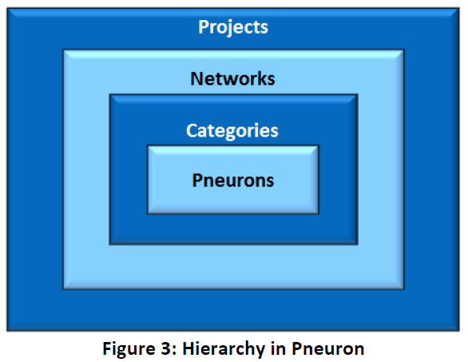
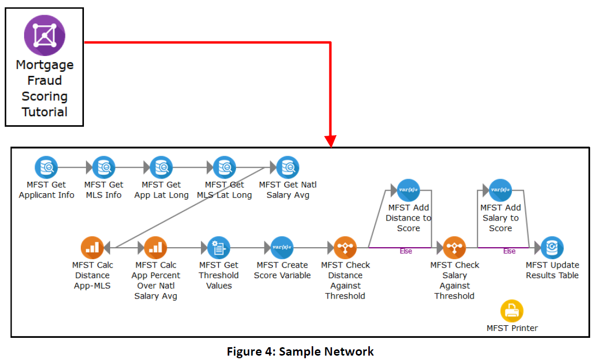

#Pneuron Design Studio Overview 
___
Pneuron Design Studio™ enables users to create, modify, deploy, and manage multiple networks, data source connections, and hosts within a private network or within a cloud computing environment from a single user interface. It also allows you to create products, integrate assets and new functions with legacy intellectual property (IP), and move applications to the Cloud for better management of your enterprise. 

The networks created in Pneuron Design Studio™ contain various connected “Pneurons,” which are mini-applications, functions, or services containing basic sets of configurable properties such as data sources, variables, queries, data acquisition, business rules, intelligence analytics, and more.  

Pneurons can act alone as independent functions or services, be overlaid on top of existing applications or data, or can be connected in real time to other Pneurons to create new products, workflows, or new operating models of any complexity.   

Each Pneuron serves as part of a network of other connected Pneurons and is customized to retrieve, calculate, analyze, and deliver the appropriate messages as configured, producing instant results based on your business needs. Pneurons employ Java and XML to assist with data retrieval and messaging. 

The Query Builder within Pneuron Design Studio™ enables users to create queries using predefined SQL, thus eliminating the need for a deep knowledge of SQL. 

The Pneuron Design Studio™ is part of the Pneuron Applications Suite, which consists of the following:

- Pneuron Design Studio™ 
- Pneuron Administration 
- Pneuron Enterprise Control Manager™ (ECM) 

The Pneuron applications run on a web server and operates in a thin client configuration.  

For detailed information related to the installation and configuration of the Pneuron Server, refer to the Pneuron Installation and Configuration Guide. 

##Hierarchy of a Project
Pneuron Design Studio functionality is organized in a hierarchy consisting of a Project, which contains networks, categories, and Pneurons.

- A **Project** contains one or more networks, with all associated categories and Pneurons.

- A **Network** contains a group of configured Pneurons that are connected together to fulfill a particular business solution. There can be multiple networks within a project.

- **Categories** are logical groupings of Pneurons that perform similar functions within a project.
Pneurons are mini-applications that are configured to perform multiple functions, such as computing mathematical formulas, retrieving data, sending messages, etc. Pneurons are joined together to form a network.

The following illustration depicts the hierarchy of projects, networks, categories, and Pneurons within Pneuron Design Studio.

##Example Pneuron Network
The following illustration shows a sample Pneuron network expanded to display Query, Analytic, Compare, Print and Variable Pneurons.

##Pneuron Solution Process
The following steps describe the process of using the Pneuron Applications Suite to solve business problems.

1. Define the business problem you are trying to solve. Can this problem be completed in phases? What are the goals of each phase?
2. Identify the criteria and data needed to solve the problem.
3. Identify the data sources containing the information for the identified criteria. What databases and/or systems do you need to access based on the data you need? What files do you need to access? Where are these files located? What connections do you need to access the data? What passwords and access credentials are required?
4. Identify the elements you need to retrieve from the data sources.
5. Identify the mathematics, analytics, or models that need to be applied to the data to solve the business problem.
6. Identify the output required for the project. Will the results be written to a database, sent to another system or network or viewed through the ECM?
7. Identify your key stakeholders in the project. What role will they play (e.g., net designer, business user, executive user, executive sponsor)? Determine when you will get them involved in the process and their expectations for the project.
8. Start the Pneuron Applications.
9. Use the Pneuron Design Studio™ application to build your Pneuron network and configure connections to the data sources you need in order to solve your business problem.
10. Use the Pneuron Enterprise Control Manager™ (ECM) application to view the generated data analyses based on the configurations within Pneuron Design Studio™. Modify conditional/user defined variables and observe the changes in business value drivers in real time. Configure and visualize intelligence and analytics, and interact directly with targeted networks in Pneuron Design Studio.
11. Make informed business decisions based on the data you have received from the Pneuron Applications Solutions Suite to solve your business problems.
