#Projects and Pneurons - General Usage
___
Pneuron Design Studio requires initial configuration by setting up a Project/Network, which includes defining a connection to specific databases via data sources, adding Pneurons, and creating queries for the Pneurons. The queries enable the Pneurons to retrieve and pass data to other Pneurons for further processing.

##Pneuron Solutions
To create a Pneuron Solution, follow these steps:

1. Create the Project for the network
2. Configure data sources for the network
3. Create and assign Pneurons to the network and configure their properties
4. Connect all Pneurons within the network
5. Debug the network, if needed
6. Execute the network.

##Creating a Project
To create a network in Pneuron Design Studio, you must create a project for the network, under which all Pneurons will reside.

To create a project:

1. From the Pneuron palette, click and drag a Project Pneuron to the canvas. The Set the name dialog box appears.

2. Enter the name of the new project and click Create. The new name of the Project appears on the canvas. Now you can start configuring the associated data sources for this project. See the Alias Management section to view how to create data sources and other alias types for use within Pneuron Networks.

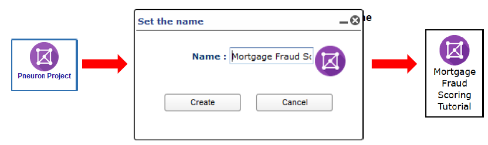

##Creating an Pneuron
After you configure your data sources for your project, you can start assigning and configuring Pneurons to that project to build a network.

To create a Pneuron:

1. From the Pneuron palette, click and drag the Pneuron onto the canvas. The **Pneuron Set Name** dialog box appears.

    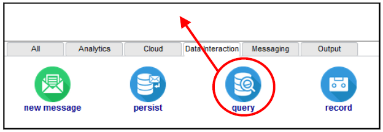

    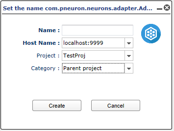

2. Enter the credentials for the following fields in the table below.

    | **Field** | Description |
    |--|--|
    | **Name** | Enter a descriptive name for the Pneuron, such as its function. Pneuron names must be unique. |
    | **Host Name** | Select a host name from the list. This is the name of the server executing this Pneuron. The hosts are configured in Pneuron Administration. |
    | **Project** | Select the project to contain this Pneuron. |
    | **Category** | This field is optional. Select or create a category (representing groups of logical functions) associated with this Pneuron. For more information, refer to the Pneuron Descriptions section in this Guide. |

3. Click Create. The Pneuron appears on the canvas of Pneuron Design Studio. You must now configure the properties of the Pneuron. Refer to the next section Configuring Pneuron Properties.

##Configuring Pneuron Properties

After creating the Pneuron, you must configure the Pneuron properties.
Pneuron properties are elements that either have a predetermined or configurable value. The properties influence the behavior of the Pneuron. Each property within a Pneuron has an associated name, value and type (such as string, integer, date, float, or long).

This guide will review the properties configuration of the Query Pneuron and the Analytic Pneuron. Both of these Pneurons have an additional feature called “Design,” where you can access an associated editor application within that Pneuron. Information on these Pneurons is located in the Using the Query Pneuron and Using the Analytic Pneuron sections in this Guide. For details on configuring other Pneurons, refer to the Pneuron Reference Guide.

To configure the Pneuron properties:

1. Right-click on the Pneuron and click **Properties**. You can also double-click the Pneuron to open the properties interface. The Pneuron Properties screen appears with default property names.

    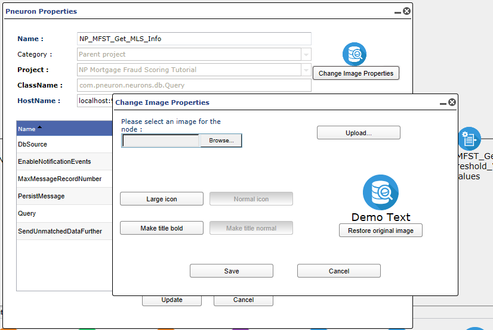

    - Click on a property to change the values within that property. Then click **Update**.

2. Click on a property name within the list and configure the value for that property.

    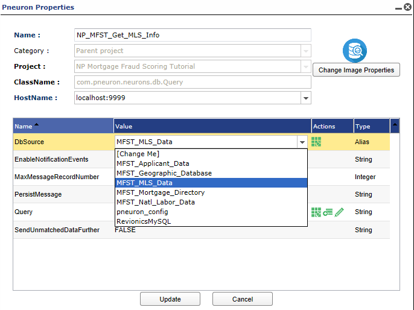

3. Enter the information in the following fields.

    |**Field**| Description |
    |--|--|
    | **Name** | Displays the Property names |
    | **Value** | Displays the values of the properties |
    | **Actions** | Design, SQL Statements, Edit |
    | **Type** | Alias, String, Integer |

4. Click Update.

##Editing Pneuron Properties
To edit Pneuron properties:

1. Right-click the Pneuron and click Properties. You can also double-click a Pneuron to open the properties interface for that Pneuron.
2. Click on the property name that you want to change. The box changes to an editable field. Make the changes and click Update.

##Deleting a Pneuron

To delete a Pneuron:

1. Right-click the Pneuron you want to delete and click Delete.

    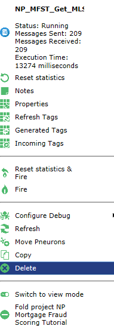

2. Click OK to confirm the deletion.

    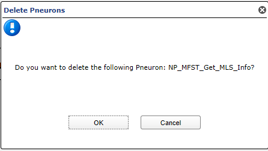

##Connecting Pneurons

After you create and configure the Pneurons for your network, you can connect the Pneurons together in the network.

To connect Pneurons:

1. Click the source Pneuron.
2. Press and hold the CTRL key and right-click on the second Pneuron you want to connect. From the right-click menu, click Connect > Connect.

    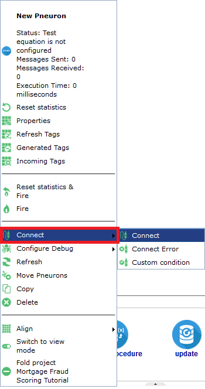

    - Alternatively, you can click Actions > Show Connection Tool.

    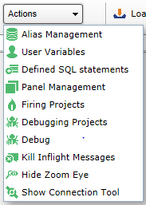

    - The Connection Tool window appears.

    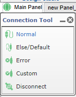

    - Select the required option. Press and hold the **CTRL** key and right-click on the second Pneuron you want to connect.

    - There is now an arrow between the two Pneurons, with the arrow pointing to the destination (second) Pneuron.

    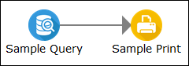

3. When you have additional Pneurons in the network, repeat Steps 1 and 2 for the remainder of the Pneurons you want to connect.

##Disconnecting Pneurons

To disconnect Pneurons:

1. Click on the source Pneuron.
2. Right-click on the second Pneuron you want to disconnect and click Disconnect.

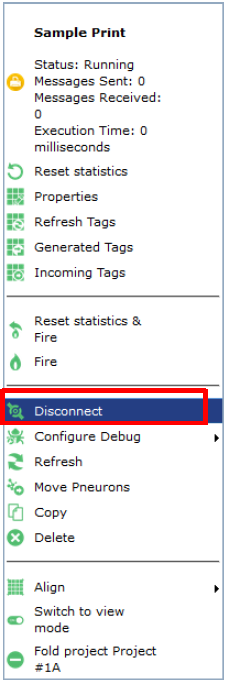

The arrow between the two Pneurons is deleted.

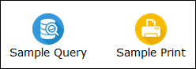

Alternatively, use the Disconnect option (as explained above) from the Connection Tool window.

##Connecting Pneurons Via If/Else Functionality

In order to determine if a value is above or below a threshold set when configuring the network user variables for the project, you can add an if/else branch between a Compare Pneuron and subsequent Pneurons. The if/else branch will appear as a purple arrow.

For example, if the result of a calculation from a Compare Pneuron is above a given threshold, the result will be sent to a Variable Pneuron for action and then onto a Print Pneuron. If the calculation of that Compare Pneuron is below the given threshold, the result will be sent directly to the Print Pneuron with no additional action.

1. Click the **Compare** Pneuron.
2. Right-click on the subsequent Pneuron and click **Connect** > **Connect Else**

    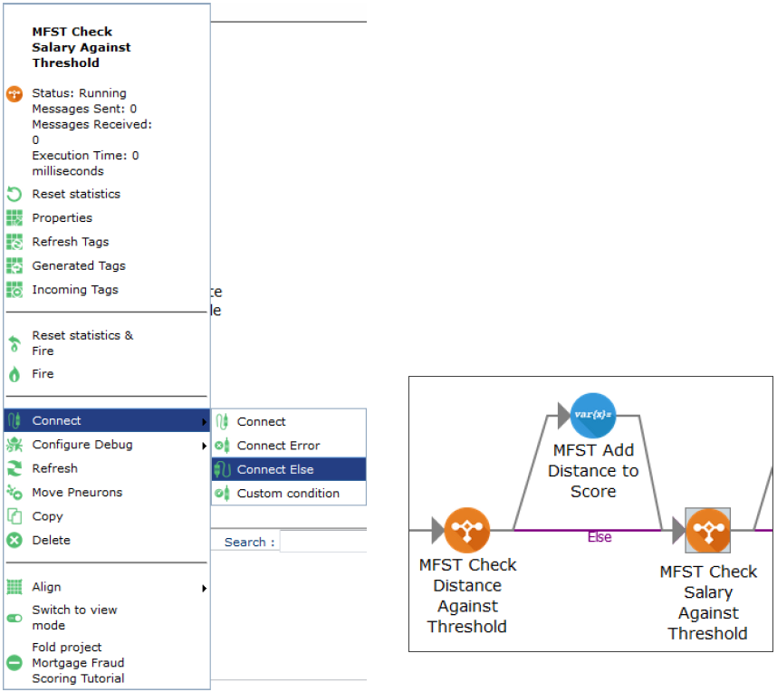

3. The purple arrow between the two Pneurons indicates an ‘Else’ branch connection.

    

For additional information using Compare Pneuron, refer to the Pneuron Reference Guide.

##Aligning Pneurons
To align two or more Pneurons on the canvas:

1. Click one of the Pneurons you wish to align.
2. Press and hold the CTRL key.
3. Click additional Pneurons to align on the canvas.
4. Right-click on any of the selected Pneurons.
5. Choose Align.
6. Click one of the align options:
    - Align Left
    - Align Center
    - Align Right
    - Align Top
    - Align Middle
    - Align Bottom

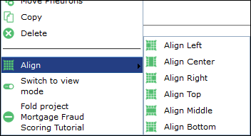

##Project Icons
There is a special Project level icon and several tooltips which provide visual information related to the state of a project. The special “information” icon is shown on the Project icon when the Project is folded. Hovering over the project will provide further details. Examples of the icon and tooltips are as follows:

##Importing a Network or Project
Projects are saved as XML files. You can import a specific project into Design Studio using the **Load Project** button at the top of the Pneuron Design Studio screen.

To import a network:

1. Click the **Load Project** button.

    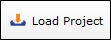

2. Click **Browse** to select an XML file and click **Open** to populate the field.

    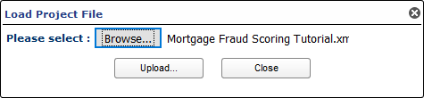

3. Click **Upload**.
4. You will be presented a host select interface:

    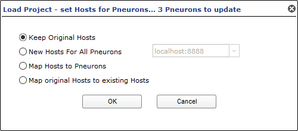

    There are four options for setting the host for the imported Pneurons within the Project:

    - **Keep Original Hosts** – This option will use the same hosts as configured for Pneurons in the source Project.
    - **New Hosts for All Pneurons** – This option will allow the designer to select a new host for all copied Pneurons in the destination Project.
    - **Map Hosts to Pneuron** – This option will display each Pneuron and their associated hosts in the import file and allow the designer the option to map every Pneuron to a new host.
    - **Map original hosts to existing hosts** – This option will display the each unique host within the import file and allow the designer to map a new host as desired.

5. Click **OK** to complete importing the Project.

**NOTE:** For Pneurons to be mapped to other hosts, the target hosts must be defined within Pneuron Administration.
