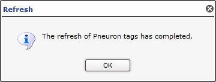
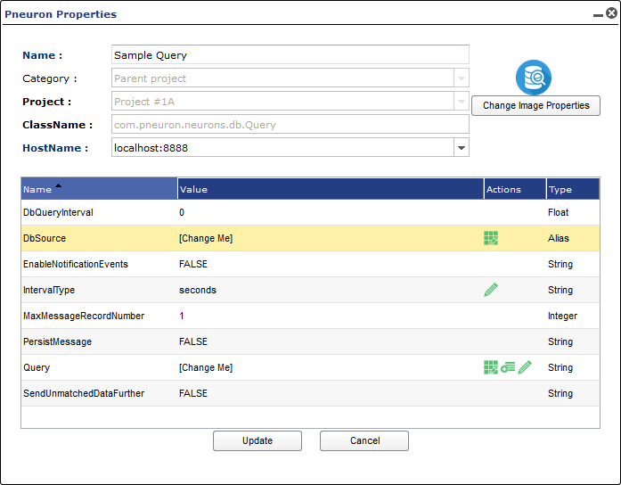

#Pneuron Menu Commands and Functions
___

The Pneuron Design Studio is deployed with a set of generic “Pneurons” (mini-Java applications containing basic sets of properties) that are customized by the designer to retrieve, calculate, analyze and output data from user-defined data sources.

Pneurons are connected within a network and can even connect to other Pneuron networks. When a Pneuron receives a message, it executes the appropriate logic and then lies dormant until it receives the next message. Each Pneuron is dependent upon the previous connected Pneuron. The characteristics and behavior of a Pneuron are defined by configuring its properties.

This section reviews the menu commands and functions available at the Pneuron level. The Pneuron command menu is available by right-clicking on any Pneuron on the Canvas.

| **Pneuron Actions** | Description |
|--|--|
| **Status** | Shows the current status of this Pneuron. |
| **Reset Statistics** | Allows designers to reset the message counts in the Status section. |
| **Notes** | Allows designers to enter free-form comments about this Pneuron. |
| **Properties** | Shows all property settings within the Pneuron. |
| **Refresh Tags** | Refreshes the generated tags for the network. |
| **Generated Tags** | Shows a list of tags created by this Pneuron.|
| **Incoming Tags** | Shows a list of the generated tags from other Pneurons received by this Pneuron. |
| **Reset Statistics & Fire** | Allows designers to reset the message counts in the Status section and Fire the Network with a single click. |
| **Fire** | Executes the function(s) of the Pneuron and all subsequent connected Pneurons and networks. |
| **Configure Project Debug** | Allows the designer to enable Pneurons for debug. The output is viewed using the Debug Utility. |
| **Refresh** | Restarts this Pneuron within the network. |
| **Move Pneurons** | Enables you to move a Pneuron, or multiple Pneurons, to a specific category within the project. Pneurons can be removed from categories with this function, as well as create new categories. |
| **Copy** | Make a copy of the selected Pneuron.|
| **Delete** | Delete the selected Pneuron. |
| **Switch to view mode** | Toggles between the “expand to edit” mode and “expand to view” mode. |
| **Fold category <Category Name>** | Collapses this Pneuron into the assigned category. This menu option only appears if the Pneuron is associated with a category. |
| **Fold project <Project Name>** | Collapses this Pneuron (and all Pneurons within the network) into the parent project. |

##Pneuron Status
Statistical information for every Pneuron is displayed when the user right-clicks on a Pneuron and displays the menu of options. The status information displays the number of messages sent and received by the Pneuron as well as the amount of time the Pneuron took to run on the last execution. Status information is cumulative for each time the Pneuron is fired. Designers can reset the statistics using the menu choices described in this document. Statistics are also reset whenever the Pneuron properties are updated, the Pneurons or Networks are refreshed or the Pneuron server is restarted.

##Pneuron Reset Statistics
This menu option allows the designer to reset the statistics for the Pneuron. Statistics can also be reset at the Project level, which will reset all statistics for all Pneurons in the selected Project.

**Before/After**

##Pneuron Notes
Use this menu option to add notes to a Pneuron. Notes can be added, updated or deleted.

##Pneuron Properties
Use this menu option to access the Properties configuration screen for a Pneuron. Each type of Pneuron has a unique Properties configuration interface. This document provides sample property configuration information for Query and Analytic Pneurons. Refer to the Pneuron Reference Guide for details on configuration for each type of Pneuron.

##Pneuron Refresh Tags
Data moves between connected Pneurons in a network via XML messages. This menu option allows designers to refresh the all the tags created or used by the Pneurons in a network. When this option is selected, the Pneuron server will refresh all tags and display the message below.

##Pneuron Generated Tags
Data moves between connected Pneurons in a network via XML messages. This menu option allows designers to view the XML tags created by the selected Pneuron as shown in the sample below.

##Pneuron Incoming Tags
Data moves between connected Pneurons in a network via XML messages. This menu option allows designers to view the XML tags received by the selected Pneuron as shown in the sample below.

##Pneuron Reset Statistics and Fire
This menu option allows the designer to reset the statistics for the Pneuron and Fire the Network with a single click. See the Reset Statistics section above for an example of statistics available for Pneurons.

##Pneuron Fire
Each time a Pneuron is configured, it is important to test it to ensure that it is working properly. In order to do this, you must run, or “fire”, the Pneuron network. Networks can be fired manually by using the menu command, or by changing the refresh interval time of the first Pneuron in the network if the network properties are set to run the network on an interval.

To fire a Pneuron network using the menu command:

1. Right-click on the first Pneuron in the network and select Fire.
2. The Pneuron and any connected Pneurons in the network will run. If you have any Print Pneurons in the network, output will be displayed on the Server Console.

##Using Pneuron Properties to Stop or Restart a Pneuron Network

1. Right-click on the first Pneuron in the network and select Properties. You can also double-click the Pneuron to open the properties interface.

    

2. Click on the DBQueryInterval property.
3. To STOP the network: Change the value to zero and click **Update**. To RESTART the network: Change the value to an appropriate time interval and click **Update**. The field DbQueryIntervalType determines the time period type.

##Pneuron Configure Project Debug
Design Studio has integrated functions that allow designers to configure Project debug properties as well as a Debug Utility to assist with debugging projects.
There are two components in the system to assist designers with the debug process:

- Project Debug Configuration that allows the designer to set debug properties on a Project
- The Debug Utility used to display messages passed between selected Pneurons.

###Using the Configure Project Degub Utility
After creating a network, you can utilize the Debug Utility to validate the contents of messages between Pneurons within the network.

To view debug output for a network/Project, you must:

1. Create at least one project
2. Create at least two Pneurons within the project
3. Connect at least two Pneurons within the project
4. Configure Pneurons to create debug messages by using the Configure Project Debug module.

In order to set the debug properties for a project, select Configure Project Debug from the right-click menu. You can access the debug configuration module by right-clicking on a Project or on a Pneuron within a Project.

This will display the **Configure Debug for <Project>** window:

The **Configure Debug Project** window enables a user to filter the data in each column by entering a few words of the required text in the textboxes or search boxes provided above each column and pressing Enter.

Click the **Clear Filter** icon to clear the text in these textboxes.

The checkboxes column at the extreme left enables you to select/deselect the rows.

| **Field Name**  | Description |
|--|--|
| **Order By** | Sorts the list of Pneurons alphabetically or by the number of incoming connections to the Pneuron. |
| **Pneuron Name** | Filter the list of Pneurons displayed and made available for debugging. Enter a partial Pneuron name in this field and press Filter.  |
| **Point to** | Minimizes the Configure Project Debug window and centers the selected Pneuron on the canvas. |
| **Hops** |  |
| **Fire** | Fires the Pneuron Network from the selected Pneuron in the list. |
| **Save** | Saves the current Debug status (off/on) for each Pneuron in the list. |
| **Clear Entire Project Debug** | Deletes all debug messages in the system for the selected Project. |
| **Cancel** | Cancels the Debug operation and closes the window. |
| **Show Results** | Launches the Debug Utility window. |

- Pneurons in the network are ordered by the number of incoming connections by default. You can order the list alphabetically by clicking the column header.
- Designers can configure which Pneurons in the project to debug by selecting the check box next to one or more Pneurons in the list.

    **NOTE:** If you choose to select all Pneurons in a network, the system can become slow and unresponsive, especially for large networks. It is recommended that designers debug a few Pneurons at a time as the network is built.

- The designer can also use the Point To icon to navigate to a particular Pneuron in the network to understand context and positioning of the Pneuron.
- Once the designer has made the required selections, click the Save button to save the selections, or click on the Fire icon to fire the network from the appropriate position in the network.

###Using the Design Studio Debug Console
To review the debug message output, launch the Debug Utility Console from the Actions menu by selecting the Debug command, or by clicking the Show Results button in the Configure Project Debug module.

This menu command will launch the Debug window.

| **Field Name**  | **Description** |
|--|--|
| **Project** | Shows a list of the Projects the designer has access to that have been configured for debugging. |
| **From Pneuron** | Shows a list of the Pneurons in the selected Project that have been configured for Debug. |
| **To Pneuron** | Shows a list of the Pneurons which are connected to the Pneuron selected in the From Pneuron field above. |
| **Refresh Project Information (button)** | Allows the designer to reset the values in the Debug window and load other Projects that have been enabled for debug. |
| **Clear Debug Messages (button)** | Clears ALL debug messages from the system for the selected Project. |
| **Clear Filter** | Clears the filter applied to display the data. |
| **Select Fields** | Shows the fields contained in the messages between the From Pneuron and the To Pneuron. The designer can select All Fields, or choose one or more discrete fields (use CTRL to select multiple fields) to display in the debug output messages panel. |
| **Filter Value 1, 2, and 3** | Allows the designer to filter the debug output messages by specific values expected within the fields of the message. Enter the value/contents of the field within the message in order to filter the debug output messages to those containing the entered value(s). A maximum of 3 filter values can be entered. |
| **Order By Time** | Sets the sort order of the messages within the tabbed debug message output. The default value is ASC. |
| **Max Number of Messages** | This value restricts the number of debug output messages that will be displayed in the output area of the Debug Utility Console. The maximum number of messages that can be displayed is 100. |
| **Display Messages (button)** | Refreshes the debug output tabs based on the current settings and displays the appropriate messages. |
| **Configure Debug Window** | Returns the user to the Debug Configuration interface. |
| **Save to Excel** | Allows the user to export the debug results to a Microsoft Excel spreadsheet. |
| **Close (button)** | Closes the Debug window. |
| **List View (tab)** | Displays the list of messages sent between the Pneurons selected in the From Pneuron and To Pneuron fields. |
| **Table View (tab)** | Displays the list of messages sent between the Pneurons selected in the From Pneuron and To Pneuron fields in table format. |

Enter the required values in the Debug window:

- **Project**
- **From Pneuron**
- **To Pneuron**
- **Select Fields** (Select All Fields, or choose specific fields)

    

Enter values in the optional fields:

- **Filter Value 1**
- **Filter Value 2**
- **Filter Value 3**
- **Order by Time** (Default ASC, or DESC)
- **Max Number of Message** (Default 10, Maximum is 100)

Click the **Display Messages** button.

Click one or more arrows to expand the contents of each message. The fields you have chosen in **Select Fields** above will be displayed as part of the message output.

To add or remove fields from the debug message output, change the selected values in the Select Fields pane above, and click **Display Messages**. The message output will be redisplayed based on the new selected values.

To view the debug message output in a table format, select the **Table View** tab.

The message field values are now displayed in columns, and the field values per message are displayed in the table. The columns can be resized by selecting and dragging the column dividers in the **Table View** tab.

###Clear Debug Messages
If you have run the network with Debug several times, and there are many debug messages for the network in the system, you can use the **Clear Debug Messages** button to remove the debug messages from the system. This will only remove debug messages for the selected project as shown in the **Project** field in the **Debug** window.

##Move Pneuron (Categories)
When a Pneuron is created, you have the option to assign it to a Category. Pneuron categories represent groups of similar logical functions associated with Pneurons in a project.

For example, you can have a group of Pneurons that retrieve transaction data from various locations within your organization. You might establish a category for these Pneurons within the network as “Retrieve Data.” Then, you can assign these Pneurons to the Retrieve Data category. These Pneurons will be grouped into the Retrieve Data category. Pneuron Categories appear as a different icon on the canvas. You can expand and collapse the categories to see all Pneurons within a category. You can also move Pneurons to different categories.

Pneuron categories are specific to the project; the category names cannot be transferred to other projects.

The following illustrations show sample
Pneuron categories when they are collapsed and expanded.

###Move Pneuron
The **Move Pneuron** menu command allows you to move or change several components of one or many Pneurons:

| **Field Name** | **Description** |
|--|--|
| **Name** | Lists the names of the Pneurons selected in the Move Pneuron menu. |
| **Project** | A drop-down box that allows the selection of another Project to move the Pneuron to. Creating a new project can also be selected through the drop-down. |
| **Category** | A drop-down box that allows the selection of another category to assign the Pneuron to. This drop-down also allows you to remove Pneurons from a category and return them to the canvas within the network. Finally, a new category can also be selected through the drop-down. |
| **New Name** | A text box that allows the Pneuron to be renamed. |
| **Host** | A drop-down box that allows the selection of another host to move the Pneuron to. |

1. Right-click on the Pneuron (or **CTRL**-click to select multiple Pneurons) that you want to move or rename and select **Move Pneurons**.

    

2. From the **Move Pneurons** dialog box, you may change the category, project, host, or rename the Pneuron. Additionally, you can create a new project or category through the interface.

    

3. Once your selections have been made, click **OK**.

##Pneuron Copy
The **Copy** command allows designers to copy the selected Pneuron. Because Pneuron names must be unique, the user is presented with a dialog box that will allow the new Pneuron to be created with a new name. A copy of the selected Pneuron will be created in the current Project. Designers can also assign the copied Pneuron to another host, if desired.

A success message will be displayed when the **OK** button is clicked. The Pneuron copy will be shown on the Canvas.

##Pneuron Delete
The **Delete** command allows designers to remove the selected Pneuron. Once selected, the user will be presented a confirmation dialog box to ensure the delete operation should proceed. Once a Pneuron has been deleted, it cannot be retrieved.
Multiple Pneurons can be deleted at the same time by using **CTRL**-click to select multiple Pneurons and then clicking the Delete command.

##Using the Query Pneuron
he Query Pneuron is used to retrieve data from a relational database so data manipulation operations can be performed on that data in subsequent Pneurons. The data retrieved by the Query Pneuron is sent as an XML message to another Pneuron based on how the project is configured.

For example, you can configure a Query Pneuron to retrieve account data and send it to an Analytic Pneuron to perform calculations on that data along with data retrieved by other Pneurons.

1. Right-click on a new Query Pneuron and click **Properties**. You can also double-click the Pneuron to open the **Pneuron Properties** window. The **Pneuron Properties** window is displayed with default property names.

    

2. Click on the DbSource property name and select a data source.
3. Select the Query property name and click on its associated Design icon to access the Query Builder and create a query for this Pneuron. Refer to the next section Using the Query Builder.

###Using the Query Builder
Query Builder is an application within the Query Pneuron that is used to build SQL queries specific to a target database. You must make sure a database is assigned to the Query Pneuron before using the Query Builder by entering a value in the DbSource property of the Pneuron. This is the database the query will execute against.
To access the Query Builder:

1. Right-click the Query Pneuron and select Properties. You can also double-click the Pneuron to open the Pneuron Properties window.
2. Click the Design icon next to the Instruction Block. The Query Builder application appears. List on the left shows data sourcesDrag the table out to the right to see list.

    

3. Decide which table(s) to use for the query and click and drag one or more tables to the blank area above the chart. The fields within the selected table(s) will appear in a separate chart.
4. Select the fields that you want to retrieve from the table(s) by clicking in their respective check boxes. These fields will be used in the query and will appear in the chart below the design area.

    

5. Enter the appropriate values for the fields in the chart to define the query that will produce the desired output. Refer to the following table for column definitions.

    | **Column Name** | **Column Description** |
    |--|--|
    | **Output** | Select the check boxes for the fields to return as output in the query. Each selection you make appears in the automatically generated code in the area below the chart. |
    | **Expression** | Shows the name of the field within the table. |
    | **Aggregate** | Optional – Select the type of calculation you want to perform on this element. Choices are: Avg, Count, Max, Min and Sum. |
    | **Alias** | Optional – Enter the Alias for this field. |
    | **Sort Type** | Optional – Select to show this field in Ascending or Descending order in the query output. Also used as a secondary type of sorting for multiple fields that employ the Sort Order function. |
    | **Sort Order** | Optional – Select a number corresponding to the order the fields will appear in the query output. Typically used when you are sorting by multiple fields. |
    | **Grouping** | Optional – Select this check box if you want to group the results of the query by this field. |
    | **Sign** | Optional – Defines the comparison operator (=, >, etc.) which will be used for comparing data to the Criteria field (see below). |
    | **Criteria** | Optional – Allows the construction of WHERE clauses. For example, to retrieve user names and IDs where the password is equal to “pneuron,” you would type “pneuron” in the Criteria field for the password element. |
    | **Or** | Optional – Enables you to enter additional values for each field in the query. This is similar to the Criteria column and is often used as a multiple expression for applying conditions to the query. Only one of the criteria must be met to return a result. |

6. Confirm that the system generated SQL statement matches the expected syntax . You must do this every time you use the Query Builder. Click Generate Query to ensure all of your selections are built into the query.
7. Click the Update button. The updated Query Pneuron appears on the canvas.

###Limiting Results Within Query Builder

Query Builder allows you to limit the number of rows returned by the query. This is useful when building and testing Query Pneurons against database tables with a large number of rows.

To limit the number of rows returned, select the Top checkbox and enter the number of data rows you want the query to return.

##Using The Analytic Pneuron
The Analytic Pneuron is used to configure and compute complex analytical, mathematical and statistical algorithms within a Pneuron project based on the data retrieved by other Pneurons.

Within a project, Query Pneurons retrieve the data to be used by the Analytic Pneuron. The retrieved data then passes to the Analytic Pneuron as an XML message. The Analytic Pneuron evaluates all messages and performs the calculations and processing of that data. The output of the Analytic Pneuron is a new message consisting of the original message plus the results of the calculations, appended as new tags.

To use the Analytic Pneuron, you can double-click on the Instruction Block and manually enter the variables, or use the Analytic Editor to configure calculations that are more complex.

The Analytic Editor is an application within the Analytic Pneuron that enables you to define formula trees of executions by using decisional and repetitive instructions. It also enables you to assign variables and associate values to those variables.

###Using the Analytic Editor
The Analytic Editor application is accessed through the Analytic Pneuron. The Analytic Editor contains two sub-editors:

- **Diagram Editor** - Enables you to assign variables and create formulas.

- **Formula Editor** - Enables you to create, edit, and delete formulas and XML messages associated with this Analytic Pneuron.

To access the Analytic Editor:

1. Right-click on the Analytic Pneuron and select Properties. You can also double-click the Pneuron to open the Properties window.
2. Click the Design icon next to the Instruction Block. The Analytic Editor window appears.

    

To access the Formula Editor, click on the Diagram Editor tab at the top left corner, select a function icon in the design area, and click Edit Formula. Not all function icons connect to a Formula Editor. If there is no Edit Formula button present, then there is no associated Formula Editor for that function icon.

###Using the Diagram Editor
The Diagram Editor is used to define variables for the formulas, create formulas, and run the calculations as a test before executing the functions.
To access the Diagram Editor:

1. From the left side of the Diagram Editor screen, click and drag a function icon to the design area, enter its properties in the right side panel, and click Save Properties. Refer to the table below for
Diagram Editor Property field definitions.
2. Repeat Step 1 to configure other functions.
3. Connect the function icons together. Click on the icons you want to connect, then right-click and select Connect. An arrow will be displayed between the two function icons.

The following table explains the Diagram Editor Property fields that appear on the right panel of the Diagram Editor.

| **Diagram Editor Functions** | Diagram Editor Property Fields | Diagram Editor Property Definitions |
|--|--|--|
| **Declare** |  | Enables you to define variables to use throughout the instruction code. In the Variable Name field, enter the name you want to use for a calculation variable. Select the Variable Type (such as string, integer, float, date, or long). Select the Store variable in result? checkbox if the results of this calculation are to be stored in the outgoing XML message. Click Save Properties. Your selections appear in the design area. |
| **Set** |  | Enables you to create a formula using the variable names created in the Declare function. In the Variable Name field, select the variable name to associate with this formula set. In the Formula field, enter the appropriate formula to calculate the result. Click Edit Formula (if needed) to access the Formula Editor. Refer |
| **Call Pneuron** |  | Enables you to make calls to an Adapter or Query Pneuron for processing data. In the Reference/Variable Name field, enter the name to assign to the variable for this call. Enter the Project Name that contains the Pneuron to call. Enter the Pneuron Name that is the source of the data. This should be an Adapter or Query Pneuron. By selecting the Direct Reply checkbox, the call will not wait on the called network to process. |
| **IF** |  | Enables you to create a true or false condition within the formula. This is typically connected to a Set function. Enter the true or false Condition to apply to this function. Click Edit Formula (if needed) to access the Formula Editor. Refer to the section Using the Formula Editor. |
| **While** |  | Enables you to configure a looped action until the formula is satisfied. Enter the Condition that is to be applied to this function. Click Edit Formula (if needed) to access the Formula Editor. Refer to the section Using the Formula Editor. Select an option from the Data Feed Name drop-down, associated with this function. Select an option for handling the error in the Error Handler drop-down. |
| **Evaluate** |  | Enables you to configure specific actions when the formula meets the specified criteria. It is similar to a branch operation that can move across multiple results. In the Variable Name field, enter the name of this function. In the Formula field, enter the appropriate formula to calculate the result. Click Edit Formula (if needed) to access the Formula Editor. Refer to the section Using the Formula Editor. |
| **Fire** | There are no configuration fields associated with this function. | Fires a message with the computed analytics at the point in the function tree where the ‘Fire’ function has been placed. Click and drag the Fire function to a branch (arrow) within the function tree to send a new message at that particular point. |

###Using the Formula Editor
You can access the Formula Editor from the Diagram Editor. Formula Editor enables you to select the formulas to use in the analytic calculations and provide the appropriate arguments (user variables or constant). The Formula Editor is only available for the Set, If, While and Evaluate diagram functions.

To use the Formula Editor:

1. While in the Diagram Editor, select a function box and click the Edit Formula button on the right side panel of the screen. The Formula Editor window appears, with four tabs on the right: Runtime, Methods, Generic Methods and Basic Methods.

    

2. Create or edit the formulas as appropriate. Click Use to choose properties and methods from the Runtime, Methods, Generic Methods and Basic Methods tabs. Refer to the instructions below for each tab.
3. Click Done and then click Save Properties to save your changes.

####Formula Editor - Runtime Tab
1. Create or edit the formulas as appropriate. Click Use to choose properties and methods from the Runtime, Methods, Generic Methods and Basic Methods tabs. Refer to the instructions below for each tab.
2. Click Done and then click Save Properties to save your changes.

    

The Methods tab within the Formula Editor enables you to select methods to use in your formula. Simply select a method and click Use. The method appears in the code area on the left.

####Formula Editor - Generic Methods Tab

The Generic Methods tab within the Formula Editor enables you to choose a specific evaluation engine and select the typical methods associated with the evaluation engine.

You can choose among three different libraries for selecting methods within the formulas from the Evaluation Engine drop-down:

- Standard
- Apache Math Library
- Matching Library

    

####Formula Editor - Basic Methods Tab

The Basic Methods tab is used to choose a SQL function (Mathematical, String, Date) and edit it as required.

