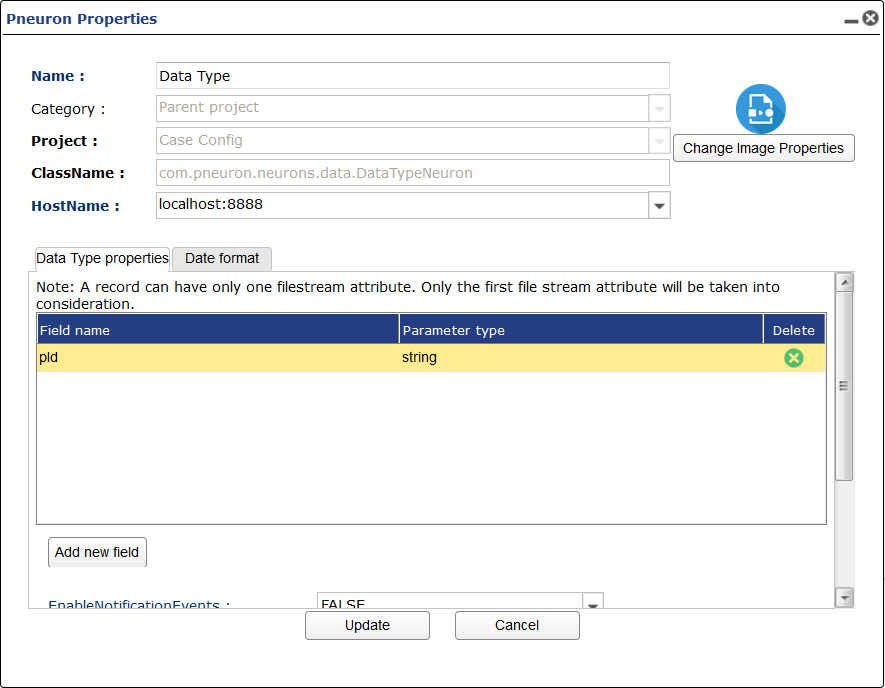
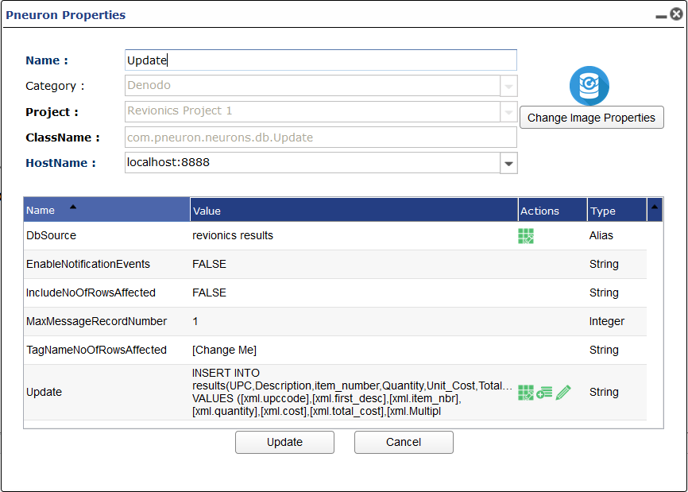

#Pneuron Descriptions
There are over 50 types of Pneurons within Pneuron Design Studio. Each Pneuron produces a specific type of output, depending on the outcome you want to achieve. You can configure multiple instances of the same Pneuron within a network. For example, you can create five Query Pneurons within your network, along with three Analytic Pneurons, two Compare Pneurons, etc.

Pneurons are organized into five logical categories that represent commonly grouped functions within a network. A Pneuron can be associated with more than one category. These categories are:

- All
- Analytics
- Cloud
- Data Interaction
- Messaging
- Output

The following describes each Pneuron in the palette, its associated category and function as well as the configuration options.
___
#Adapter Pneuron

| Image | Category | Description |
|--|--|--|
|  | Data Interaction | Caches large data sets for processing with one operation to avoid repeated query demand on the underlying relational database. |

##Pneuron Configuration


**Cache Type**

How the data is cached. Options are:
- `File System Cache`
- `In Memory Cache`

**Adapter Group Selector**

Choose how the data is gathered. Options are either `Query` or `Service`.

**Enable Notification Events**

Option for enabling notification events. `TRUE` or `FALSE`.

**Refresh Interval**

How long the refresh interval is.

**Interval Type:**

Units of time the refresh interval lasts.

If `Query` is Chosen as Selector

**Send Unmatched Data Further**

Send unmatched records to cache.

**Db Source**

Datasource alias that is queried and cached

**Query**

SQL Query
If `Service` is Chosen as Selector Type

**HTTP Alias**

HTTP URL alias used to make HTTP or Service requests

**Web Service Interface**

Library used as service interface.

**Call Method**

Method call used in request.

**Parameter/Header Box**
Box used to configure parameters and headers needed in HTTP or service calls.
___

#Analytic Pneuron

| Image | Category | Description |
|--|--|--|
|  | Analytics | Executes complex analytical, mathematical and statistical algorithms in the Pneuron network in real time using the data extracted from an incoming XML message. |

##Pneuron Configuration


**Enable Notification Events**

Option for enabling notification events. `TRUE` or `FALSE`.

**Instruction Box**

When selecting the green actions icon you will be taken to the analytics editor where you can build logic and utilize several forulas on incoming tags. THe pneuorn will execute the instructions for each message received.

**Max Message Record Number:**

Number of records per message sent from this pneuron.
___
#Case Pneuron

| Image | Category | Description |
|--|--|--|
|  | Analytics | Create multiple message routing paths based on defined conditions within the XML data in messages. |

##Pneuron Configuration


**Enable Notification Events**

Option for enabling notification events. `TRUE` or `FALSE`.

**Max Message Record Number:**

Number of records per message sent from this pneuron.

**Case Branch Box**

In this box you create the the branches with associated condition. start by pressing the add new button and naming the branch. Add a conditional statement and entering the project and pneuron the branch connection goes to. Default is the branch that doesn't satisfy any previoud conditional statement. The execute only first condition match stops each conditional statement being used for each message.
___
#Check Transaction Pneuron

| Image | Category | Description |
|--|--|--|
|  | Message | Checks to determine if messages marked as transactions by the Start Transaction Pneuron have been processed. |

##Pneuron Configuration


**Enable Notification Events**

Option for enabling notification events. `TRUE` or `FALSE`.

**Fire Completion on Error**

Will this pneuron fire if the branch after start transacion errors? `TRUE` or `FALSE`.

**Idle Timeout**

Time the check transaction pneuron takes to execute network following it. based on last received message on the last pneuron network after the start transaction pneuron.

**Idle Timeout Type**

Unit of time that applies to idle time.

**MaxMessageRecordNumber**

Number of records per message sent from this pneuron.
___
#Compare Pneuron

| Image | Category | Description |
|--|--|--|
|  | Analytics | Used to create two alternate paths within a Pneuron network by configuring an if/else statement. |

##Pneuron Configuration


**Enable Notification Events**

Option for enabling notification events. `TRUE` or `FALSE`.

**Max Message Record Number**

Number of records per message sent from this pneuron.

**Script**

The conditional statement for the branch.
___

#Custom Pneuron

| Image | Category | Description |
|--|--|--|
|  | All | Enables experienced developers to create new Pneuron types by placing custom logic within a standard Pneuron shell that maintains interoperability with all other Pneurons. |

___

#Data Type Pneuron

| Image | Category | Description |
|--|--|--|
|  | Data Interaction | Casts incoming XML fields to a specified data type. |

##Pneuron Configuration



**Data conversion Table**

This is where you choose oncoming tags to cast to  different data type.

**Enable Notification Events**

Option for enabling notification events. `TRUE` or `FALSE`.

**MaxMessageRecordNumber**

Number of records per message sent from this pneuron.

**Keep Original Attribute if File Stream**

If the data item you are converting is a file stream do you want to keep the original attribute after conversion? `TRUE` or `FALSE`.

**Repository Alias**

Directory alias used to store data item converted to file type.
___

#Database Stream Pneuron

| Image | Category | Description |
|--|--|--|
|  | Data Interaction | Takes data, saves it to a file, and then stores the file reference in a database in a specified data type. |

##Pneuron Configuration


**DB Source Alias**

Choose DB source you want to get data from.

**EnableNotificatinEvents**

Option for enabling notification events. `TRUE` or `FALSE`.

**MaxMessageRecordNumber**

Number of records per message sent from this pneuron.

**Query**

SQL Query

**Repository Alias**

Directory alias where the data will be saved to file.
___

#Document Pneuron

| Image | Category | Description |
|--|--|--|
|  | Data Interaction | Indexes documents and retrieves the file name containing a specific search string.|

___

#EDI/HL7 Parser Pneuron

| Image | Category | Description |
|--|--|--|
|  | Data Interaction | Enables you to convert EDI or HL7 messages to XML.|

##Pneuron Configuration


**EnableNotificatinEvents**

Option for enabling notification events. `TRUE` or `FALSE`.

**Incoming Message Format**

The type of message format that you want to parse.

**Incoming Tag Source**

What tag contains the message to be parsed.

**Max Message Record Number**

Number of records per message sent from this pneuron.

**Output XML Tag Name**

Tag name of the result of parsing incoming tag.
___

#Event Hub Listener Pneuron

| Image | Category | Description |
|--|--|--|
|  | Messaging | Provides the ability receive messages from an Azure Event Hub. |

##Pneuron Configuration


**Alias**

Event Hubs alias you want to listen to.

**Checkpoint Frequency**

Number of messages till you update the checkpoint.

**Enable Notification Events**

Option for enabling notification events. `TRUE` or `FALSE`.

**Max Message Record Number**

Number of records per message sent from this pneuron.

**Output XML Tag Name**

Tag name of the message being read from Event Hubs.
___

#Event Hub Publisher Pneuron

| Image | Category | Description |
|--|--|--|
|  | Messaging | Provides the ability to place a message onto an Azure Event Hub . |

## Pneuron Configuration


**Alias**

Event Hubs alias you want to listen to.

**Enable Notification Events**

Option for enabling notification events. `TRUE` or `FALSE`.

**Max Message Record Number**

Number of records per message sent from this pneuron.

**Message Item**

Tag item to be published to Event Hubs.

**Partition Key**

Partition key used to specify what partition the message is sent to. Round Robin is the default method of choosing the partition.
___

#File Pneuron

| Image | Category | Description |
|--|--|--|
|  | Data Interaction | Used to parse a file (JSON, XML, CSV, Excel, Unstructured) and retrieve specific attributes for further processing.|

##Pneuron Configuration


**Enable Notification Event**

Option for enabling notification events. `TRUE` or `FALSE`.

**Max Message Record Number**

Number of records per message sent from this pneuron.

**Processor Type**

What file type are you reading in? Options are:

- `CSV`
- `XML`
- `Unstructured Data/XLS`
- `Bulk Read`
- `JSON`

**_If `CSV` is Chosen New Options Appear:_**

- **Delimeter**

    How is the CSV delimited. Options are:

    - `Comma`
    - `Tab`
    - `Semicolon`
    - `Space`
    - `Other`

- **Text Qualifier**

    How is text escaped from in the CSV? Options are:

    - `'`
    - `"`

**_If `JSON` is Chosen New Options Appear:_**

- **JSON Path**

    Path that allows for extracting certain fields from JSON file. See example for more information.

**Repository Alias**

Directory alias where you are reading the file from.

**Finalization**

Upon completion of pneuorn functionality what do you want to happen to the file you read in. Options are:

- `Keep File`
- `Move To`
- `Delete`.

**_If `Move To` is Chosen New Options Appear:_**

- **Destination Alias**

    Directory alias of where you want the file moved to upon completion.

**_If `Keep File` is Chosen New Options Appear:_**

- **Keep Files Pattern**

    Pattern of files you want to keep.

**File Name Pattern**

Name of file or pattern you want to be read in.

**Check Interval**

Integer interval between checking files.

**Check Interval Type**

Unit of time check interval goes by.

**Process Files From**

Where you process files from. Options are:

-  `Repository`
- `File Reference`.
___

#File Action Pneuron

| Image | Category | Description |
|--|--|--|
|  | Data Interaction | Used to manage directory, file data and structure. |

##Pneuron Configuration


**Action Type**

What action on the files or folder do you want to perform. Options are:

- `Copy Files`
- `Move Files`
- `Delete Files`
- `Create Folder`
- `Delete Folder`
- `Count Files`
- `Rename File`

**_If `Copy Files` or `Move Files` is Chosen More Options Appear:_**

- **Source Alias**

    Directory alias were you are copying or moving files from.

- **Destination Alias**

    Directory alias were you are copying or moving files to.

- **Conflict Resolution**

    How do you want to resolve conflicts. Options are:

    - `Add GUID`
    - `Overwrite with Error`
    - `Skip and Throw Error`

- **Destination Location**

    File path location within Destination Alias you want the file copied to moved to.

- **Pattern**

    File pattern you want to perform action on.

**_If `Copy Files` or `Move Files` is Chosen More Options Appear:_**

- **Pattern**

    File pattern you want to perform action on.

**_If `Rename File` is Chosen More Options Appear:_**

- **Conflict Resolution**

    How do you want to resolve conflicts. Options are:

    - `Add GUID`
    - `Overwrite with Error`
    - `Skip and Throw Error`

- **New File Name**

    New name of file you want to rename.

- **Current File Name**

    File you want to Rename.

**Enable Notification Events:**

Option for enabling notification events. `TRUE` or `FALSE`.

**Max Message Record Number:**

Number of records per message sent from this pneuron.
___

#File Writer Pneuron

| Image | Category | Description |
|--|--|--|
|  | Data Interaction | Used to output specific attributes to a file for viewing or for use by external systems. |

##Pneuron Configuration


**Enable Notification Events**

Option for enabling notification events. `TRUE` or `FALSE`.

**Repository Alias**

Directory Alias of where in the file system you want to write the file to.

**File Type**

What type of file you want to save content as. Options are:

- `CSV`
- `XML`
- `Excel`
- `JSON`

**_If `Excel` is Chosen a New Option Appear:_**

- **Sheet Name**

    Name of sheet created in excel file.


**_If `CSV`, `XML`, or `JSON` is Chosen New Options Appear:_**

- **File Name**

    Name of file being written to.

- **Max Size of Files in Mb**

    Max file size of file being written to. 0 is default and means it can be infinite size.

- **Destination Location**

    Path within Directory Alias that you want file to be written to.

**Processor Type**

How you want the file to be written. Options are:

- `On the Fly Write`
- `Bulk Write`

**Adapter Group Selector**

What processor for bulk write do you want. Options are:

- `Query`
- `Service`

**_If `Query` is Chosen New Options Appear:_**

- **Send Unmatched Data Further**

    Name of sheet created in excel file.

- **DB Source Alias**

    DB Source alias.

- **Query**

    SQL Query.

**_If `Service` is Chosen New Options Appear:_**

- **HTTP Alias**

    HTTP Alias used for web service.

- **Web Service Interface**

    What library interface to use.

- **Call Method**

    HTTP Method being used.

**Max Message Record Number**

Number of records per message sent from this pneuron.

**Message Tag Table**

This table is where you select which tags are written to file.
___

#Filter Pneuron

| Image | Category | Description |
|--|--|--|
|  | Data Interaction | Allows the filtering of fields from XML messages and passes only the selected fields forward in the network. |

##Pneuron Configiration


**Enable Notification Events**

Option for enabling notification events. `TRUE` or `FALSE`.

**Max Message Record Number**

Number of records per message sent from this Pneuron.

**Message Items**

Choose which tags you want to continue onto the following Pneuron network. The unselected items will be filtered/removed from the network.
___

#FTP Pneuron

| Image | Category | Description |
|--|--|--|
|  | Data Interaction, Output | Allows interaction with an FTP server to retrieve or store information. |

##Pneuron Configuration


**Check Interval**

Time till check of FTP occurs.

**Conflict Resolution**

Conflict resol0tion. Options are:

- `Add GUID`
- `Overwrite with Error`
- `Skip and Throw Error`

**Delete Files**

Delete Files you perform FTP action on.

**Direction**

What action being performed in FTP. Options are:

- `Download`
- `Upload`

**Enable Notification Events**

Option for enabling notification events. `TRUE` or `FALSE`.

**File Name Pattern**

Name of file/s.

**FTP Alias**

FTP Alias.

**Interval Type**

What unit of tie applies to Check Interval.

**Keep Files Pattern**

What files should be kept after FTP action.

**Max Message Record Number**

Number of records per message sent from this Pneuron.

**Process Files From**

Where are files processed from. Options are:

- `File Reference`
- `Repository`

**Repository Alias**

Directory Alias used to download/upload files from.
___

#Hadoop Action Pneuron

| Image | Category | Description |
|--|--|--|
|  | Data Interaction | Perform a variety of actions on files in the Hadoop Distributed File System (HDFS).|

##Pneuron Configuration


**Action Type**

The Action you want to perform in a file/folder in HDFS. Options are:

- `Create File`
- `Delete File`
- `Rename/Move File`
- `Get Used Space`
- `Get File Names in Location`
- `Check if File Exists`

**_If `Rename/Move File` is Chosen New Options Appear_**

- **Destination File Path**

    File path destination of where you want to move the file in HDFS.

**Source Alias**

Hadoop Alias used for conecting to HDFS.

**Source File Path**

File path of file you want to perform action on.

**Enable Notification Events**

Option for enabling notification events. `TRUE` or `FALSE`.

**Max Message Record Number**

Number of records per message sent from this Pneuron.
___
#Hadoop Reader Pneuron

| Image | Category | Description |
|--|--|--|
|  | Data Interaction | Read files from a Hadoop Distributed File System (HDFS). |

##Pneuron Configuration


**Add GUID Number**

Should this pneuron add a GUID number to the file your reading.

**Enable Notification Events**

Option for enabling notification events. `TRUE` or `FALSE`.

**File Name**

Name of file you want to read.

**Hadoop Source**

Hadoop Alias used to connect to HDFS.

**Max Message Record Number**

Number of records per message sent from this Pneuron.

**Repository Alias**

Directory Alias that is the destination folder in the local file system.

**Sequenced Files**

Are the files sequenced. Options are `True` or `False`.
___

#Hadoop Writer Pneuron

| Image | Category | Description |
|--|--|--|
|  | Data Interaction | Write files to a Hadoop Distributed File System (HDFS). |

##Pneuron Configuration


**Delete Files**

Delete the files you're writing from.

**Enable Notification Events**

Option for enabling notification events. `TRUE` or `FALSE`.

**Export Sequenced Message**

Export sequenced message with records and file reference.

**File Name Pattern**

Name of the file you're writing to.

**Max Message Record Number**

Number of records per message sent from this Pneuron.

**Repository Alias**

Directory Alias containing files your reading from.

**Use File Reference**

Use file reference instead of witing from Directory Alias.
___

#HTTP Pneuron

| Image | Category | Description |
|--|--|--|
|  | Data Interaction | Retrieves an HTTP response as a file. |

##Pneuron Configuration


**Parameters and Headers Box**

Enter any needed headers or parameters into this box. If the body requires a body type in body into a parameter field.

**HTTP Alias**

HTTP Alias that allows for requests to a URL.

**Timeout**

Timeout for response.

**Repository Alias**

Directory Alias for saving the response as a file.

**Configuration Alias**

Configuration Alias used to describe the HTTP Request. (Optional)

**Enable Notification Events**

Option for enabling notification events. `TRUE` or `FALSE`.

**Max Message Record Number**

Number of records per message sent from this Pneuron.
___

#HTTP Proxy Pneuron

| Image | Category | Description |
|--|--|--|
|  | Data Interaction | Works as an HTTP Proxy which enables the capture of individual HTTP requests. Each request is sent in a message with the request details. |

##Pneuron Configuration


**Enable Notification Events**

Option for enabling notification events. `TRUE` or `FALSE`.

**Max Message Record Number**

Number of records per message sent from this Pneuron.

**Service Host**

URL of service host that this Pneuron is a proxy too.
___

#HUD Pneuron

| Image | Category | Description |
|--|--|--|
|  | Output | Heads Up Display. Allows the display an external pop-up message that provides immediate feedback on a function within a network. |

##Pneuron Configuration


**Enable Notification Events**

Option for enabling notification events. `TRUE` or `FALSE`.

**Max Message Record Number**

Number of records per message sent from this Pneuron.
___

#JMS Listener Pneuron

| Image | Category | Description |
|--|--|--|
|  | Messaging | Provides the ability to listen to a JMS queue. |

##Pneuron Configuration


**Enable Notification Events:**
Option for enabling notification events. `TRUE` or `FALSE`.

**JMS Alias**

JMS Alias used to connect to a JMS queue.

**JMS Client ID**

Client ID used in JMS.

**Max Message Record Number**

Number of records per message sent from this Pneuron.

**Persist Message**

All messages that are read off the JMS can be persisted. Options are `True` or `False`.
___

#JMS Publisher Pneuron

| Image | Category | Description |
|--|--|--|
|  | Messaging | Provides the ability to place an XML message onto a JMS queue. |

##Pneuron Configuration


**Enable Notification Events**

Option for enabling notification events. `TRUE` or `FALSE`.

**JMS Alias**

JMS Alias used to connect to a JMS queue.

**JMS Client ID**

Client ID used in JMS.

**Max Message Record Number**

Number of records per message sent from this Pneuron.

**Remove Persist**

All messages that are pubished the JMS can be persisted. This would remove them from being persisted. Options are `True` or `False`.
___

#Kafka Listener Pneuron

| Image | Category | Description |
|--|--|--|
|  | Messaging | Enables you to read from a Kafka topic. |

##Pneuron Configuration


**Alias**

This is the Kafka alias containing information like host, port, and topic you wish to listen to.

**Auto Commit Interval**

This is the auto commit interval in ms for offset managing.

___

#Kafka Publisher Pneuron

| Image | Category | Description |
|--|--|--|
|  | Messaging | Enables you to write to a Kafka topic. |

##Pneuron Configuration


**Alias**

This is the Kafka alias containing information like host, port, and topic you wish to write to.

**Message Key**

Optional. The key of the message you want to send. The key would be used to determine to which partition the message would be sent. If not set, a message with a null key would be sent.
___

#Mail Pneuron

| Image | Category | Description |
|--|--|--|
|  | Output | Sends e-mail. Requires the user to provide an SMTP server and login information. |

##Pneuron Configuration


**From**

Email address of sender.

**To**

Email address/es of receiver.

**CC**

Email address/es who will receive a carbon copy of the email.

**BCC**

Email address/es who will receive a bind carbon copy of the email.

**Subject**

Subject of the email.

**Body**

Body of the email.

**Mail Alias**

Mail alias used to send emails.

**Enable Notification Events**

Option for enabling notification events. `TRUE` or `FALSE`.

**Max Message Record Number**

Number of records per message sent from this Pneuron.
___

#Mail Reader Pneuron

| Image | Category | Description |
|--|--|--|
|  | Output | Used to connect to the mail server, establish recipients and senders, and get mail content. |

##Pneuron Configuration


**Attachment Alias**

Directory Alias where attachements will be saved to.

**Attachment File Name Pattern**

File name of saved attachment.

**Body**

Email body message.

**CC**

Email carbon copy.

**Check Interval**

Time interval between checks

**Enable Notification Events**

Option for enabling notification events. `TRUE` or `FALSE`.

**From**

Email address of sender.

**Has Attachment**

Does the email you want read have an attachment

**Interval Type**

Time unit of interval

**Mail Alias**

Mail Alias used to connect to email server.

**Max Message Record Number**

Number of records per message sent from this Pneuron.

**Not Older Than Days**

Date for max age of email to be read.

**Read From Folder Path**

Option to read emails from a file path.

**Subject**

Subject line of email.

**To**

Email address of receiver.
___

#Matching Pneuron

| Image | Category | Description |
|--|--|--|
|  | Analytics | Provides complex matching algorithms that can be used to identify and consolidate duplicate records or match records from different databases. |

##Pneuron Configuration


**Enable Notification Events**

Option for enabling notification events. `TRUE` or `FALSE`.

**Instruction Block**

Instruction set built in the analytic editor. Gives access to large matching library.

**Max Message Record Number**

Number of records per message sent from this Pneuron.
___

#New Message Pneuron

| Image | Category | Description |
|--|--|--|
|  | Data Interaction | Generates a new XML message when defined criteria are satisfied by the content of an incoming XML message. |

##Pneuron Configuration


**Enable Notification Events**

Option for enabling notification events. `TRUE` or `FALSE`.

**Field**

Tag that you are monitoring to trigger a new message to be created.

**Max Message Record Number**

Number of records per message sent from this Pneuron.

**Script**

Script to be run when a new message is created.
___

#NOSQL Pneuron

| Image | Category | Description |
|--|--|--|
|  | Data Interaction | Enables you to run queries on a NoSQL database. |

##Pneuron Configuration


###Data Source

This is the NoSQL Alias used by the NoSQL Pneuron. This pneuron supports MongoDB, CouchDB, and Cassandra.

###Output Data

This is the name of the tage for the JSON output

###Query

Where you put query. Input dependant on DB type.

####MongoDB Query Example

####Cassandra Query Example

####CouchDB Query Example

```
POST;
_find;
{"selector":{"_id":{"$gt": null}}}
```

Note: You must supply the HTTP method and the route name first separated by `;`. The third part the json query is optional depending on the query you want to run.

[CouchDB API Reference](https://docs.couchdb.org/en/stable/api/index.html)

**Enable Notification Events**

Option for enabling notification events. `TRUE` or `FALSE`.

**Max Message Record Number**

Number of records per message sent from this Pneuron.
___

#Persist Pneuron

| Image | Category | Description |
|--|--|--|
|  | Data Interaction | Used to save a message to a database table for future processing. |

##Pneuron Configuration


**Enable Notification Events**

Option for enabling notification events. `TRUE` or `FALSE`.

**Max Message Record Number**

Number of records per message sent from this Pneuron.

___

#Pneuron Project

| Image | Category | Description |
|--|--|--|
|  | All | Enables you to create a new project for Pneuron Networks. |

___

#Predictive Pneuron

| Image | Category | Description |
|--|--|--|
|  | Analytics | Enables users to import and execute a PMML compliant predictive model within a network. |

##Pneuron Configuration


**Enable Notification Events**

Option for enabling notification events. `TRUE` or `FALSE`.

**Class**

Class named inside of PMML file.

**Max Message Record Number**

Number of records per message sent from this Pneuron.

**PMML/XML File**

PMML or XML File that contains predictive model.
___

#Print Pneuron

| Image | Category | Description |
|--|--|--|
|  | Ouput| Provides ability to display XML message content within the Pneuron server console. |
___

#Qubz Pneuron

| Image | Category | Description |
|--|--|--|
|  | Data Interaction | Provides ability to interact with Qubz's OLAP cubes and jobs.|

## Pneuron Configuration


**Action**

There are currently 5 supported actions.

- `BUILD` This action builds the OLAP cube of the given cubename. Will wait for build job to finish based on maxwaittime.
- `DELETE` This action deletes the OLAP cube of the given cubename.
- `PAUSE` This action stops the job of the given jobid
- `CANCEL` This action discards the job of the given jobid
- `RESUME` This action resumes the job of the given jobid. Will wait for job to finished based on maxwaittime.

**CubeName**

This is the name of the cube you want to build. Must be exact match.

**DbSource**

DbSource alias for Qubz.

**JobId**

This is the Job Id of a job you want to perform an action on. Current Actions that require this field are PAUSE, CANCEL, RESUME. You can feed in tags into this config. Ex: `[xml.qubz_job_id]`

**MaxWaitTime**

This is the number of minutes you want to wait for a BUILD or RESUME action to complete. If this is set to 0 the pneuron will wait forever till the job is finished or errors. If the maxwaittime is less than the amount of time required to finish the job it will pass a tag named `[xml.qubz_job_id]` that contains the id of the job being acted on for further interaction.

**Scheme**

Either HTTP or HTTPS. If HTTPS is selected SSL is enabled when making the request to Qubz.

**Enable Notification Events**

Option for enabling notification events. `TRUE` or `FALSE`.

**Max Message Record Number**

Number of records per message sent from this Pneuron.
___

#Query Pneuron

| Image | Category | Description |
|--|--|--|
|  | Data Interaction | Provides ability to create and execute a SQL database query against a defined data source. |

##Pneuron Configuration


**DB Source**

DB Source alias used to make SQL queries.

**Enable Notification Events**

Option for enabling notification events. `TRUE` or `FALSE`.

**Max Message Record Number**

Number of records per message sent from this Pneuron.

**Persist Message**

Persist incoming message.

**Query**

SQL Query.

**Send Unmatched Data Further**

Send unmatched data further.
___

#Record Pneuron

| Image | Category | Description |
|--|--|--|
|  | Data Interaction, Output | Records and stores events for auditing. |

##Pneuron Configuration


**DB Source**

DB Source alias you will record events to.

**Enable Notification Events**

Option for enabling notification events. `TRUE` or `FALSE`.

**Max Message Record Number**

Number of records per message sent from this Pneuron.
___

#SAS Pneuron

| Image | Category | Description |
|--|--|--|
|  | Analytics | Provides ability to import and execute a SAS model within a network. |

___

#Save Pneuron

| Image | Category | Description |
|--|--|--|
|  | Data Interaction | Saves a message to disk. |

##Pneuron Configuration


**Destination Location**

Location inside the repository alias where the message to be saved.

**Enable Notification Events**

Option for enabling notification events. `TRUE` or `FALSE`.

**Max Message Record Number**

Number of records per message sent from this Pneuron.

**Repository Alias**

Repository alias specifying a file path on the local system.
___

#Schedule Pneuron

| Image | Category | Description |
|--|--|--|
|  | Data Interaction | Provides ability to configure time intervals and recurring events for executing Pneurons or a Pneuron network. |

##Pneuron Configuration


**Enable Notification Events**

Option for enabling notification events. `TRUE` or `FALSE`.

**Days of Month**

Specify which days of the month you want scheduled separated by semicolons. 1;15;24;30

**Execution Time**

Time of day you want to be scheduled. enter in hour and minute with colon. For multiple times separate using semicolon. EX 00:00;10:00;15:00

**Start Date**

Date to start scheduled fires of network.

**End Date**

Last day of scheduled fires of network.

**Recurring Interval**

Scheduler for a set interval between fires. 0 means not set.

**Recurring Interval Type**

Unit if time for recurring interval.

**Run For**

Fixed number of fire events that will occur.

**Execution Days**

Select days that the scheduler will fire.

**Working Holidays**

Select holidays that the scheduler will fire.
___

#Sequence Pneuron

| Image | Category | Description |
|--|--|--|
|  | Messaging | Enables the network designer to set and increment a sequence number in an XML message. |

##Pneuron Configuration


**DB Source**

DB Source Alias

**Enable Notification Events**

Option for enabling notification events. `TRUE` or `FALSE`.

**Max Message Record Number**

Number of records per message sent from this Pneuron.

**Sequence Column**

name of column containing sequence.

**Sequence Table**

Name of table containing sequence.
___

#Service Pneuron

| Image | Category | Description |
|--|--|--|
|  | Data Interaction, Output | Connects to a web service defined by a WSDL specification. |

##Pneuron Configuration


**HTTP Alias**

HTTP alias containing SOAP Service details

**Web Service Interface**

Library of interfaces.

**Call Method**

Service call method.

**Enable Notification Events**

Option for enabling notification events. `TRUE` or `FALSE`.

**Max Message Record Number**

Number of records per message sent from this Pneuron.
___

#SharePoint Pneuron

| Image | Category | Description |
|--|--|--|
|  | Data Interaction | Connects to SharePoint to send or retrieve data. |

___

#Shell Pneuron

| Image | Category | Description |
|--|--|--|
|  | Data Interaction | Executes shell scripts. |

##Pneuron Configuration


**Commands**

CLI command you want executed

**Enable Notification Events**

Option for enabling notification events. `TRUE` or `FALSE`.

**Host**

Host string of machine that the commands will be executed on.

**Max Message Record Number**

Number of records per message sent from this Pneuron.

**Password**

Password of user that the command will execute as

**Port**

Port number

**Public Key**

Public key used to run command on given host.

**User**

User that the command will execute as.
___

#Sniffer Pneuron

| Image | Category | Description |
|--|--|--|
|  | Data Interaction | Monitors a URL and take an action if the URL is detected. |

##Pneuron Configuration


**Enable Notification Events**

Option for enabling notification events. `TRUE` or `FALSE`.

**HTTP Server Host Name**

Host of HTTP server.

**HTTP Server Port**

HTTP Server port number.

**Listen Port**

Port the sniffer should listen on.

**Max Message Record Number**

Number of records per message sent from this Pneuron.

**Running**

Is the sniffer running.
___

#Solr Pneuron

| Image | Category | Description |
|--|--|--|
|  | Data Interaction | Used to search through a Solr Server. |

##Pneuron Configuration


**Enable Notification Events**

Option for enabling notification events. `TRUE` or `FALSE`.

**Max Message Record Number**

Number of records per message sent from this Pneuron.

**HTTP Alias**

HTTP alias containing HTTP URL

**Q**

Query string.

**Sort**

Sort field or function containing asc or desc.

**Start**

number of leading documents to skip.

**Rows**

Number of documents to return after start.

**Get all Rows**

Return all rows.

**Fl**

**Raw Query Parameters**

Additional query parameters that are supported by Solr.

**Response Data Type Mapping**

Configure what data type the returned data is.
___

#Spark Pneuron

| Image | Category | Description |
|--|--|--|
|  | Data Interaction | Used to submit Jar or Pyspark Applications to a Spark Cluster. |

##Pneuron Configuration


**Spark Alias**

Spark Alias used to connect and submit jobs to the Spark Cluster

**Appication Type**

The type of appliction you are submitting. Jar or PySpark

**Spark Application File**

Path to the file you want to execute.

**Class Name**

Class name when using Jar.

**Application Arguments**

Application arguments you want to enter into the application. These can be message tags.

**Application File Arguments**

File path to any file arguments that the application needs to run

**Jar Files**

Path to any Jar files needed to run the application.

**Redirect Output**

Path to a file where output is saved. If left blank output is shown on console.
___

#Start Transaction Pneuron

| Image | Category | Description |
|--|--|--|
|  | Messaging | Flags network messages as transactions for tracking network start. Used with Check Transaction Pneuron to determine when a network has completed processing. |

##Pneuron Configuration


**Enable Notification Events**

Option for enabling notification events. `TRUE` or `FALSE`.

**Max Message Record Number**

Number of records per message sent from this Pneuron.
___

#Stored Procedure Pneuron

| Image | Category | Description |
|--|--|--|
|  | Data Interaction | Calls a stored procedure within a defined data source. |

##Pneuron Configuration


**Enable Notification Events**

Option for enabling notification events. `TRUE` or `FALSE`.

**Max Message Record Number**

Number of records per message sent from this Pneuron.

**DB Source Alias**

DB Source Alias where the stored procedure is.

**Stored Procedure**

Name of stored procedure.

**Parameter Mapping**

Map returned parameter to a XML tag.
___

#Update Pneuron

| Image | Category | Description |
|--|--|--|
|  | Data Interaction | Executes a database insert, delete or update statement against a defined data source. |

##Pneuron Configuration



**Db Source**

DB Source Alias of table or database you want to perform an update/inset into/ or delete query.

**Enable Notification Events**

Option for enabling notification events. `TRUE` or `FALSE`.

**Include No. of Rows Affected**

Returns number of rows affected from the query as a message item.

**Max Message Record Number**

Number of records per message sent from this Pneuron.

**Tag Name No. of Rows Affected**

Tag name of number of rows affected from the query.

**Update**

Update SQL query.
___

#Var Cache Pneuron

| Image | Category | Description |
|--|--|--|
|  | Data Interaction | Inserts pre-defined user variable values into an outgoing XML message. These values can be viewed and changed in the ECM. |

##Pneuron Configuration


**DB Source**

DB Source alias where results are saved to.

**Enable Notification Events**

Option for enabling notification events. `TRUE` or `FALSE`.

**Max Message Record Number**

Number of records per message sent from this Pneuron.

**Projects**

Which projects will have the pre-defined variable inserted in the outgoing XML.

**Refresh Interval**

Interval till a refresh happens.

**Refresh Interval Type**

Unit of time that applies to the refresh interval.
___

#Var Pneuron

| Image | Category | Description |
|--|--|--|
|  | Data Interaction | Creates a new element in a message by adding a field to the outgoing XML message. |

##Pneuron Configuration


**Enable Notification Events**

Option for enabling notification events. `TRUE` or `FALSE`.

**Field**

Name of new message item

**Max Message Record Number**

Number of records per message sent from this Pneuron.

**Script**

What is contained in the new message item.
___

#Wrapper Pneuron

| Image | Category | Description |
|--|--|--|
|  | All | Encapsulates existing third party or customer written Java libraries, classes and methods into a Pneuron for use within a network. |
