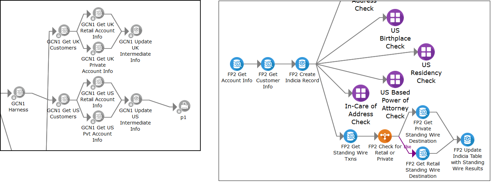
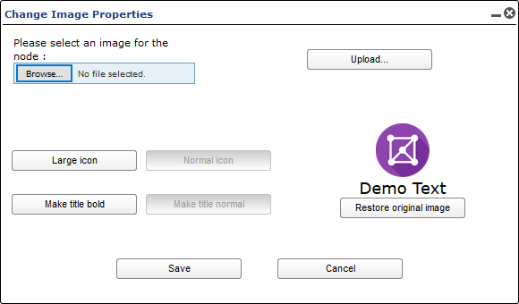

#Project Menu Commands and Functions
___
The Project Pneuron is the first Pneuron created and is the parent of the network. You define the name of the project by simply renaming the Project Pneuron. As you assign Pneurons to the network within the project, you identify this project as the associated project name.
Right-click the Project Pneuron to view the box shown below.

| **Project Menu Name** | **Description** |
|--|--|
| **Move to Panel** | Moves the project to a different Panel. |
| **Reset Position to 0** | Moves the project icon to the upper left corner of the design canvas. |
| **Expand** | **Expand for Edit** Shows all Pneurons and categories within the network with the ability to edit. **Expand for View** - Shows all Pneurons and Categories within the network, for viewing only. **Expand network and categories** - Shows all Pneurons within the network. All Categories are expanded. |
| **Refresh** | Restarts all Pneurons within the network. |
| **Reset Statistics** | Resets statistics for all Pneurons in the project. |
| **Change Image Properties** | Allows designers to change the icon and select a size and title preferences. |
| **Generic Error Handlers** | Allows the network designer to connect to a network (or networks) specifically for handling error conditions. |
| **Save** | Exports the entire network to an XML file. |
| **Copy Project** | Copies the entire network project. |
| **Rename and Description** | Change the name and description of the network. |
| **Delete** | Delete the network. |
| **User Variables** | Shows a list of the user variables used within the network. You can add, edit, and delete user variables for the network. |
| **Manage Categories** | Enables you to add, edit, and delete categories (groups of similar logical functions) of Pneurons within a project. |
| **Clear Debug** | Clears the debug entries from the system for the selected project. |
| **Configure Project Debug** | Presents a window where the designer can select which Pneurons within the project should create debug messages. |
| **Notification Events** | Enable/Disable logging of configured system Notifications for the project. |

###Move to Panel
The canvas area in Design Studio includes a feature that allows designers to create one or more working panels to assist with managing their work area. The first time you log in, you see only the default canvas tab titled Main Panel. All projects that designers create, or have permission to view, will be displayed on the Main Panel. Use the Move To panel option to open the Project in an existing working panel or create a new working panel.

Select an existing panel, or create a new one. Clicking New Panel will display an input box to name the new panel.

After you have made your selections, click the Move to this Panel button to move the project to that panel. Once a project has been opened in a panel, the project icon on the Main Panel will be displayed with an icon as shown below.

Refer to the Project Icons section in this document for additional information on other icons that can be displayed on the Project.

##Expand
Use this menu option to “open” a Project and view the Pneurons and connections for the Project. This command has several options:

- **Expand for edit** - Shows all Pneurons and categories within the network with the ability to edit.
- **Expand for view** - Shows all Pneurons and Categories within the network, for viewing only. The icons will be displayed greyed and with a lock symbol.
- **Expand network and categories** - Shows all Pneurons within the network. All Categories are expanded.

##Refresh
This command stops and restarts all the Pneurons in the Project on the Pneuron Server(s). This action will also reset statistics for all the Pneurons in the Project.

##Reset Statistics
The **Reset statistics** command resets all the statistics for all the Pneurons in the Project to zero. Statistics include counts of messages sent and received, in addition to execution times. Statistics for Pneurons are shown at the top of the Pneuron menu (right-click on any Pneuron).

This menu option allows the designer to reset the Statistics for the Pneuron to zero. Statistics can also be reset at the Pneuron level.

**Before/After**

##Change Image Properties

The **Change Image Properties** option presents the user with a dialog box that has options to change the attributes of the Project icon.

Designers can change the size of the icon and icon text using the buttons provided. To change the icon image, click the Browse button, navigate to the desired image file, and click Upload. Click Save to save the image properties and return to the canvas.

##Generic Error Handlers
This feature allows designers to connect Projects to one or more external Projects created for the purpose of handling error messages.

To create a generic error connection to another Project:

1. Within Pneuron Design Studio, right-click on the Project and select Generic Error Handlers. A configuration window appears.
2. Click the **Add New** button.
3. Click the **[Change Me]** value in the Project Name column. This will display a drop-down list of Projects. Select the appropriate project to be defined as the error handler project.
4. Double-click the **[Change Me]** value in the Pneuron Name column. This will display a drop-down list of Pneurons that can send error messages to the error handler project. Select the appropriate Pneuron.
5. Toggle the Always Call value to true or false. True means that all errors will be sent to the selected error network. False means that only errors that do not have another configured error branch within the network will be sent to the generic handler network.
6. Click **Close** and return to the canvas.

    

Click **Add New**, select values in the drop downs, click **Save**

##Project Save
You can export (Save) a Project to a specific location. The Project is saved as an XML file.
To export a Project:

1. Within Pneuron Design Studio, right-click on the Project that you want to export and select Save. A file directory window appears*.
2. Choose the file directory where you want to export the network and click Save. The Pneuron Project is saved to the designated directory. A downloads list appears.

    

    **NOTE:** If the file directory window does not appear, then your browser setting automatically saves downloads to a specific directory.You can change this browser setting so that you can manually specify where you want to save downloads each time.

3. Exit the Screen

##Copy Project
To model a new project from an existing project, you can copy a project. The copied project must have a unique name.

To copy a project:

1. Right-click on the project that you want to copy and select Copy Project.

    

    When copying a project, there are three options for setting the host for the copied Pneurons within the Project:

    - **Keep Original Hosts** – This option will use the same hosts as configured for Pneurons in the source Project.
    - **New Hosts for All Pneurons** – This option will allow the designer to select a new host for all copied Pneurons in the destination Project.
    - **Map original hosts to existing hosts** – This option will display the distinct hosts defined in the source project and allow the designer to replace the original host with a new host.

    **NOTE:** For Pneurons to be mapped to other hosts, the target hosts must be defined within Pneuron Administration.

2. Enter a name for the project in the New Name column (replace the [Change Me] value), enter a prefix for each Pneuron in the destination Project, and click OK. A dialog box appears, which asks if you wish to stop any running Pneurons on the project you are about to copy:

    

3. Click Yes to stop any running Pneurons.

4. Click OK on the confirmation message. The copied project appears on the canvas appended with the name entered in step 1.

    

##Rename and Description
Use this command to rename the Project or change its description.

Enter a new Project name and/or description and click **Save** to return to the canvas.

##Delete
The **Delete** command allows designers to remove the selected Project. Once selected, a confirmation dialog box appears to ensure that the delete operation should proceed. Once a Project has been deleted, it cannot be retrieved. All associated debugging messages are also deleted.

Multiple Projects can be deleted at the same time by holding **CTRL** and click/selecting multiple Projects, right-clicking and choosing the **Delete** command.

##Defined SQL Statements
Designers and administrators have the ability to create predefined SQL statements for use in Projects in Design Studio. This is useful when the designer wants to use SQL statements that have been created and tested for a particular requirement, versus creating the query from scratch. This feature also allows administrators to control access to queries. The **Defined SQL Statements** menu command displays the input and management window below:

1. From the Design Studio main menu, select **Actions** > **Defined SQL statements**.
The window will open in the default **Add New** mode.

    

    **TIP:** Delete Predefined SQL Statements by clicking the green 'X' icon.

2. Enter the appropriate data in the following fields and click Save.

    | **Field** | **Description** |
    |--|--|
    | **Name** | The name to associate with the defined SQL statement. |
    | **Sql Statement** | Enter the SQL statement you want to define. |
    | **DbSource Alias** | Select a data source alias to use for this defined statement. |

3. Click Close to exit the screen and return to the Canvas.

##User Variables
In order to employ global user variables, they must be defined in Design Studio and associated with the Project. This is done through the Design Studio User Variables screen.

1. Right-click on a Project and select User Variables from the box that appears.

    

    Enter the appropriate data in the following fields and click **Save**.

    | **Field** | **Description** |
    |--|--|
    | **Name** | The name to apply to the threshold. There cannot be any spaces in the name. |
    | **Project** | Select the project name associated with this threshold variable using the drop-down feature. |
    | **Type**  | Select one of the following entries: string, integer, long, float, date double, bigdecimal, boolean |
    | **Value** | Enter the value for the variable. |
    | **Network Use Only** | Select this checkbox if you want the defined user variable to be available ONLY to the associated Project, not any other Projects. |

3. Click Add New. Repeat Step 2 to add additional variables.

4. Click Close to exit the screen and return to the network.

After you have created one or more variables for your project, the Variable Cache Pneuron is used to bring the variables into the Network. Refer to the Pneuron Reference Guide for details on using additional Pneurons.

##Manage Categories
When you create a Project, you have the option to use categories. Pneuron categories represent groups of similar logical functions associated with Pneurons in a project.

For example, you can have a group of Pneurons that retrieve transaction data from various locations within your organization. You might establish a category for these Pneurons within the network as “Retrieve Data.” Then, you can assign these Pneurons to the Retrieve Data category. These Pneurons will be grouped together in the Retrieve Data category. Pneuron Categories appear as a different icon on the canvas. You can expand and collapse the categories to see all Pneurons within a category. You can also move Pneurons to different categories.

Pneuron categories are specific to the project; the category names cannot be transferred to other projects.

Use the **Manage Categories** menu command to create and manage categories for a Project.

**TIP:** To edit the name of a category, double-click the name.

1. Right-click on a project and select **Manage Categories**.
2. Click Add **New**.
3. Enter a name for the Category and press **Enter**.
4. Repeat Steps 2 and 3 to add additional categories.
5. Click **Close** to exit the screen and return to the Canvas.

The categories will be available when creating Pneurons in the Project.

##Clear Debug
This command deletes all debug messages in the system for the selected Project.

Refer to the Pneuron Configure Project Debug section for details on using the Debug Console Utility.

##Configure Project Debug
This command relates to integrated functions that allow designers to configure Project debug properties as well as a Debug Utility to assist with debugging projects.

There are two components in the system to assist designers with the debug process:

- Project Debug Configuration that allows the designer to set debug properties in a Project
- The Debug Utility used to display messages passed between selected Pneurons.

Refer to the Pneuron Configure Project Debug section for details on using the Debug Console Utility.

##Notification Events
This command enables or disables notification event logging for the Pneurons in the project. If enabled, notification events that have been activated within Pneuron Administration will be generated when the Pneurons in the selected Project are run.

Refer to the Pneuron Administration User Guide for details on configuring Notification Events.
