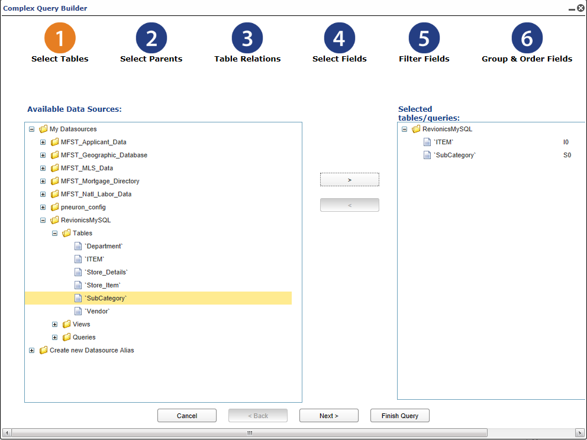
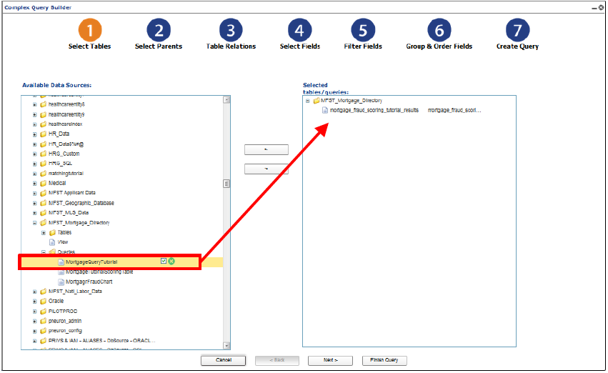
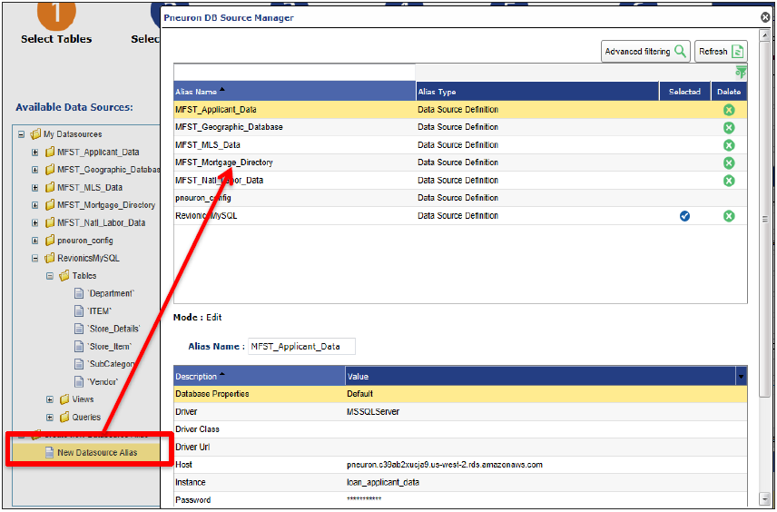
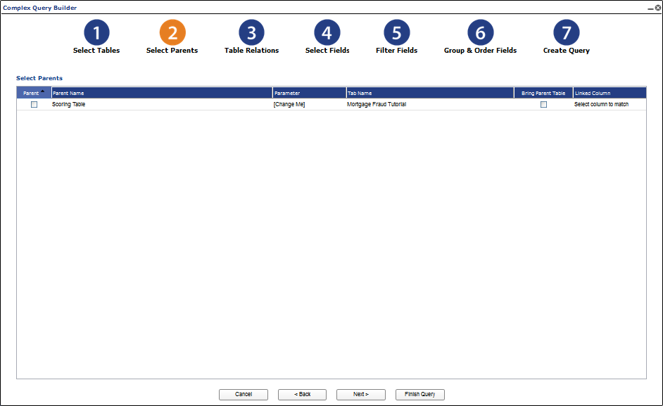
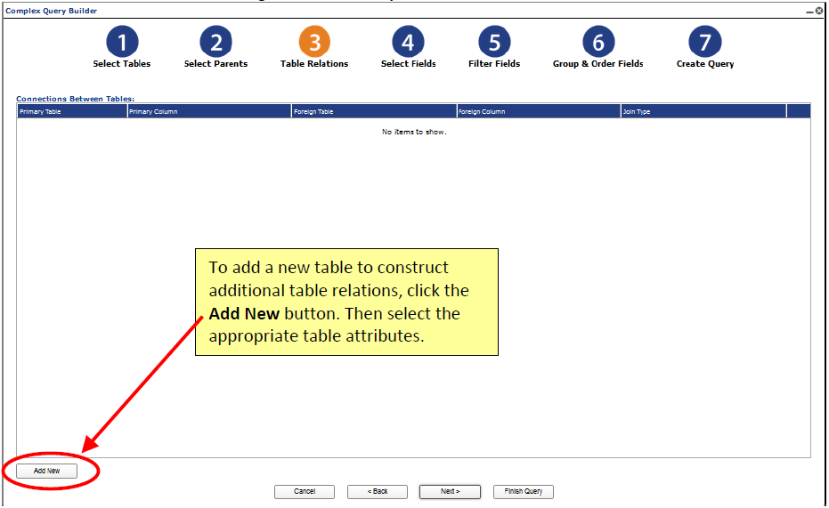
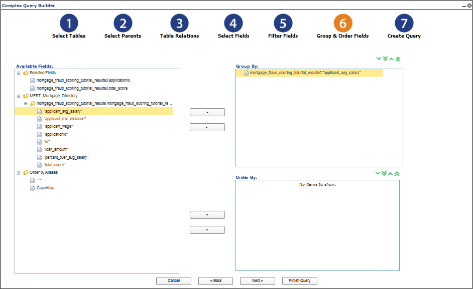
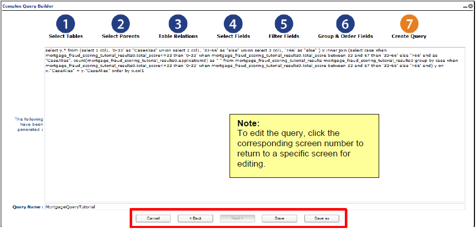

#Using the Report Builder
Pneuron Enterprise Control Manager™ contains a Report Builder used to extract information from various data sources, apply conditions and parameters to the data, and construct a query that will produce results via the ECM widgets. As you select and filter the data sources and fields, the Report Builder automatically creates a query that will generate data the widget will display. You can view and edit the query at any time during the configuration process. You can also manually construct predefined SQL queries for displaying results in widgets.

##Report Builder Configuration Process
The ECM Report Builder contains the following steps for configuring the widgets:

1. Select the data sources to include for the widget.
2. Select a parent widget (optional).
3. Select table relations (optional).
4. Select the table fields to include in the widget.
5. Filter the table fields.
6. Group the table fields (optional).
7. View and save the query for the widget.

##Step 1 - Selecting Data Sources
When configuring a widget, you must choose the data sources to include in this widget. The widget will retrieve and show data from the selected tables. The Select Tables screen allows you to choose specific data sources for the query that is being constructed.
To select a data source for the widget:

1. From the ECM dashboard, select the widget that you want to configure.
2. Click on the **Data Source** tab in the bottom right section of ECM. Select the data source name created for this widget and click the **Edit** button. The data source editor screen appears.
3. Click the Create/Edit Query button. The Select Tables screen of the ECM Report Builder is displayed. Additionally, the data source can be a predefined SQL query or SQL view.

   

There are four options for selecting a data source:

1. Select tables from an existing database
2. Create a new data source
3. Select an existing query to edit
4. Select an existing view to edit

###Selecting Tales From Database
1. From the Select Tables screen within the ECM Report Builder, expand a data source from the Available Data Sources box and select the tables from the databases to use for the query in this widget.
2. Click and drag the selected tables to the empty box on the right (or use the arrow button to move the fields).

    
3. Click Next. The Select Parents screen appears. Refer to the section Step 2 – Creating a Parent/Child Widget.

###Creating a New Data Source
To create a new data source:

1. From the Available Data Sources box within the Select Tables screen, expand the Create new Datasource Alias entry and select the option New Datasource Alias. The following dialog box appears.
2. Enter the appropriate data source values for the following fields and click OK.

    

  | **Property** | **Description** |
  |--|--|
  | **Alias Name** | The name to assign to this data source. |
  | **Database Properties** | The Environment where this data source’s details should be saved. For more information about alias environments, see the Pneuron Administration Guide. |
  | **Driver** | The type of database you are using for this data source (such as “Oracle”or “MSSQLServer”). Refer to **Driver Class** and **Driver URL** in this table. |
  | **Driver Class** | When **Custom Driver** is selected in the **Driver** field, then a value needs to be entered here, otherwise a default value is taken. |
  | **Driver URL** | When Custom Driver is selected in the Driver field, then a value needs to be entered here, otherwise a default value is taken. |
  | **Host** | Enter the hostname or IP address of the machine that the database server is running on (such as “localhost”). |
  | **Instance** | Enter the name of the database you are connecting to (such as “pneuron_config”). |
  | **Username** | Enter the user name for logging in to the database server. |
  | **Password** | Enter the password (associated with the Username property) used for logging in to the database server. |
  | **Port** | Enter the port number that the database server is using (such as “1433”). |
  | **Schema** | The schema associated with the data source. This is typically used with an Oracle database. |
  | **Throttle** | Enter the number of concurrent database connections the alias should use. Default is ‘0’, which will allow the Pneuron server to use the maximum number of allowable connections. |

  The new data source appears in the Available Data Sources box.

3. Expand the new data source and select the tables from the database you want to query in this widget.
4. Click Next. The Select Parents screen appears. Refer to the section Step 2 – Creating a Parent/Child Widget.

##Step 2 - Creating a Parent/Child Widget
This step is optional. You can create a secondary (child) widget whose data are based on a primary (parent) widget. For example, suppose you have a primary widget that displays age ranges for customers. A secondary widget can be created to display the income level for each age range shown in the primary widget.

After you select the tables and data sources for the widget in the ECM Report Builder, the Select Parents screen appears.

If you do not want to select a parent for this widget, click the Next button to proceed to the Table Relations screen.

To select a parent for a child widget:

1. On the **Select Parents** screen, select the widget name you want to designate as the parent. The value of the parameter associated with the selected parent widget will appear in the child widget.
2. Double-click the Parameter name to create a name for the associated parameter.
3. Click **Next**. The Table Relations screen appears.

##Step 3 - Selecting Table Relations
Within the ECM Report Builder, you can construct a relation between two or more tables within the query so data from multiple tables are joined into the current widget. You can select additional tables by using the **Add New** button.

1. From the Table Relations screen, select the appropriate table attributes for the following fields and click Save.

    | **Field** | **Description** |
    |--|--|
    | **Primary Table** | Select the table to use as the primary table for the relation. |
    | **Primary Column** | Select the column to use from the primary table you selected. |
    | **Foreign Table** | Select the table that you want to apply as the secondary relation to the primary table you selected. |
    | **Foreign Column** | Select the column that you want to apply as the secondary relation to the primary column you selected. |
    | **Join Type** | Choose how to join the tables – as “Inner” or “Left.” An Inner join creates a query results set based on matching the rows between the two joined tables and the where clause. A Left join creates query results by taking all records from the first (left) table and the matched records from the second table. |

2. Click Next. The Select Fields screen appears. Refer to the section Step 4 – Selecting Fields.

##Step 4 - Selecting Fields
After selecting the data sources and tables (and optionally, the parent widget(s) and relational tables), you must select the fields to display in the widget and choose the order they appear in the widget. The selected fields also appear in the query, which generates the data output for the widget.

1. From the **Select Fields** screen, click and drag the fields from the **Available Fields** box to the **Displayed Fields** box (or use the arrow buttons to move the fields). You can select multiple fields by using the **Shift** or **CTRL** key.
2. Select a field, enter the following appropriate field attributes, and click **Save**.

    | **Options** | **Description** |
    |--|--|
    | **Aggregate** | Select the aggregate function to apply to this field (such as None, Sum, Count, Average, Minimum or Maximum). |
    | **Function** | Choose the function for the selected field (such as Equal to, is between, Less than, Greater than). If you select “is between,” two additional fields - First Value and Second Value - appear. If the function only requires one value, then only a First Value field appears. |
    | **Value** | Enter the value based on the selected field function. |
    | **Alias** | | Enter a name for the field, if desired |

3. Repeat Step 2 to apply attributes to additional fields.
4. Use the green arrows to sort the fields in the order they should appear in the widget.
5. Optionally, select the check box next to a field to use that field as the legend in the widget. (This is typically used for pie charts.) Only one field can be defined as the legend.
6. Click Next. The Filter Fields screen appears. Refer to the section Step 5 – Filtering Fields.

##Step 5 - Filtering Fields
After selecting the fields to display in your widget, you can apply parameters, conditions, and additional functions to the fields to filter the data that will appear in the widget.

1. From the Available Fields box within the **Filter Fields** screen, select the fields to filter from the **Available Fields** box.
2. Click the right arrow button to move the fields to the **Filter Fields** box.
3. Optionally, you can create new conditions in the bottom right section. Configure a new condition and click the **Save** below the condition configuration.
4. From the **Filter Fields** box, select a field and enter the appropriate conditions, functions, and parameters. When you have completed the Filter configuration and are ready to proceed to the next step, click **Save**.

| **Filter Fields** | **Description** |
|--|--|
| **AND/OR** | The default value between conditions is “OR.” Select “AND” from the drop-down list if required. |
| **Condition** | Choose a condition to apply to the selected field. Alternatively, add a new condition by clicking the Add Condition button. |
| **Function** | Choose the function for the selected field, such as Equal to, Between, Less than, Greater than, etc. |
| **First Value** | Enter the value for the function you chose. |

###Adding a Condition
Within the **Filter Fields** screen, you can apply additional conditions for the selected field.

To add a condition to a field:
1. From the **Filter Fields** screen, select the field for which you want to add a condition and click the **Add Condition** button. A Condition field will appear in the Filter Fields box.
2. In the Condition, Function, and Value fields, enter the appropriate information for the selected field and click **Save**.
3. Repeat Steps 1 and 2 to add additional conditions for the selected field.
4. Click **Next**. The Group & Order Fields screen appears. Refer to the section Step 6 – Grouping Fields.
5. Optionally, you can click the **Add Condition** button to apply additional conditions for the selected field. Refer to the section Adding a Condition.
6. Click **Next**. The Group & Order Fields screen appears. Refer to the section Step 6 – Grouping Fields.

##Step 6 - Grouping Fields
After you apply conditions, parameters, and functions to various fields for the widget, you can specify how the information should be grouped and/or ordered for the widget.

1. From the **Available Fields** box, click and drag the fields you want to use to the **Group By** and **Order By** boxes (or use the arrow buttons to move the fields).
2. Use the green arrows to arrange the fields in the order that you want the information to be grouped or ordered by.
3. Use the gray arrows to indicate if the selected field should be sorted in ascending or descending order.
4. Click **Next**. The Create Query screen appears. Refer to the section Step 7 – Viewing the Query for the Widget.

##Step 7 - Viewing the Query for the Widget
Queries enable the widgets to retrieve the appropriate data and provide the results based on your selected data sources and how the conditions and functions were configured.

The Create Query screen enables you to view the query you have generated for the current widget. To edit the query, you must click the step number corresponding to the type of change you wish to make.

1. From the **Create Query** screen, view the query you have generated.
2. In the **Query Name** field, enter a name for this query.
3. Click **Save**. Then click **OK** to confirm and return to the ECM dashboard.
