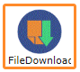
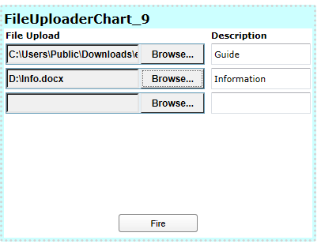

#Widget Descriptions
Widgets are visual charts, graphs, and gauges in various formats that represent the final output of data analysis based on the Pneuron networks configured in Pneuron Design Studio™. Widgets are configured through the Report Builder within Pneuron Enterprise Control Manager™.

The following tables provide a listing of the available widgets (**Basic**, **Extended**) in Pneuron Enterprise Control Manager™, along with a brief description, typical usage and example of each widget. Additional properties are listed for those widgets that have additional properties that are not common to all widgets.

Shapes (in the **Shapes** section on the left) can be used when the **Drawing** mode is enabled in the Display tab.

##Basic Widgets
___
### Stacked Area

The **Stacked Area** widget displays a set of points connected by a line, with the area below the line filled in with color. These area segments are usually stacked on top of each other, as in a stacked bar graph, so that the total size of the area for each category reflects the cumulative value of all data items in that category. Each data series in the graph corresponds to a colored segment of the total area. The first series is always the top area segment.

The Stacked Area widget is useful for:

- Showing group trends and comparing trends between individual data series (such as year-by-year trends in overall market penetration for a certain product type)
- Comparing values over time
- Displaying changes in cumulative value or percentage over time
- Comparing groups on outcome measurements
___
### Browser Image

 The **Browser Image** widget allows the user to display HTML data within the widget from a URL or custom script.
___
### Pie

The **Pie** widget compares parts to a whole and shows a percentage distribution. The entire pie represents the total data set and each segment of the pie is a particular category within the whole. The data must depict a ratio or percentage relationship and must always contain the same unit of measure.

The Pie widget is useful for:

- Conveying approximate proportional relationships (relative amounts) at a point in time
- Comparing part of a whole at a given point in time
- Emphasizing a small proportion of parts (exploded pie chart)

**Additional Properties:**

- DisplayScaleValues: Display the values of data.
___
### Donut

The **Donut** widget displays value data as percentages of the whole. Categories are represented by individual slices. Donut charts are functionally identical to pie charts.

___
### FileUploader

The **FileUploader** widget allows a user to upload a single or multiple files to a directory index.

___
### FileDownloader

The **FileDownloader** widget allows a user to download a single or multiple files.

___
### Dial Chart

The Dial Chart widget is a gauge that displays a single value as progress of a whole, taking the form of an arc of a circle. This circle is filled with the color of the range the value falls into.

The Dial chart work is useful for:

- Indicating performance
- Displaying completion thresholds

___
### FormChart

The **FormChart** widget allows the designer to set variables and toggle networks. Controls, forms or fields can be added with this widget.

Controls like text box, check box, drop down and button etc. can be added to the form chart in the Controls tab.

___
### HorizontalBar

The **HorizontalBar** widget shows relationships between different data series, where the height or length of the bar represents the measured value or frequency. The Bar widget is useful for comparing data.

**Additional Properties:**

- DisplayScaleValues: Display the values of data.
___
### Line

The **Line** widget is used to connect the data points that you plot.

The Line widget is useful for:

- Showing trends
- Identifying correlations between variables
- Displaying long data rows

**Additional Properties:**

- DisplayScaleValues: Display the values of data.
___
### Line Bar Combo

The LineBarCombo widget provides both bars and lines similar to bar graph and line graph. Lines and bars can have different value scales, one on the left and one on the right side of the graph.

**Additional Properties:**

- DisplayScaleValues: Display the values of data.
___
### Step Line

The **Step Line** widget is similar to the Line widget, but it does not use the shortest distance to connect two data points. Instead, this chart uses vertical and horizontal lines to connect the data points in a series, forming a step-like progression.

The Step Line widget is useful for:

- Showing trends
- Identifying correlations between variables
- Displaying long data rows

**Additional Properties:**

- DisplayScaleValues: Display the values of data.
___
### Table

The **Table** widget shows raw data for each defined category and consists of multiple columns and rows with quantitative or qualitative entries, similar to a spreadsheet analysis.

This widget is useful for showing data comparisons. For large data sets, you can paginate the results using the **Page Size** option in the chart properties.

**Additional Properties:**

- RowHeightType: Fixed or Auto.
- RowHeight: The height of the row.
- PageSize: The number of items per page.
___
### Vertical Bar

The **VerticalBar** widget shows relationships between different data series, where the height or length of the bar represents the measured value or frequency. This Bar widget is useful for comparing data.

**Additional Properties:**

- DisplayScaleValues: Display the values of data.

##Extended Widgets

___
### Radar

The **Radar** widget displays data values circling around a central point, which represents zero. Higher data values are farther from the center point. The radial grid is not circular, but an equilateral polygon, with each category plotted at a vertex of the polygon. Thus, three categories create a triangular grid; eight categories create an octagonal grid. There must be at least three categories to populate a Radar graph. The area inside of the polygon for each series is colored translucently. This coloring makes it easier to see the total "size" of a data series, but still be able to see the other data series in the graph.

The Radar widget is useful for showing mathematical and statistical applications.

**Additional Properties:**

- DisplayScaleValues: Display the values of data.
___
### Timeplot

The **Time Plot** widget displays the relationship of two data series on a coordinate plane, marked by points, and a third data series that influences the size of the point. It allows you to compare three variables at once: one is on the x-axis, one is on the y-axis, and the third is represented by the area size of the bubbles.

The Time Bubble widget is useful for:

- Showing values at irregular intervals, such as sampling data at random times
- Showing trends or cyclical variations
- Displaying money distribution over time
- Showing production or price variation over time
- Identifying environmental changes over time

**Additional Properties:**

- DisplayScaleValues: Display the values of data.
___
### XY

The XY widget (also called a scatter chart) displays data points in the chart space according to the X and Y values for the value series. Values typically contain non-aggregate expressions and are represented by the position of the point in the chart space. Categories are represented by different points in the chart.

The XY widget is useful for:

- Comparing distinct values across categories
- Plotting data pairs
- Identifying relationships between large data sets
- Identifying trends in large data sets

**Additional Properties:**

- DisplayScaleValues: Display the values of data.

#Shapes
To use shapes from the Shapes section on the left, click Display > Drawing > Enable.

To delete a shape, right-click the shape and then click the Delete button that appears.

The figure below shows an example where shapes are used to add a description to the chart.

___
###  Triangle

The Triangle shape can be added to the dashboard where required. It can be used to create shapes or diagrams in addition to a chart.

**Dashlet Properties:**

- Line Color: Color of the line or border of the shape
- Line Width: The width of the line
- Rotation Angle: Rotation angle of the shape
- Gradient: Type of gradient to fill the shape – none, Simple, Linear, Radial

The following settings depend on the type of gradient chosen.

- Start Color – Start color for the gradient
- First Stop Color – First stop color for the gradient
- Second Stop Color – Second stop color for the gradient
- End Color – Last or end color of the gradient
- X1, Y1, X2, Y2, R: Angle or area of each color used in the gradient
- Direction: Direction of color used in the simple gradient
___
### Curve

The Curve shape can be used as required on the dashboard. It can be used to create shapes or diagrams in addition to a chart.

**Dashlet Properties:**

- **Line Color:** Color of the line or border of the shape
- **Line Width:** The width of the line
- **Gradient:** Type of gradient for the curve – none, Simple, Linear, Radial

The following settings depend on the type of gradient chosen.

- **Start Color** – Start color for the gradient
- **First Stop Color** – First stop color for the gradient
- **Second Stop Color** – Second stop color for the gradient
- **End Color** – Last or end color of the gradient
- **X1, Y1, X2, Y2, R:** Angle or area of each color used in the gradient
___
### Line Path

The Line Path shape can be used to draw arrows with different attributes.

**Dashlet Properties:**

- **Line Color:** Color of the line or border of the shape
- **Line Width:** The width of the line
- **Gradient:** Type of gradient for the curve – none, Simple, Linear, Radial

The following settings depend on the type of gradient chosen.

- **Start Color** – Start color for the gradient
- **First Stop Color** – First stop color for the gradient
- **Second Stop Color** – Second stop color for the gradient
- **End Color** – Last or end color of the gradient
- **X1, Y1, X2, Y2, R:** Angle or area of each color used in the gradient
___
### Oval

The Oval shape can be used to draw oval or round shapes on the dashboard. It can be used to create shapes or diagrams in addition to a chart.

**Dashlet Properties:**

- **Line Color:** Color of the line or border of the shape
- **Line Width:** The width of the line
- **Gradient:** Type of gradient for the curve – none, Simple, Linear, Radial

The following settings depend on the type of gradient chosen.

- **Start Color** – Start color for the gradient
- **First Stop Color** – First stop color for the gradient
- **Second Stop Color** – Second stop color for the gradient
- **End Color** – Last or end color of the gradient
- **X1, Y1, X2, Y2, R:** Angle or area of each color used in the gradient
___
### Rectangle

The Rectangle shape can be used to draw square or rectangle shapes on the dashboard. It can be used to create shapes or diagrams in addition to a chart.

**Dashlet Properties:**

- **Line Color:** Color of the line or border of the shape
- **Line Width:** The width of the line
- **Gradient:** Type of gradient for the curve – none, Simple, Linear, Radial

The following settings depend on the type of gradient chosen.

- **Start Color** – Start color for the gradient
- **First Stop Color** – First stop color for the gradient
- **Second Stop Color** – Second stop color for the gradient
- **End Color** – Last or end color of the gradient
- **X1, Y1, X2, Y2, R:** Angle or area of each color used in the gradient
___
### Line

The Line shape is used to draw lines where required.

**Dashlet Properties:**

- **Line Color:** Color of the line or border of the shape
- **Line Width:** The width of the line
- **Line Cap:** Shape of endpoints for an open path
- **Line Cap Style:** The type of line – Solid, Dot. Dash etc.
___
### Image

The Image shape can be used to add an image to the dashboard.

**Dashlet Properties:**
- **Rotation angle:** The slider is used to set the rotation angle of the image
- **Image URL:** The URL of the image to be inserted
___
### Label

The Label shape is used to add a label to the dashboard in addition to the chart or separately.

**Dashlet Properties:**
- **Text Color:** Color of the label text
- **Rotation angle:** The slider is used to set the rotation angle of the label text
- **Text:** The text for the label
- **Font Size:** Font size of the label text
___
