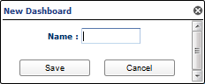
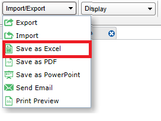

#Working with Dashboards

Prior to creating charts and graphs (also called widgets), you must create a new Dashboard. A Dashboard is a collection or container for all the widgets and tabs that will display graphical output from the data analytics gathered either in the individual widgets or from data accumulated as a result of a Pneuron Design Studio™ network.

##Creating Dashboards
Before widgets are created, you must create the Dashboard where the widgets will reside.

To create a new Dashboard:

1. From the Actions menu, select Add New Dashboard.

    

2. Enter a name for the new Dashboard and click Save. A new dashboard and tab appears with the new name.

##Deleting Dashboard

To delete a dashboard and all widgets within it:

1. Select the Dashboard you want to delete and click Delete Dashboard under the Actions menu. A Dashboard can also be deleted by selecting the Dashboard and pressing Delete.
2. Click OK to confirm the deletion.

##Importing A Dashboard XML File

Pneuron ECM dashboards are saved as XML files during the export process. You can import a specific dashboard into the ECM using the Import/Export option on the main menu. Pneuron dashboard imports also include all related information resources, including data sources, user variables, and network toggle configuration.

To import a dashboard:

1. From the Top Level Navigation Import/Export menu, select the Import option.

    

2. Click **Browse** to select an XML file that contains a Dashboard file. Click **Open** to populate the field.

    

3. Click Upload. The imported dashboard appears on the canvas.

##Exporting a Dashboard As A Pneuron XML File
Dashboards can be exported for archival purposes or for facilitating promotion to other environments. Pneuron dashboard exports include all related information resources, including data sources, user variables, and network toggle configuration.

To export a dashboard:

1. From the Top Level Navigation Import/Export menu, select the Export option.

    

2. In the event a dashboard has not been saved, a pop-up window will be displayed prompting you to save the ECM dashboard. Click **Yes** to confirm saving the dashboard before exporting.

    

    **Export Pop Up Window**

      

3. Select Save File and click OK. A file directory window appears*.
4. Choose the file directory where you want to export the dashboard and click Save.

##Exporting Dashboard to Excel
To export a dashboard to Excel:

1. Select the dashboard from the top-level navigation menu.

   

2. From the Top Level Navigation Import/Export menu, click the Save as Excel option. You will be presented with the Export Data menu. Each tab in the current dashboard will be shown as an option for export, along with each widget and its data source. A widget must have its data source exported for the widget to be exported.
3. For Table Widgets, exporting to PDF, PowerPoint or Excel will only export the visible number of rows selected. You can increase the page size or export multiple pages as desired.

    

    Select Dashboard and tabs for excel

    
