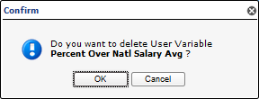

#Working With Widgets

After a dashboard has been created, you can start creating widgets (graphs and charts) to visually represent the generated data from the analytics configured within Pneuron Design Studio™ and Pneuron Administration. You can choose from 25 different widgets to represent real-time results, including bar and pie charts, tables, area graphs, radar, box plot, stock charts, heat maps, and many others.

##Creating Dashboard Widgets

###Dragging a Widget Onto the Dashboard
Start by dragging a widget onto the dashboard.

###Deleting a Widget
To delete a widget and all of its configurations:

1. Select the widget you want to delete and click the X button in the widget title bar if the show buttons property is checked or right click the widget, and select Delete Widget. Additionally, you can highlight the widget by clicking on it and using the Delete key.
2. Click OK to confirm the deletion.

##Configuring a Widget

###Review of Widget

| Property | Description |
|--|--|
| **Title** | Enter or update the title of the widget |
| **Show Title** | Show the title of the widget in the text box. |
| **Show Buttons** | Toggle on or off the action buttons on the widget. |
| **Set as Inner Child** | Define a child widget relationship with another widget as inner child. In View mode the inner child widget will not be visible. When you make a selection in the parent widget, the inner child widget is displayed and parent widget is hidden. |
| **Height** | Enter the height for the selected widget. Also, the height can be adjusted by dragging the bottom margin of the widget. |
| **Width** | Enter the width for the selected widget. Also, the width can be adjusted by dragging the right margin of the widget. |
| **Column Numbers** | You can divide the widget into multiple columns. This is useful when you have many data sources and need to display each chart in a separate column. The default setting displays each chart as a separate line. |
| **WidgetColor** | Change the background color of the |
| **Fire On Click** | Set a network to fire when a data element is clicked on the widget. Available on specific widgets. |
| **Toggles** | Select the network toggle to fire. Available on specific widgets. |
| **Display warning message** | Display a warning message before firing the network. Available on specific widgets. |
| **Message** | Customize the warning message. |

###Review of Widget Properties

| **Property** | **Description** |
|--|--|
| **Refresh Timer** | Sets the time interval to re-execute the query and refresh the chart widget. |
| **Timer Type** | Sets the time interval in the refresh timer to seconds, minutes or hours. |
| **Type** | Select a pre-defined chart template. |
| **Chart Title** | Enter and update the chart title for the selected widget. |
| **Chart Title Font Color** | Enter and update the chart title font color for the selected widget. This can be a typed in hex color code or selected from the color picker on the right side of the input box. |
| **Chart Title Position** | Position of the title of the chart. |
| **Chart Title Font Color** | Set the color of the font used in the chart title. |
| **Chart Title Font Size**  | Configure the font size for the chart title. |
| **Value Font Size** | Configure the font size of the values in the chart. |
| **Category Font Size** | Configure the font size for the category used in the chart. |
| **Category Font Color** | Set the color of the font used for the category. |
| **Alpha Color Filter** | Sets the degree of transparency (or opacity) of a color. |
| **Legend Position** | Position of the legend in the chart. |
| **Legend Width%** | Percentage of the total widget dedicated to the legend section of the widget. |
| **Legend Title** | Sets a title for the legend. |
| **Background Color** | Set the background color of the widget. This can be a typed in hex color code or selected from the color picker on the right on the input box. |
| **DisplayScaleValues** | When this checkbox is selected, the labels for the X and Y axes are displayed. |

##Configuring a Widget
To configure a widget:

1. Drag a widget into the dashboard tab. Reference the previous section Dragging Widgets onto the Dashboard.
2. Enter the name of the widget in the **Title** field
3. In the **Chart** section of the widget, enter the appropriate properties for each field, such as refresh rate, font color and size for titles or labels and background attributes. These settings apply to this widget only. Reference the previous section Review of Widget Properties - Chart.
4. From the **Actions** menu, click **Save**.
Now you can connect this widget to the data that was produced by a network in Pneuron Design Studio™.
5. Refer to next section - Applying a Data Source Name to the Widget.

##Applying a Data Source Name to the Widget
After the appearance attributes for the widget have been selected, you can apply a data source name to the widget for easy reference. This name is the alias used to identify the data source (not the actual data source name).

1. Click on the Data Source tab in the bottom right section of ECM.
2. Double-click on the default data source name and enter the alias name for the data source.
3. Click the Edit button. Next, click Create/Edit Query to access the Report Builder.

    

Now you can start using the Report Builder to retrieve the source data, apply conditions and parameters to fields, and generate the associated automated query that will produce the results in your charts.

##Editing Widet Data Sources
You can add, edit, and delete data sources associated with a particular widget.

To edit a widget data source:

1. From the dashboard, select the widget whose data source you want to edit.
2. Click on the Data Source tab in the bottom right section of ECM. A list of the data sources appears for the widget.

    

3. Click the Edit button to modify the data source as needed.
4. Click Save to save your settings.

##Editing Widget Data Source Groups
You can add, edit, and delete data source groups associated with a particular widget.

To edit a widget data source group:

1. From the dashboard, select the widget containing the data source group to edit.
2. Click on the **Data Source Group** tab in the bottom right section of ECM. A list of the data source groups appears for the widget.

    

3. Click the Edit button to modify the data source group as needed.
4. Click Save.

##Editing Widget Colors
You can edit the colors of the bars, pie pieces, and other data representation colors within a widget.
To edit the colors within a widget:

1. From the dashboard, select the widget you want to edit.
2. Click on the Color tab in the bottom right section of ECM. The Chart field displays the currently selected widget.

    

3. Click either the Color tab in the bottom right section or the arrow to present the menu list. The colors will be presented based on the chart.

    

4. Click on the color to select options.

    

5. Refresh the widget and note the changed colors. Use **More** to define custom colors.

    

##Editing Widget Appearance Properties
To edit widget appearance properties:

1. Select the widget you want to edit and make the appropriate changes in the widget property fields.
2. From the Actions menu, click Save to save your settings.
3. Click the Refresh button in the widget title bar for your widget property changes to take effect.

##Creating a Parent for a Widget
You can make the current widget a parent or child widget. The data displayed by the child widget is built on the data selection of the parent widget. This tab allows you to perform the same steps as in the Select Parents screen within the Report Builder Step 2.

To create a parent widget for the current widget:

1. From the dashboard, select the widget that will be the child widget.
2. Click the Select Parent tab in the bottom right section of ECM. A list of the parent widgets will be shown.

    

3. Click the check box next to the name of the widget to designate it as the parent of this child widget.
4. Double-click the parameter for the selected parent widget and change the name of the parameter to match the name within the current query for the current widget.
5. From the Actions menu, click Save to save your settings.

##Managing Widgest Variables
###Overview
User variables provide a flexible configuration mechanism for dashboards to display variable controls associated with a Pneuron Design Studio network. The ECM user accesses the user variables by flipping the widget to present a slider or text box on the back of the widget. Changing a slider changes the value of the assigned variable. The Variable Cache Pneuron is used in the Network to retrieve the values of all user variables and inserts them into the message for subsequent processing within the Pneuron project. In order to use a user variable on the back of a widget, it must be created and configured in the User Variables section of Design Studio and associated with a Pneuron Project. See **Pneuron Design Studio User Guide** for more information on creating and managing User Variables and Networks.

###Exposing Network User Variables
To expose user variables on the back of a widget:

1. Click on the User Variable tab in the bottom right section of ECM.

    

2. Click the Add New button to add a new user variable. A new row will appear within the listing. Enter a name for the new user variable.

    

    Click the **Edit** button for the new user variable. The New User Variable Editor Window will be displayed.

    

3. Select a value from the What If Project drop-down to apply the user variables (if being used).
4. Select a value from the What If Name drop-down to associate with the user variable (if being used).
5. Select a project from the Pneuron Project drop-down that the ECM user variable will be linked with for processing.
6. Select a value from the Pneuron Variable drop-down to map to the ECM user variable.
7. Click MinValue up/down icons to set the minimum value range for the user variable.
8. Click MaxValue up/down icons to set the maximum value range for the user variable.
9. Select the slider type in the Slider Type drop-down. That values are Integer Values and Floating-Point Values.
10. In the Slider Step field, set the step count for the slider.
11. Select the Is text check box if the user variable should appear in a text box instead of a slider bar. This option is used with alphabetic entries. The slider is typically used for numeric values or ‘what-if’ analyses.
12. Include in XML adds the variable to the XML when the Fire button is clicked.
13. Select the target data source to be applied from the Select Datasource drop-down list (if being used).
14. Select the value to match to the parameter (if being used).
15. Click the Save button to complete the user variable modifications.

###Modify User Variables
To modify user variables:
1. Click on the User Variables tab in the bottom right section of ECM.
2. Click the Edit button for the selected user variable.

3. Perform the updates to the selected fields.
4. Click the Save button to complete the user variable modifications.

###Deleting User Variables
To delete user variables:

1. Click on the User Variables tab in the bottom right section of ECM. Click the green X to delete the selected user variable. A delete user variable confirmation popup window will be displayed.

    

2. Click the OK button. The user variable will be deleted.

    

##Managing Toggle Network Functions
###Creating Toggle Network Functions

To create toggle network functionality:

1. Click on the **Toggle Network** tab in the bottom right section of ECM.

    

2. Click the **Add New** button to add a new **Toggle Network**. A new row will appear within the listing. Enter a name for the toggle network.

    

3. Click on the **Edit** button. The Toggle Network Editor pop-up window will be displayed.

    

4. Select the Pneuron Project and associated Pneuron within the network.
5. In the **Label** field, enter a label name.
6. Select the **Show name** checkbox to display the label specified.
7. Click the **Save** button.

###Modifying Toggle Network Functions

To modify existing toggle network functions:

1. Click on the **Toggle Network** tab in the bottom right section of ECM.
2. Click on the **Edit** button for the selected Toggle Network function.
3. Update the information in the Toggle Network Editor. Click the **Save** button.

###Deleting Toggle Network Functions

To delete an existing toggle network:

1. Click on the **Toggle Network** tab in the bottom right section of ECM.
2. Click the green **X** for the selected Toggle Network.
3. A delete Toggle Network confirmation Popup window will be presented
4. Click the **OK** button.
5. The Toggle Network will be deleted.

###Applying User Variables and Toggle Network Functions
You can easily apply additional user variable and parameter conditions, functions and values to the widget without having to return to the Filter Fields screen of Report Builder. This also allows you to see immediate results on the widget for real time data analysis.

Changes to user variables and parameters in Pneuron Enterprise Control Manager™ automatically update the same user variables and parameters within Pneuron Design Studio™.

To edit widget user variables or parameters:

1. From the ECM dashboard, select the widget you want to edit.
2. Click Flip Widget in the widget title bar to view the back of the widget. A list of parameters/user variables appears for each field identified as a user variable or parameter that was configured in the **Filter Fields** screen in the Report Builder.

    

      

3. Drag the slider parameters to the desired values. Click the gear icon to flip to the front of the widget.

    

    Another way to edit user variables is the following.

1. From the dashboard, select the widget you want to change.
2. Click the User Variable tab in the bottom right section of the screen.
3. Click the Edit button. The User Variable Editor appears.

    

4. Enter the appropriate user variable attributes for the following fields and click Save.

    

    | **Properties** |   |
    |--|--|
    | **Whatif Project** | Select the name of the Project to use to perform a “what if” scenario. When you change the value of the user variable, the selected project will be fired with the value from the user variable starting from the Whatif Pneuron. |
    | **Whatif Name** | Select the name of the first Pneuron in the What If network. |
    | **Pneuron Project** | Select the name of the project that contains the user variable to attach to the text box or slider. |
    | **Pneuron Variable** | Select the name of the user variable to use. |
    | **Min Value** | Enter the minimum value for the user variable. |
    | **Max Value** | Enter the maximum value for the user variable. |
    | **Slider Type** | Set a slider type here with a value as either Integer or Floating-Point. |
    | **Slider Step** | Set the step count for the slider. |
    | **Is Text** | Select this check box if you want the user variable to appear in a text box instead of slider bar. This option is used with alphanumeric entries. The slider bar is typically used for a number or “what if” analysis. |
    | **Include in XML** | Select this box to include the variable in XML message. |
    | **Select Data Source** | Select the appropriate data source for the user variable. |
    | **Match to Parameter** | Select the parameter name within the widget to link with the user variable, if desired. When you select a parameter for this field, the query will execute with the parameter value. However, when you change the parameter value, it will automatically change the user variable value. This option is used for text boxes. |

5. Click the Flip button in the widget title bar to return to the front of the widget.

##Firing a Network
###Creating a **Network Execute** Button
The ECM allows you to create a Network Execute button so you do not have to access Pneuron Design Studio™ to fire a network. This button allows you to observe changes to the data in real time.

To fire a network:

1. From the dashboard, select the widget connected to the network you want to fire.
2. Click on the **Toggle Network** tab in the bottom right section of ECM and click the **Add New** button. The Toggle Editor appears.
3. Enter a name for the **Toggle Network** and press **Edit**.

    

4. Enter the appropriate attributes for the following fields and click Save.

| **Fields** | **Descriptions** |
|--|--|
| **Project** | Select the Project containing the network to be fired. |
| **Pneuron** | Select the first Pneuron within the network. |
| **Label** | Enter a label in this field, for example, Fire. |
| **Show name** | Select this checkbox to display the label entered in the Label field. |

The back of the widget will show a Fire button under the Network Controls section. You can click this button to manually fire the network.

###Seeing the Results in Real Time
After creating the widgets, apply user variables to those widgets and create a **Network Execute** button. You can immediately see the changes in the widgets as the data is changed. This also enables all associated parent/child widgets in the dashboard to immediately reflect the different values you assigned.

1. Click the **Flip Widget** button in the widget title bar to view the back of the widget.

2. Use the slider bar to change the variable thresholds.
3. Click on the Fire button to execute the network. The button will briefly change color and indicate Firing.
4. Click the Flip Widget button in the widget title bar to view the front of the widget, showing the changes made to the data based on the new user variable values.

