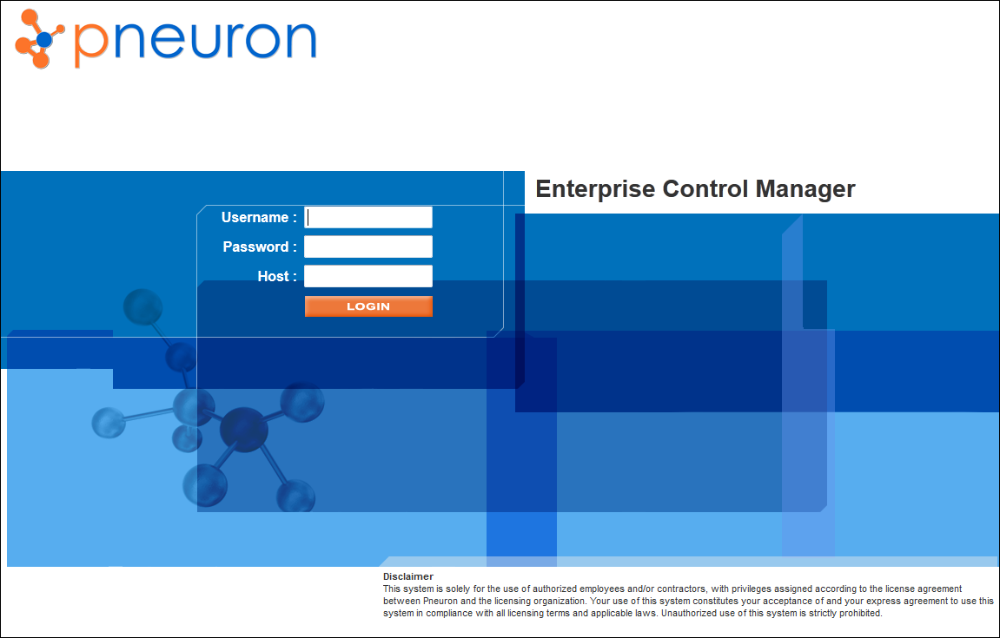

#Pneuron Enterprise Control Manager Overview

The Pneuron Enterprise Control Manager™ (ECM) application enables users to view generated data analyses via “widgets” (bars, graphs, and charts) based on query output and network configurations within Pneuron Design Studio™ and Pneuron Administration.

ECM offers real time visualization dashboard and analytical capabilities that are easily configured and managed using a visual and graphical toolset. Additionally, you have the ability to define variables and thresholds, and link these features to the Pneuron Projects. By combining the thresholds and Pneuron Projects, you can perform real-time what-if evaluation and change the underlying process model based on experimentation and refinement. The tools are intended for business-level analysts and do not require programming knowledge.

Users can select from over 25 different types of widgets to display data output. Widgets are configured using the Report Builder within ECM. The Report Builder enables you to build an automated query that generates the data output for the widgets based on the selected data sources, filtered fields, assigned conditions and parameters to the fields.

The widgets also provide the Dashboard designer the ability to easily modify conditional and user-defined variables, observe the changes in business value drivers in real time, and configure and visualize intelligence and analytics in real time. Each widget is also aesthetically customizable with colors, size, fonts, and overall appearance attributes.

The Pneuron Enterprise Control Manager is part of the Pneuron Application Suite, which consists of Pneuron Design Studio™, Pneuron Administration, and Pneuron Enterprise Control Manager™ (ECM).

The Pneuron applications run on a web server and operate in a thin client configuration.

##ECM Operations Process
The following list shows the standard process flow typically used when creating dashboards in the Pneuron Enterprise Control Manager™.

1. Create a dashboard to contain the widgets.
2. Select widgets and configure their appearance attributes.
3. Use the Report Builder to select data sources, filter fields, assign conditions and parameters to the fields, and view or edit the automatically generated query for the widgets.
4. Assign a query to the widget.

##Starting The Enterprise Control Manager
To access Pneuron Enterprise Control Manager™, perform the following steps:

1. Start the Pneuron Server.
2. Start the web server.
3. Start the Pneuron Enterprise Control Manager™ application.

###Opening Pneuron ECM - All Platforms
After starting the Pneuron and web servers, you can start Pneuron Enterprise Control Manager™.

1. Open a web browser.
2. In the address field, type the hostname or IP address and port number of the web server, followed by the name of the Pneuron ECM directory created during the installation process (such as “/ecm”). If the web server is installed on a remote machine, enter the IP Address or host name, port number and name of the Pneuron ECM directory created during installation, such as http://192.168.10.197:8080/ecm. If the web server is installed on the local machine, enter localhost:port number and name of the Pneuron ECM directory you created during installation, such as http://localhost:8080/ecm.

    **The Pneuron Enterprise Control Manager™ Login screen appears.**

    

3. Enter your Username, Password, and Host location for Pneuron Enterprise Control Manager™. Then click Login. The Pneuron Enterprise Control Manager™ page appears.
