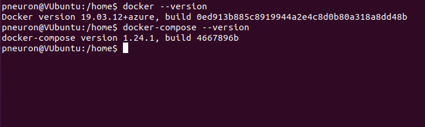
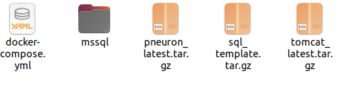
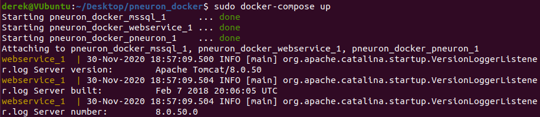
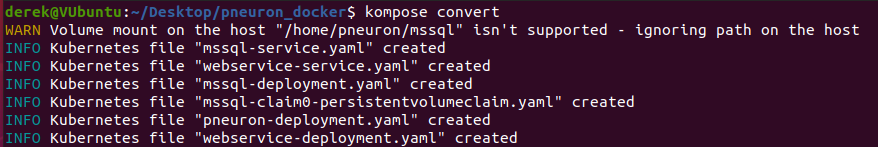

#Docker Installation
The following is about how to install Pneuron in a environment capable of handling docker images such as Kubernetes, Azure Container Groups, and on Linux VM instances.

##Pneuron Installation Introduction

This manual is intended as a reference guide for the correct installation of the Pneuron Application Suite, version 2.0 and the required third-party components. The instructions assume the person performing the installation is experienced in the administration of databases and other server-side applications.

##Prerequisites

The Pneuron Applications Suite requires that appropriate hardware and third party applications have been installed prior to installing the Pneuron applications.  The customer must configure the hardware and set up the environment before installing the Pneuron applications.

###Minimum Hardware Requirements

For installation of the Pneuron Application Suite, Pneuron recommends the following minimum system requirements:

- 16 GB Memory 
- 50 GB Hard disk
- 2-Quad core CPUs 

The requirements above are typical of a Pneuron test environment deployment. 

###Production Hardware Requirements

A typical production installation would consist of a 3-tiered environment with the following minimum configuration. Dockerized Pneuron includes each of the following.

Pneuron server

- 16 GB Memory
- 50 GB Hard disk
- Quad core Intel CPU 

Web server

- 16 GB Memory
- 50 GB Hard disk
- Quad core Intel CPU

Database Server

- 32 GB Memory
- 50 GB Hard disk. Disk size may need to increase if third party databases are deployed.
- 2-Quad core Intel CPUs 

> Please note that these values are a set of minimum recommendations.  As more information about the implementation becomes available, a better understanding of hardware requirements will evolve.  Actual requirements will vary based on your system configuration, message or transaction volume and the type and complexity of the Pneuron networks.'

###Required Software Components

The Docker Installation has all required software components included. The environment must be configured to allow docker and docker-compose modules.

###Pneuron Web Application Description

The following table describes the web applications contained in the Pneuron Application Suite.

| Web Application                          | Description                                                                                                                                          |
|------------------------------------------|------------------------------------------------------------------------------------------------------------------------------------------------------|
| Pneuron Design Studio                    | Enables configuration of Pneurons, Pneuron Networks, data sources, data acquisition, business rules, intelligence analytics and supporting artifacts |
| Pneuron Administration                   | Enables configuration of user permissions, roles, module access and data source access as well as participating hosts and realms.                    |
| Pneuron Enterprise Control Manager (ECM) | Enables users to configure and visualize intelligence and analytics, and interact directly with targeted networks in Pneuron Design Studio.  

###Access to the Customer Environment

Prior to performing the deployment of the dockerized Pneuron applications we would need access credentials required for installation. For example, administrator credentials for the servers.

##Deploying Dockerized Pneuron On a Linux VM

1. The environment must be prepared before deployment. This would mean you installed docker and docker-compose libraries to the VM. You can use the latest version of these applications.

    

2. Download the Pneuron Docker kit. You will get the following files. A docker-compose yaml file containing the configuration for deploying the three docker images needed to have a fully functioning pneuron instance. It will also contain the deployment and config yams for each of the three application. The tarballs are the config database, the web server, and the pneuron server. 
   
    
	
3. Now open the terminal and change directory to the wherever the pneuron docker kit is. Now load each tarball into docker. Use the following commands.

    - `sudo docker load < tomcat_latest.tar.gz`
	- `sudo docker load < sql_template.tar.gz`
	- `sudo docker load < pneuron_latest.tar.gz`

4. Then run the command `sudo docker-compose up`. If the environment is set up appropriately then this should launch the web server, config database, and Pneuron server. You should see the following when you execute the command.

    

    > Once the images are fully up and running you can access the Pneuron UIs at the following hosts.

    - DS: http://[IP address of docker host]/ds
    - ECM: http://[IP address of docker host]/ecm
    - Admin:  http://[IP address of docker host]/admin

##Deploying Dockerized Pneuron In Kubernetes

1. The environment must be prepared before deployment. This would mean you have a Kubernetes cluster and the Kompose application installed needed to convert the docker images into Kubernetes resources. You can use the latest version of these applications.

2. Open the terminal and change directory to the Pneuron docker kit to where the docker-compose.yml file is.

3. Run the following command `kompose convert`. This will convert the docker-compose.yml into files that can be used by Kubernetes. 

    

4. Run the command `sudo kubectl apply -f mssql-service.yaml,webservice-service.yaml,mssql-deployment.yaml,mmsql-claim0-persistentvolumeclaim.yaml,pneuron-deployment.yaml,webservice-deployment.yaml` and check your Kubernetes cluster for your newly deployed containers.

##Deploying Dockerized Pneuron In Azure Container Groups

1. To deploy the dockerized pneuron to Azure you must follow the steps on deploying it on a [linux vm](#deploying-dockerized-pneuron-on-a-linux-vm) up to step 4. Also you must create an Azure container registry. After you can begin moving the images to Azure Container Group.

2. Alter the docker-compose.yaml file as follows.

    - Alter the tomcat_latest image property to `(myregistry).azurecr.io/tomcat_latest`. (myregistry) is the name of your Azure container registry.
	
	- Alter the port for tomcat_latest to `80:80`.
	
3. Once saved you can run the `sudo docker-compose up --build -d` command. 

4. Check if the command worked with `sudo docker images` and `sudo docker ps` commands which should show the names of the following three images.

    - pneuron_latest
	- (myregistry).azurecr.io/tomcat_latest
	- sql_template
	
	> Now shut down the docker images with `sudo docker-compose down`
	
5. Once that is confirmed execute `docker-compose push` to push it into the Azure registry. You can check the images are there within the Azure CLI with the command `az acr repository show --name <acrName> --repository azure-vote-front`.

6. Next you need to create an Azure context. Run the command `sudo docker login azure` and login using your Azure credentials. Next enter `docker context create aci pneuronaci`. To confirm this  worked run `docker contaxt ls` to see the ACI context added to your Docker contexts.

7. Now it is time to deploy the application to Azure container instances. run `docker context use pneuronaci` to set the context. Now run `sudo docker-compose up` to start the application in Azure Container Instances. In a short period of time you will see sample output showing each image has been created. 
