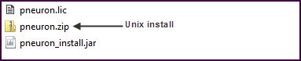
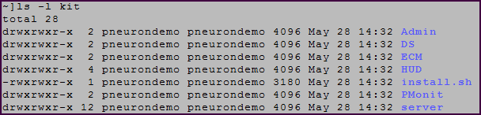
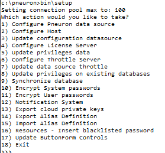
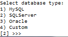
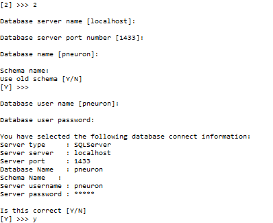
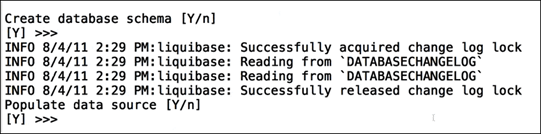
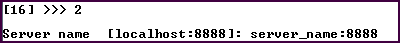
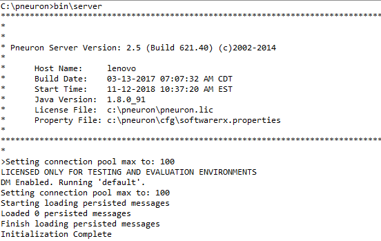

#Linux Installation
The following is about how to install Pneuron in a Linux environment.

##Pneuron Installation Introduction

This manual is intended as a reference guide for the correct installation of the Pneuron Application Suite, version 2.0 and the required third-party components. The instructions assume the person performing the installation is experienced in the administration of databases and other server-side applications.

##Prerequisites

The Pneuron Applications Suite requires that appropriate hardware and third party applications have been installed prior to installing the Pneuron applications.  The customer must configure the hardware and set up the environment before installing the Pneuron applications.

###Minimum Hardware Requirements

For installation of the Pneuron Application Suite, Pneuron recommends the following minimum system requirements:

- 16 GB Memory 
- 50 GB Hard disk
- 2-Quad core CPUs 

The requirements above are typical of a Pneuron test environment deployment. 

###Production Hardware Requirements

A typical production installation would consist of a 3-tiered environment with the following minimum configuration.

Pneuron server

- 16 GB Memory
- 50 GB Hard disk
- Quad core Intel CPU 

Web server

- 16 GB Memory
- 50 GB Hard disk
- Quad core Intel CPU

Database Server

- 32 GB Memory
- 50 GB Hard disk. Disk size may need to increase if third party databases are deployed.
- 2-Quad core Intel CPUs 

> Please note that these values are a set of minimum recommendations.  As more information about the implementation becomes available, a better understanding of hardware requirements will evolve.  Actual requirements will vary based on your system configuration, message or transaction volume and the type and complexity of the Pneuron networks.

###Required Software Components

The following table shows the list of required components that the customer must install in the environment before the Pneuron applications are installed. 


| Required Component       | Pneuron Supported Components                                                                             |
|--------------------------|----------------------------------------------------------------------------------------------------------|
| Web Server               | Apache Tomcat, JBoss*, IBM WebSphere*                                                                    |
| Java (JDK)               | Oracle Sun JDK Version 1.8.x                                                                             |
| Database                 | MySQL 5.0 + <br/> Oracle 10g + <br/> SQL Server 2008R2 +                                                 |
| Database Driver          | sqljdbc41.jar - MS SQL Server <br/> ojdbc6.jar - Oracle <br/> mysql-connector-java-5.1.7-bin.jar - MySQL |
| GUI Database Access Tool | MS SQL Server Management Studio <br/> Oracle SQL Developer/Toad/dbForge Studio <br/> MySQL Query Browser |
| Web Browser              | IE 10 + <br/> Firefox 50 + <br/> Chrome                                                                  |

> *Candidates for Future Releases

###Optional Components

The following table shows additional components that may be required, depending on the Pneuron application functionality the customer has licensed.  These components must be installed in the customer’s environment before the Pneuron applications are installed.


| Component                  | Required if...                                   | Pneuron Supported Components             |
|----------------------------|--------------------------------------------------|------------------------------------------|
| Java Message Service (JMS) | Customer wants to use clustered Pneuron networks | Active MQ 5.7/5.9, IBM WebSphere MQ 7.1* |

###Pneuron Web Application Description

The following table describes the web applications contained in the Pneuron Application Suite.


| Web Application                          | Description                                                                                                                                          |
|------------------------------------------|------------------------------------------------------------------------------------------------------------------------------------------------------|
| Pneuron Design Studio                    | Enables configuration of Pneurons, Pneuron Networks, data sources, data acquisition, business rules, intelligence analytics and supporting artifacts |
| Pneuron Administration                   | Enables configuration of user permissions, roles, module access and data source access as well as participating hosts and realms.                    |
| Pneuron Enterprise Control Manager (ECM) | Enables users to configure and visualize intelligence and analytics, and interact directly with targeted networks in Pneuron Design Studio.          |

###Access to the Customer Environment

Prior to performing the installation of the Pneuron applications in the customer environment, the following data must be available:

- Database host server name 
- User name and password of the user associated with the Pneuron configuration database
- Any other access credentials required for installation. For example, administrator credentials for the servers.

##Installing Pneuron in a Linux Environment

The following steps assume the Pneuron installation directory is `/opt/pneuron`. This can be changed to comply with customer standards.

1. Copy the Pneuron installation media contents to a local drive and navigate to that directory. The directory will contain the files shown:

    

2. Transfer the Pneuron installation file, `pneuron.zip`, to the UNIX server.

3. Create the Pneuron installation directory
`mkdir /opt/pneuron`

4. Unzip `pneuron.zip` to the local drive. This will create a kit directory shown below:
   
    

5. `su` to the root user
6. Change tot he kit directory
7. Run the `install.sh` script and provide appropriate responses to the following questions:

    Default answers are shown in brackets. Modify as required.
   ```
   Enter the path to JAVA_HOME [/opt/java]
   Enter the path to install the Pneuron server [/opt/pneuron]
   Enter user name the Pneuron server should run as [root]
   Enter group name the Pneuron server should run as [root]
   ```

   The Pneuron application will be installed in the specified directory.

   > _**Note**_: If a user other than root is used, modify `install.sh` by commenting the following lines:
   
   > ```
   > if [ "$USER" != "root" ]; then
   >     echo "ERROR - You must run this script as root"
   >     exit
   > fi
   > ```

The directories created by the installation are shown below:

| Install Directory | Description |
| --- | --- |
| Admin | The Pneuron Administration application war file  |
| bin | Shell/batch scripts used to run the server  |
| cache | Temporary files created by specific Pneurons |
| cfg | Property/configuration files  |
| db | Database schema files in XML format  |
| DS | The Pneuron Design Studio application war file  |
| ECM | The Enterprise Control Manager application war file (if purchased by customer)  |
| images | Legacy images |
| javadoc | Java documents for the com.pneuron  package  |
| Javadoc.srx | Java documents for the com.softwarerx package  |
| jetty | Servlet/web  engine for Pneuron web services |
| keys | Pneuron encryption keys   |
| lib | Pneuron and third-party `.jar` files  |
| logs | Pneuron log files  |

###Creating the Pneuron Web Directories

You must create Pneuron directories within the Tomcat directory structure and manually deploy the Pneuron applications to the Tomcat directory. 

These steps are performed on the web server.

To create the Pneuron directories:

1. Navigate to the `webapps` directory under the Tomcat home directory.
For example `/opt/tomcat/webapps`
`/opt/tomcat` is the Tomcat home 

2. Create a directory in the `webapps` directory called `ds`.

3. Create a directory in the `webapps` directory called `admin`. 

4. If the ECM module was licensed, create a directory in the `webapps` directory called `ecm`.

###Deploying the Pneuron Web Applications

There are `.war` files in each Pneuron application directory that must be unzipped into their respective `webapps` directories.  To populate the Pneuron `webapps` directories:

1. Open a terminal window and execute the following commands.

2. `cd /[Tomcat home]/webapps/ds` to navigate to the `ds` directory.

3. `jar -xvf /opt/pneuron/DS/designstudio-web-1.0-SNAPSHOT.war` and press Enter to unpack the `.war` file into the `ds` folder.

4. `cd /[Tomcat home]/webapps/admin` to navigate to the `admin` directory.

5. `jar -xvf  /opt/pneuron/Admin/pneuronadmin-web-1.0-SNAPSHOT.war` and press Enter to unpack the `.war` file into the `admin` folder.

6. If the ECM module was licensed, perform step 7 and 9.

7. `cd /[Tomcat home]/webapps/ecm` to navigate to the `ecm` directory.

8. `jar -xvf /opt/pneuron/ECM/dashboards-web-1.0-SNAPSHOT.war` and press Enter to unpack the `.war` file into the `ecm` folder.

### JDBC Driver Installation

Copy the appropriate JDBC driver to the following directories:
`/opt/pneuron/lib`
`/[Tomcat Home]/lib`

###Copying the Pneuron License File

The Pneuron installation media contains the Pneuron license file.  This file, `pneuron.lic`, controls how many concurrent users can access the Pneuron system as well as which Pneurons are available.

Copy `pneuron.lic` to the Pneuron root folder, `\opt\pneuron`

##Configuring the Pneuron Environment

After the Pneuron installation process has completed, you must configure the Pneuron environment by creating the database, defining the data sources, populating the schema tables and configuring the Pneuron server host.

###Creating the `pneuron_config` Database

1. From a command prompt, change to the Pneuron installation directory and type `bin/setup` and press Enter.
   
    

2. Type `1` and press Enter to configure the Pneuron data source.

    

3. Type the appropriate number for the database type and press Enter. Enter the appropriate database details when prompted. The example below assumes MS SQL Server as the target database.

    

4. Confirm your selections, type `Y` and press Enter. The output generated by the database population is displayed.
   
    

5. Type `Y` to confirm that you want to create the database schema and press Enter. This will run a script to create the database tables required for the Pneuron applications.

6. Type `Y` to confirm that you want to populate the data source and press Enter. This configures the `pneuron_config` data source.

7. Type `2` and press Enter to configure the Pneuron host.

    

8. Type the Pneuron server name and port number (to connect to via web services) and press Enter. The default port number is `8888`.

9. Type `4` and press Enter to configure the Pneuron license server.

    

10. Type the server name and port number (to connect to via web services) and press Enter. The default port number is `8888`. In a Pneuron deployment that has a single Pneuron server, the Pneuron host and Pneuron license server are the same machine and port.

11. Type `18` and press Enter to exist.

##Modifications to `softwarerx.properties`

Depending on the configuration of the Pneuron environment, changes may need to be performed to the file `/pneuron/cfg/softwarerx.properties`. This file was created and populated in the previous steps. `softwarerx.properties` can be modified using a text editor. These modifications can also be performed using the Pneuron Administration application (Security-Properties Management). 
 
Modification 1:
If the ECM has been installed and the web server is on a node separate from the Pneuron server:
Locate the line: `cordaextserver=http\://localhost\:2001` 
Replace `localhost` with the `<hostname/IP>` address of the web server.

Modification 2:
If the ECM has been installed and the web server is on a node separate from the Pneuron server:
Locate the line: `repositoriesecmexternalpath=http\://localhost\:2001` 
Replace `localhost` with the `<hostname/IP>` address of the web server.

## Starting the Pneuron Server and web server

After the installation process has been completed, start the Pneuron server and web server.

### Starting the Pneuron Server

From a command prompt, change directory to the Pneuron installation directory and type `bin/server` and press Enter.  The message `Initialization Complete` will appear, indicating that the Pneuron server has been started. 



###Stopping the Pneuron Server

If the Pneuron server had been started from a command prompt window, issue the `quit` command in the Pneuron server command window.  A list of all of the running Pneurons will display as they are shut down. 
The `Shutdown Complete` message indicates the Pneuron server has terminated processing.

###Starting the Web Server

To start the web server, refer to the web server documentation. As an example, the following procedures will start the Tomcat server in a Linux environment.

1. From a command line, change directory to the top-level directory of the Tomcat server. `cd [TomcatHome]` for example  `cd /opt/tomcat`

2. Invoke the batch file to start the Tomcat server
`bin/catalina run`

The Tomcat server will start and output will be sent to the command prompt window. 

###Stopping the Web Server

To stop the web server, refer to the web server documentation.  As an example, the following procedures will stop the Tomcat server in a Linux environment.

1. To stop the Tomcat server issue a `Ctrl-C` and type `y` at the prompt `Terminate batch job (Y/N)`?

###Sample Linux Shell Script to Start All Applications

A script can be created to start the applications required for Pneuron. Modify the directories as required.
Contents of the shell script:

####Start the Pneuron Server

1. `cd /opt/pneuron/`
2. `nohup bin/server -D > logs/server.log 2> logs/error.log &`
3. `cd /opt/tomcat/bin`

####Start web server

1. `nohup ./catalina.sh run >/opt/tomcat/logs/catalina.log 2>/opt/tomcat/logs/catalina_error.log &`

##Upgrading Pneuron in a Linux Environment

It is the customer’s responsibility to ensure they have a suitable backup strategy in place for their Pneuron system. Pneuron is not responsible for the customer’s backup strategy or system.

###Updating the Pneuron Install

Prior to upgrading the application, insure the Pneuron server and web server have been stopped.

Updating Pneuron to the latest version is a similar process to the initial installation.

1. Copy the Pneuron installation media contents to a local drive and navigate to that directory. 

2. Unzip `pneuron.zip` to the local drive. This will create a kit directory shown below

    

3. `su` to the root user

4. Change to the kit directory

5. Run the install.sh scrip and provide appropriate responses to the following questions:

   Default answers are shown in brackets. Modify them to match the current Pneuron installation.

   ```
   Enter the path to JAVA_HOME [/opt/java]
   Enter the path to install the Pneuron server [/opt/pneuron]
   Enter user name the Pneuron server should run as [root]
   Enter group name the Pneuron server should run as [root]
   ```

   If prompted, confirm to overwrite the current Pneuron installation.

   > _**Note**_: If a user other than root is used, modify `install.sh` by commenting the following lines:
   > ```
   > if [ "$USER" != "root" ]; then
   >     echo "ERROR - You must run this script as root"
   >     exit
   > fi
   > ```

###Updating the Pneuron Webapp Directories

The Pneuron webapp directories that were created during the initial installation need to be updated with the latest Pneuron application. These steps are performed on the web server.

There are `.war` files in each Pneuron application directory that must be unzipped into their respective webapp directories.

To populate the Pneuron webapp directories:

1. Open a command prompt and execute the following commands.

2. `cd /[TomcatHome]/webapps/ds` to navigate to the `ds` directory.

3. Delete all folders under the `ds` directory

4. `jar -xvf  /opt/pneuron/DS/designstudio-web-1.0-SNAPSHOT.war` and press Enter to unpack the `.war` file into the `ds` folder.

5. `cd /[TomcatHome]/webapps/Admin` to navigate to the `Admin` directory.	

6. Delete all folders under the `Admin` directory

7. `jar -xvf  /opt/pneuron/Admin/pneuronadmin-web-1.0-SNAPSHOT.war` and press Enter to unpack the `.war` file into the `Admin` folder.

8. If the ECM module was licensed, perform step 9, 10 and 11.

9. `cd /[Tomcat home]/webapps/ecm` to navigate to the `ecm` directory.

10. Delete all folders under the `ecm` directory

11. `jar -xvf /opt/pneuron/ECM/dashboards-web-1.0-SNAPSHOT.war` and press Enter to unpack the `.war` file into the `ecm` directory.

12. Type `Exit` and press Enter to exit the command prompt.

###Restart the Applications

Restart the Pneuron server and web server.