#Overview
The following is about how to install Pneuron in a Windows environment

##Pneuron Installation Introduction

This manual is intended as a reference guide for the correct installation of the Pneuron Application Suite, version 2.0 and the required third-party components. The instructions assume the person performing the installation is experienced in the administration of databases and other server-side applications.

##Prerequisites

The Pneuron Applications Suite requires that appropriate hardware and third party applications have been installed prior to installing the Pneuron applications.  The customer must configure the hardware and set up the environment before installing the Pneuron applications.

###Minimum Hardware Requirements

For installation of the Pneuron Application Suite, Pneuron recommends the following minimum system requirements:

- 16 GB Memory 
- 50 GB Hard disk
- 2-Quad core CPUs 

The requirements above are typical of a Pneuron test environment deployment. 

###Production Hardware Requirements

A typical production installation would consist of a 3-tiered environment with the following minimum configuration.

Pneuron server

- 16 GB Memory
- 50 GB Hard disk
- Quad core Intel CPU 

Web server

- 16 GB Memory
- 50 GB Hard disk
- Quad core Intel CPU

Database Server

- 32 GB Memory
- 50 GB Hard disk. Disk size may need to increase if third party databases are deployed.
- 2-Quad core Intel CPUs 

> Please note that these values are a set of minimum recommendations.  As more information about the implementation becomes available, a better understanding of hardware requirements will evolve.  Actual requirements will vary based on your system configuration, message or transaction volume and the type and complexity of the Pneuron networks.

###Required Software Components

The following table shows the list of required components that the customer must install in the environment before the Pneuron applications are installed. 

| Required Component       | Pneuron Supported Components                                                                             |
|--------------------------|----------------------------------------------------------------------------------------------------------|
| Web Server               | Apache Tomcat, JBoss*, IBM WebSphere*                                                                    |
| Java (JDK)               | Oracle Sun JDK Version 1.8.x                                                                             |
| Database                 | MySQL 5.0 +   Oracle 10g +   SQL Server 2008R2 +                                                 |
| Database Driver          | sqljdbc41.jar - MS SQL Server   ojdbc6.jar - Oracle   mysql-connector-java-5.1.7-bin.jar - MySQL |
| GUI Database Access Tool | MS SQL Server Management Studio   Oracle SQL Developer/Toad/dbForge Studio   MySQL Query Browser |
| Web Browser              | IE 10 +   Firefox 50 +   Chrome                                                                  |

> *Candidates for Future Releases

###Optional Components

The following table shows additional components that may be required, depending on the Pneuron application functionality the customer has licensed.  These components must be installed in the customer’s environment before the Pneuron applications are installed.

| Component                  | Required if...                                   | Pneuron Supported Components             |
|----------------------------|--------------------------------------------------|------------------------------------------|
| Java Message Service (JMS) | Customer wants to use clustered Pneuron networks | Active MQ 5.7/5.9, IBM WebSphere MQ 7.1* |

###Pneuron Web Application Description

The following table describes the web applications contained in the Pneuron Application Suite.

| Web Application                          | Description                                                                                                                                          |
|------------------------------------------|------------------------------------------------------------------------------------------------------------------------------------------------------|
| Pneuron Design Studio                    | Enables configuration of Pneurons, Pneuron Networks, data sources, data acquisition, business rules, intelligence analytics and supporting artifacts |
| Pneuron Administration                   | Enables configuration of user permissions, roles, module access and data source access as well as participating hosts and realms.                    |
| Pneuron Enterprise Control Manager (ECM) | Enables users to configure and visualize intelligence and analytics, and interact directly with targeted networks in Pneuron Design Studio.          |

###Access to the Customer Environment

Prior to performing the installation of the Pneuron applications in the customer environment, the following data must be available:

- Database host server name 
- User name and password of the user associated with the Pneuron configuration database
- Any other access credentials required for installation. For example, administrator credentials for the servers.

##Installing Pneuron in a Windows Environment

Pneuron provides installation media containing all necessary installation files based on the customer’s operating system.   The Pneuron directory structure is automatically created and populated during installation of the Pneuron applications. 

Two components are installed during the installation process. These components are the Pneuron Server and Pneuron web applications. If the environment is a single machine, both components are installed on the single server. If the environment consists of a web server and a Pneuron server, the installation will be performed on both machines by selecting the appropriate component. The server component is installed on the Pneuron server host and the Pneuron UI component is installed on the web server.

If you are using Windows XP, the Pneuron installation directory is automatically created for you during installation.  If you are using Windows 7 or later versions, you must manually create a Pneuron installation directory prior to installing the application. The recommended installation directory is `c:\pneuron`. 

1. Copy the Pneuron installation media contents to a local drive and navigate to that directory. The directory will contain the files shown:

    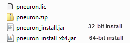

2. Create an installation directory to contain the Pneuron application. This document uses the directory `c:\pneuron` as the installation directory. This location can be modified to support customer requirements.

3. Double-click on the appropriate installation file. The following screen appears.

    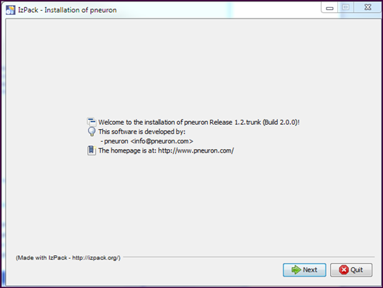

    > If the screen does not appear, it may be because the file association for .jar files is not set to Java. To modify the setting, navigate to _Control Panel->Default Programs->Associate a file type or protocol with a program_. Scroll to the .jar entry. If the Current Default is not associated with Java, use the _Change program…_ button to modify.

    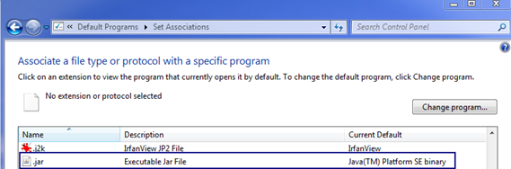

    > Alternatively, the installation program can be invoked from a command prompt:
    
	> Open a command prompt and navigate to the directory containing the installation files.
 
    - For 64-bit systems
    Execute the command: `javaw -jar pneuron_install_x64.jar` 
    - For 32-bit systems
    Execute the command: `javaw -jar pneuron_install.jar`

4. Click **Next**.

5. Click the **Browse** button and navigate to the folder containing the Java Developer Kit (JDK) and click **Save**.

    

    > The path now appears in the Browse field.  This tells the Pneuron application where to find the JDK, as the Pneuron application requires the JDK in order to run.

6. Click **Next**. The path for the installation appears.

    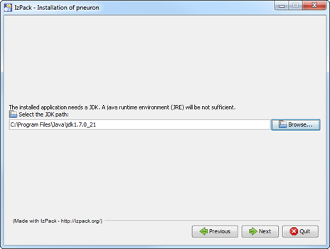

7. Select `C:\pneuron` as the installation path and click **Next**.
   > _**Note**_:
   If the installation directory was created in a previous step, click Yes on the warning 'The directory already         
   exists!'. 
   The default installation path is `c:\pneuron`. This can be modified to support customer requirements. The following screen appears:
   
   
   
   > Both applications are selected above. This is appropriate for a single server install. If configuring a web server and Pneuron server, Server should be selected for the Pneuron Server and Pneuron UI selected for the web server. In this case, the install process is executed on both machines.

8. Click **Next**. The following screen shows the installation progress

    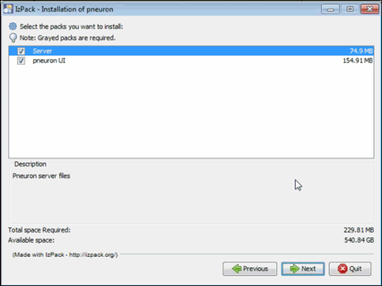

9. When the installation process is finished, click **Next**.

    

10. Click **Next**.

    

11. Click **Done**. The Pneuron application installation is complete.

The directories created by the installation are show below:
| Install Directory | Description |
| --- | --- |
| Admin | The Pneuron Administration application war file  |
| bin | Shell/batch scripts used to run the server  |
| cache | Temporary files created by specific Pneurons |
| cfg | Property/configuration files  |
| db | Database schema files in XML format  |
| DS | The Pneuron Design Studio application war file  |
| ECM | The Enterprise Control Manager application war file (if purchased by customer)  |
| HUD | Heads Up Display components |
| images | Legacy images |
| javadoc | Java documents for the com.pneuron  package  |
| Javadoc.srx | Java documents for the com.softwarerx package  |
| jetty | Servlet/web engine for Pneuron web services |
| keys | Pneuron encryption keys |
| lib | Pneuron and third-party `.jar` files  |
| logs | Pneuron log files |
| PMonit | Monitor tool war file  |
| Uninstaller | Files to support Pneuron removal  |

###Creating the Pneuron Web Directories

You must create Pneuron directories within the Tomcat directory structure and manually deploy the Pneuron applications to the Tomcat directory.  

These steps are performed on the web server. Prior to creating the directories, the web server must be installed. These instructions utilize an Apache Tomcat installation. In addition, the environment variable `JAVA_HOME` must be defined.

To create the Pneuron directories:
1. Navigate to the webapps directory under the Tomcat home directory.
For example `C:\pneuron\apache-tomcat-8.0.24\webapps`
`C:\pneuron\apache-tomcat-8.0.24` is the Tomcat home

2. Create a new folder in the `webapps` directory called `ds`.

3. Create a new folder in the `webapps` directory called `Admin`.

4. If the ECM module was licensed, create a new folder in the `webapps` directory called `ecm`.

###Deploying the Pneuron Web Applications

Each Pneuron application directory contains a `.war` file that must be deployed into their respective `webapps` directories.

To populate the Pneuron webapp directories:
1. Open a command prompt and execute the following commands.

2. `cd \[TomcatHome]\webapps\ds` to navigate to the `ds` directory.

3. `jar.exe -xvf  \pneuron\DS\designstudio-web-1.0-SNAPSHOT.war` and press Enter to unpack the `.war` file into the `ds` folder.

4. `cd \[TomcatHome]\webapps\Admin` to navigate to the `Admin` directory.	

5. `jar.exe -xvf  \pneuron\Admin\pneuronadmin-web-1.0-SNAPSHOT.war` and press Enter to unpack the `.war` file into the `Admin` folder.

6. If the ECM module was licensed, perform steps 7 and 8.

7. `cd \[Tomcat home]\webapps\ecm` to navigate to the `ecm` directory.

8. `jar.exe -xvf \pneuron\ECM\dashboards-web-1.0-SNAPSHOT.war` and press Enter to unpack the `.war` file into the `ecm` folder.

9. Type `Exit` and press Enter to exit the command prompt.

###JDBC Driver Installation
Copy the appropriate JDBC driver for the pneuron_config database to the following directories:
`c:\pneuron\lib`
`c:\[Tomcat Home]\lib`

###Copying the Pneuron License File

The Pneuron installation media contains the Pneuron license file.  This file, `pneuron.lic`, controls how many concurrent users can access the Pneuron system as well as which Pneurons are available.

Copy `pneuron.lic` to the Pneuron root folder, `c:\pneuron`

##Configuring the Pneuron Environment

After the Pneuron installation process has completed, you must configure the Pneuron environment by creating the database, defining the data sources, populating the schema tables and configuring the Pneuron server host.

###Creating the `pneuron_config` Database

1. From a command prompt, change to the Pneuron installation directory and type `bin\setup` and press Enter.
   
   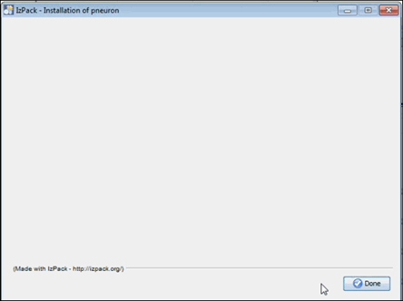

2. Type `1` and press Enter to configure the Pneuron data source.

   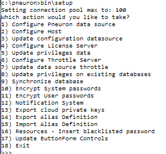

3. Type the appropriate number for the database type and press Enter. Enter the appropriate database details when prompted. The example below assumes MS SQL Server as the target database.
   
   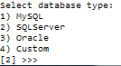

4. Confirm your selections, type `Y` and press Enter. The output generated by the database population is displayed.
   
   !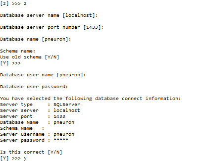

5. Type `Y` to confirm that you want to create the database schema and press Enter. This will run a script to create the database tables required for the Pneuron applications.

6. Type `Y` to confirm that you want to populate the data source and press Enter. This configures the `pneuron_config` data source.

7. Type `2` and press Enter to configure the Pneuron host.

   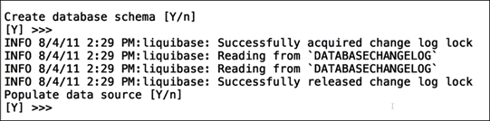

8. Type the Pneuron server name and port number (to connect to via web services) and press Enter. The default port number is `8888`.

9. Type `4` and press Enter to configure the Pneuron license server.

   

10. Type the server name and port number (to connect to via web services) and press Enter. The default port number is `8888`. In a Pneuron deployment that has a single Pneuron server, the Pneuron host and Pneuron license server are the same machine and port.

11. Type `18` and press Enter to exist.

###Modifications to `softwarerx.properties`

Depending on the configuration of the Pneuron environment, changes may need to be performed to the file `\pneuron\cfg\softwarerx.properties`. This file was created and populated in the previous steps. `softwarerx.properties` can be modified using a text editor. These modifications can also be performed using the Pneuron Administration application (Security-Properties Management). 
 
Modification 1:
If the ECM has been installed and the web server is on a node separate from the Pneuron server:
Locate the line: `cordaextserver=http\://localhost\:2001` 
Replace `localhost` with the `<hostname/IP>` address of the web server.

Modification 2:
If the ECM has been installed and the web server is on a node separate from the Pneuron server:
Locate the line: `repositoriesecmexternalpath=http\://localhost\:2001` 
Replace `localhost` with the `<hostname/IP>` address of the web server.

##Starting the Pneuron Server and web server

After the installation process has been completed, start the Pneuron server and web server.

###Starting the Pneuron Server

From a command prompt, change directory to the Pneuron installation directory and type `bin\server` and press Enter.  The message `Initialization Complete` will appear, indicating that the Pneuron server has been started. 

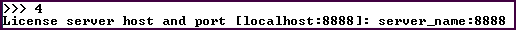

###Stopping the Pneuron Server

If the Pneuron server had been started from a command prompt window, issue the `quit` command in the Pneuron server command window.  A list of all of the running Pneurons will display as they are shut down. 
The `Shutdown Complete` message indicates the Pneuron server has terminated processing.

###Starting the Web Server

To start the web server, refer to the web server documentation. As an example, the following procedures will start the Tomcat server in a Windows environment.

1. From a command line, change directory to the top-level directory of the Tomcat server.
`cd [TomcatHome]`
for example  `cd c:\tomcat`

2. Invoke the batch file to start the Tomcat server
`bin\catalina run`

The Tomcat server will start and output will be sent to the command prompt window. 

###Stopping the Web Server

To stop the web server, refer to the web server documentation.  As an example, the following procedures will stop the Tomcat server in a Windows environment.

1. To stop the Tomcat server issue a `Ctrl-C` and type `y` at the prompt `Terminate batch job (Y/N)`?

##Upgrading Pneuron in a Windows Environment

It is the customer’s responsibility to ensure they have a suitable backup strategy in place for their Pneuron system. Pneuron is not responsible for the customer’s backup strategy or system.

###Updating the Pneuron Install

Prior to upgrading the application, insure the Pneuron server and web server have been stopped.

Updating Pneuron to the latest version is a similar process to the initial installation.

1. Copy the Pneuron installation media contents to a local drive and navigate to that directory. 

2. Double-click on the appropriate installation file.  The following screen appears

   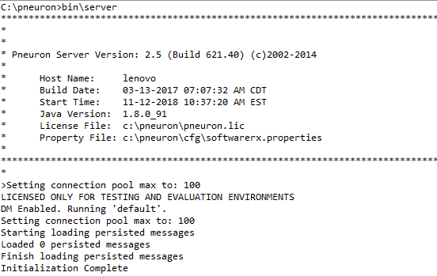

   If the screen does not appear, it may be because the file association for .jar files is not set to Java. To modify the setting, navigate to _Control Panel->Default Programs->Associate a file type or protocol with a program_. Scroll to the .jar entry. If the Current Default is not associated with Java, use the _Change program…_ button to modify.

   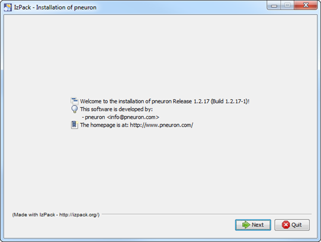

   > Alternatively, the installation program can be invoked from a command prompt. Open a command prompt and navigate to the directory containing the installation files.

   - For 64-bit systems execute the command: `javaw -jar pneuron_install_x64.jar`

   - For 32-bit systems execute the command: `javaw -jar pneuron_install.jar`

3. Click **Next**.

4. Click the **Browse** button and navigate to the folder containing the Java Developer Kit (JDK) and click **Save**. 

   

   > The path now appears in the Browse field.  This tells the Pneuron application where to find the JDK, as the Pneuron application requires the JDK in order to run.

5. Click **Next**.  The path for the installation appears.

   

6. Select `C:\pneuron` as the installation path and click **Next**.

   > _**Note**_: The installation directory was created during the initial application installation. Click Yes on the warning ‘The directory already exists!’. The following screen appears.

   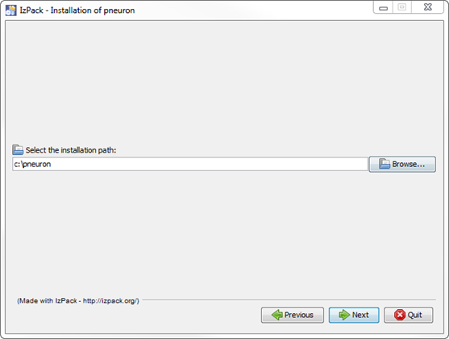

   > Both applications are selected above. This is appropriate for a single server install. If configuring a web server and Pneuron server, Server should be selected for the Pneuron Server and Pneuron UI selected for the web server. In this case, the install process is executed on both machines.

7. Click **Next**. The following screen shows the installation progress.

   

8. When the installation process is finished, click **Next**.

   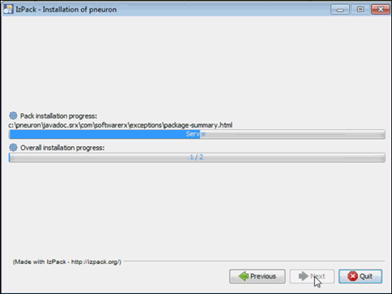

9. Click **Next**.

   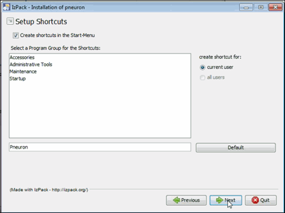

10. Click **Done**. The Pneuron application installation is complete.

###Updating the Pneuron Webapp Directories

The Pneuron webapp directories that were created during the initial installation need to be updated with the latest Pneuron application. These steps are performed on the web server.

There are `.war` files in each Pneuron application directory that must be unzipped into their respective webapp directories.

To populate the Pneuron webapp directories:

1. Open a command prompt and execute the following commands.

2. `cd \[TomcatHome]\webapps\ds` to navigate to the `ds` directory.

3. Delete all folders under the `ds` directory

4. `jar.exe -xvf  \pneuron\DS\designstudio-web-1.0-SNAPSHOT.war` and press Enter to unpack the `.war` file into the `ds` folder.

5. `cd \[TomcatHome]\webapps\Admin` to navigate to the `Admin` directory.	

6. Delete all folders under the `Admin` directory

7. `jar.exe -xvf  \pneuron\Admin\pneuronadmin-web-1.0-SNAPSHOT.war` and press Enter to unpack the `.war` file into the `Admin` folder.

8. If the ECM module was licensed, perform step 9, 10 and 11.

9. `cd \[Tomcat home]\webapps\ecm` to navigate to the `ecm` directory.

10. Delete all folders under the `ecm` directory

11. `jar.exe -xvf \pneuron\ECM\dashboards-web-1.0-SNAPSHOT.war` and press Enter to unpack the `.war` file into the `ecm` directory.

12. Type `Exit` and press Enter to exit the command prompt.

###Restart the Applications

Restart the Pneuron server and web server.

