#Managing Pneuron Sources Overview
The Sources menu within Pneuron Administration provides features for administrators to manage many different source definitions and configurations used within Pneuron. The Sources Menu provides administrators access to manage the following areas:

- Environment Management
- Alias Management
- Group Map Management
- Sql Statement Management
- Host Management
- Hypervisor Management
- Schedule Management
- User Variables Management
- Templates management
- Data Format Management
- Global Panel Management

Administrators can access and configure all of these features on a global basis and provide access to users working with the Design Studio or Enterprise Control Manager applications. An overview of each of the Sources Menu management areas is provided below.

##Environment Management Overview
Environment Management allows administrators to create multiple named environments across the Pneuron deployment within the customer infrastructure. Environments can be used to segment different configurations for aliases for different environments such as development, Test and QA environments where the data sources, directory paths, or FTP details may be specific to that environment.

Once the Environments have been created, individual Pneuron Servers can be configured to run within a given environment and the connection configuration for that segment will be used by the server. This allows administrators to define and manage alias configurations for multiple environments within a single module.

###Adding An Environment
Administrators first need to add one or more new Environments to the system before they can be utilized by Aliases and Servers.

To add an Environment:

1. Click on **Sources > Environment Management**
2. Enter the Environment Name.
3. Enter a description in the **Comment** field, if desired.
4. Click the **Save** Button.

    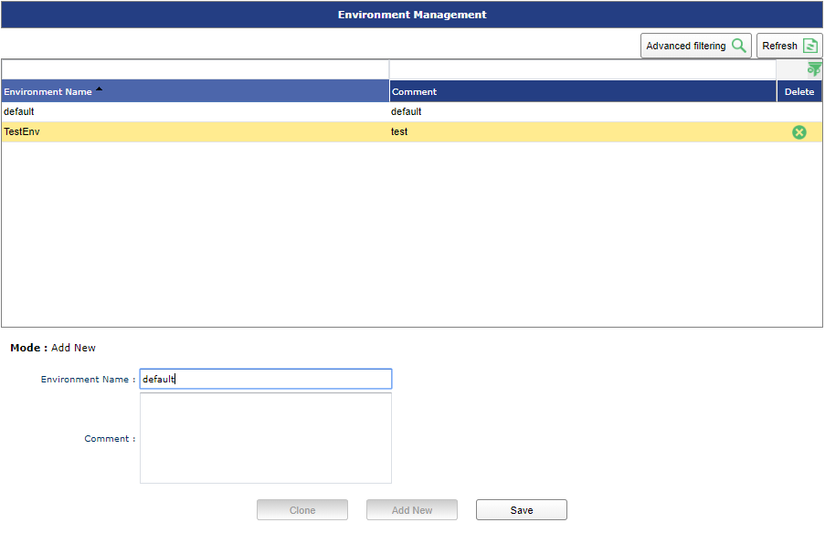

You can use the **Clone** button to copy an existing Environment. To use the Clone feature, select the Environment to copy and click the **Clone** button. You will be prompted to give the Environment a new name.

###Updating An Environment
To update an Environment:

1. Click the Environment you wish to update from the list of available Environments
1. Edit the name and/or comment field as desired.
1. Click **Update** to save the changes.

##Alias Management Overview
Alias Management allows administrators to define and manage the following types of aliases:

- Data Source Definition
- Index Definitions
- HTTP URL Definition
- FTP Source Definition
- Mail Source Definition
- Directory Definition
- JMS Definitions
- Configuration Definition
- NoSQL Database

The Aliases Management module allows administrators to define and configure all types of aliases from a single location.

###Adding An Alias
All Alias types are added in the same manner, and they are then configured independently. To add an Alias:

1. Click on **Sources > Alias Management**
2. Enter the Alias Name
3. Select the Type of Alias from the dropdown list. For a list of the different Alias Types, see Configuring an Alias, below
4. Press the **Save** Button
5. If you have more than one environment configured, you will be prompted to configure the new Alias for each environment. See Configuring an Alias, below.

    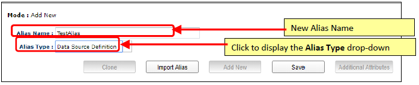

You can use the **Clone** button to copy an existing Alias. To use the Clone feature, select the Alias you would like to copy and click the **Clone** button. You will be prompted to give the Alias a new name.

###Configuring An Alias
Once your Alias is created, you must configure it. The configuration will differ for each alias type.

To configure data sources:

1. Select the alias you wish to configure from the grid and expand the properties for that alias. If you wish to add a new Alias, see Adding an Alias, above.

    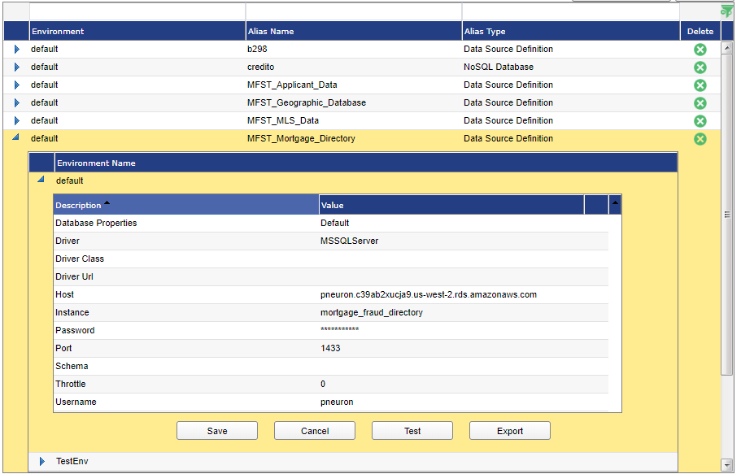

2. If you have configured multiple Environments, select the environment in which you would like to configure your Alias.

    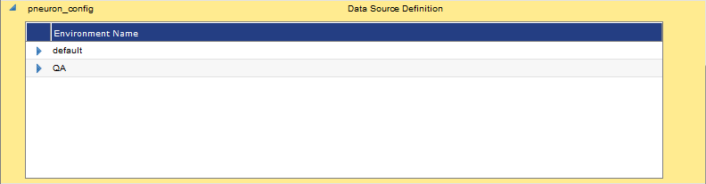

Enter the alias properties based on the alias type as outlined below. Please note that the properties of the alias will be different depending on what type of data source you have chosen. Reference the appropriate Definitions section below:

####Index Definition
The Index Definition alias is for use with the Document Pneuron. The Document Pneuron will scan the configured directory looking for a defined data set and return the filenames containing that data.

| **Field** | **Description** |
|--|--|
| **Delete Permission** | Select Yes or No. This will allow or deny the ability to delete the index files from the defined directory. |
| **Directory File Path** | Path to the location of the index files which will be created for this alias. |
| **Directory Host** | Host Pneuron server where the index files will be stored and referenced. Choose an available host from the drop-down list. |
| **Mapping Group** | Select one item for the list. Defines which source file directories will be indexed within the index location defined by this alias. |
| **Throttle** | Enter the number of concurrent database connections the alias should use. Default is ‘0’ which will allow the Pneuron server to use the maximum number of allowable connections. |
| **Write Permission** | Select Yes or No. This will allow or deny the ability create index files within the defined directory. |

####Data Source Definition
The Data Source Definition Alias is used when configuring a connection to a database. This is used when a user wants to query information or write information to a configured database. A valid user name and password must be provided to gain access.

| **Field** | **Instructions** |
|--|--|
| **Driver** | Select the type of database (such as “Oracle” or “MSSQL Server”) |
| **Host** | Enter the IP address or hostname of the machine that the database server is running on (such as “localhost”). |
| **Username** | Enter the user name for logging in to the database server. |
| **Instance** | Enter the name of the database. |
| **Port** | Enter the port number that the database server is using. |
| **Password** | Enter the password (associated with the Username property) used for logging in to the database server. |
| **Schema** | If applicable, enter the schema owner of the database. Default is blank. (Typically used with Oracle data sources). |
| **Throttle** | Enter the number of concurrent database connections the alias should use. Default is ‘0’ which will allow the Pneuron server to use the maximum number of allowable connections. |

####HTTP URL Definition
The HTTP URL Definition Alias is used when a webpage will be used as either the input or output of a Pneuron network via the HTTP Pneuron.

| **Field** | **Instructions** |
|--|--|
| **Password** | Enter the password (associated with the Username property) used for logging in to the web page. Only required if the Username is entered. |
| **Send Method** | Select GET or POST. |
| **Throttle** | Enter the number of concurrent connections the alias should use. Default is ‘0’ which will allow the Pneuron server to use the maximum number of allowable connections. |
| **URL Address** | Enter a valid URL for the HTTP URL Definition to use. |
| **Username** | Enter the user name for logging in to web page (if required). |

####FTP Source
The FTP Source Definition Alias is for use when a user will be downloading or uploading files to an FTP Server from a Pneuron Network. Note that the FTP Source Definition Alias only contains information necessary to connect to an FTP Server. A Directory Source Definition Alias must also be used within an FTP Pneuron to configure the directory location where the user would like to write information to or retrieve information from.

| **Field** | **Instructions** |
|--|--|
| **Debug** | Default is No. When set to yes it will display debugging information in the server console. |
| **Delete Permission** | Select Yes or No. This will allow or deny the ability to delete the files from the defined location. |
| **Driver** | Select sftp or ftp. |
| **Host** | Enter the IP address or hostname of the FTP server. |
| **Password** | Enter the password for the FTP user. |
| **Port** | Enter the FTP port required to connect to the FTP location. |
| **Throttle** | Enter the number of concurrent connections the alias should use. Default is ‘0’ which will allow the Pneuron server to use the maximum number of allowable connections. |
| **Username** | Enter the username for the FTP location. |
| **Working FTP Directory** | Home directory of the FTP user |
| **Write Permission** | Select Yes or No. This will allow or deny the ability create files within the defined location. |

####Mail Source Definition
The Mail Source Definition is for use with the Mail Pneuron. When configured correctly, a Mail Pneuron will send emails to a configured address with any information the network designer creates. This can be used to inform someone when a Pneuron Network is finished processing, or to communicate the results of a Network.

| **Field** | **Instrctions** |
|--|--|
| **Host** | Enter the IP address or hostname of the SMTP server. |
| **Password** | Enter the password for the SMTP user. |
| **Port** | Enter the SMTP port for the mail server. |
| **StartTLS** | Select Yes or No as required for data encryption when sending SMTP messages. |
| **Throttle** | Enter the number of concurrent connections the alias should use. Default is ‘0’ which will allow the Pneuron server to use the maximum number of allowable connections. |
| **Username** | Enter the username for the SMTP user. |

####Directory Definition
The Directory Definition Alias is for use with the File and FTP Pneurons. Whenever a Pneuron must interact with a file, the user must define where that file will exist.

| **Field** | **Description** |
|--|--|
| **Delete Permission** | Select Yes or No. This will allow or deny the ability to delete the files from the defined directory. |
| **Directory File Path** | Path to the location of source files which will be referenced by this alias. |
| **Directory Host** | Host Pneuron server where the source files will be stored and referenced. Choose an available host from the drop-down list. |
| **Throttle** | Enter the number of concurrent connections the alias should use. Default is ‘0’ which will allow the Pneuron server to use the maximum number of allowable connections. |
| **Write Permission** | Select Yes or No. This will allow or deny the ability create index files within the defined directory. |

####JMS Definition
The JMS Definition Alias is used when configuring Pneurons within a cluster.

| **Field** | **Description** |
|--|--|
| **JMS Client Type** | Choose the correct driver from the drop-down list. The requirements for the following properties are dependent on the Client Type. |
| **JMS Context/Queue Manager Name** | Definition of the Context or Queue Manager. |
| **JMS Topic/Queue** | The JMS Topic that the cluster will listen to. |
| **JMS URL** | The URL for connecting to the ActiveMQ Cluster. |
| **Throttle** | Enter the number of concurrent connections the alias should use. Default is ‘0’ which will allow the Pneuron server to use the maximum number of allowable connections. |

###Editing A Data Source
To edit a data source:

1. From the Data Source Management screen, click the data source you want to change.
2. Choose the environment in which you would like to edit the data source’s properties.
3. Edit the desired fields and click **Update**.

###Deleting A Data Source
To delete a data source:

1. From the **Data Source Management** screen, select the data source to delete and click the green icon at the end of the row.
2. Click **OK** to confirm the deletion.

##Group Map Management Overview
Group Map Management is used to link document repositories to document index locations. It also allows administrators to create a many:1 relationship between source documents and index locations. Administrators can create one or more references called Group Maps that link directories defined by Directory Definitions to document index locations.

In order to use an Index Definition, at least one Group Map must be defined. This feature allows administrators to create a single index location for multiple document repositories defined by the group. In the case where there is a single repository of documents for which an index needs to be created, a Group Map definition should be created which maps the singular document repository.

###Adding A Group Map
Administrators first need to add one or more new Environments to the system before they can be utilized by Aliases and Servers. To add an Environment:

1. Click on **Sources > Group Map Management**. You will be in the Add New mode.
2. Enter the Group Map Name.
3. Click the Directory Source Definitions you wish to include as part of the Group Map.
4. Click the **Save** Button.

##SQL Statement Management Overview
The **SQL Statement Management** option enables administrators to build SQL queries for use within the **Design Studio** or **Enterprise Control Manager** applications. Administrators can assign a query to a project or dashboard.

1. Click on **Sources > SQL Statement Management**.

###Adding a New Query
To add a new query:

1. Click SQL Statement Management on the Sources menu. You will be in the Add New mode.

    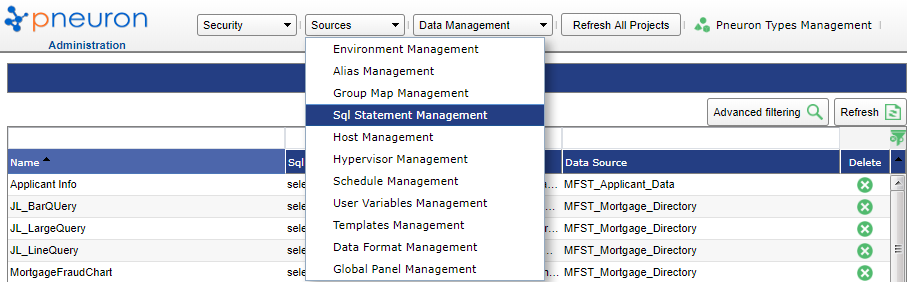

2. Enter the appropriate information in the following fields:

    | **Function** | **Description** |
    |--|--|
    | **Name** | Create a name for the new query. Query names must be unique. |
    | **Data Source** | Select the data source this query will use to retrieve information. The data source must already be defined in order for it so display in the drop-down list. See Alias Management section for details on creating data source definitions. |
    | **SQL Statement** | Enter the query. |

3. Click the **Save** button.

To use the Query Builder user interface, click the **Design** button. Otherwise, you may enter your query directly into the **Query** field. You can also paste a query into the **Query** field.

Click on **Add New** button and repeat Steps 2 and 3 to add additional queries.

###Editing A Query
To edit a query:

1. From the **Query Management** screen, click the query that needs to be edited.
2. Edit the query and click **Update**.

###Copying A Query
To copy a query:

1. From the **Query Management** screen, click the query that needs to be copied.
2. Click **Copy Query**.
3. Name it as required in the **Copy Query** dialog box.
4. Click **OK**.

    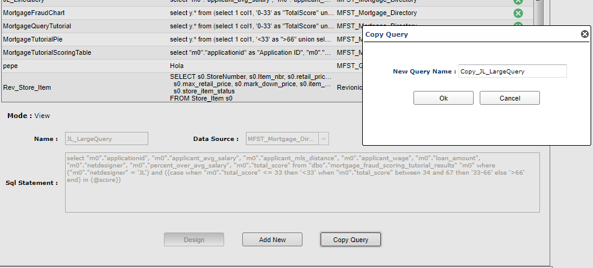

###Deleting A Query
To delete a query:

1. From the **Query Management** screen, select the query to delete and click the green icon in that row.
2. Click **OK** to confirm the deletion.

##Configuring Hosts Overview
The **Host Management** option enables you to add, edit, and delete connections to different host servers. Hosts that have been installed and point to the same pneuron_config database will automatically appear in the Host Management list when running the Pneuron Setup process on the remote host(s). You will be able to see if the hosts are currently running in the Status column.

To add a new host:

1. Click on **Sources > Host Management**.

    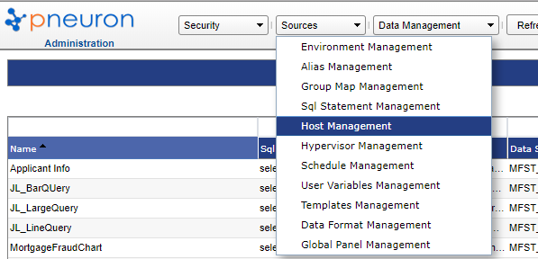

2. In the **Host Name** field on the **Host Management** screen, enter the IP address or hostname and port number of the host that you are adding.
3. Click **Save**.
4. Repeat Steps 1 and 2 to add additional hosts.

###Editing A Host
To edit a host:

1. From the **Host Management** screen, click the host that you want to change.
2. Edit the desired fields and click **Update**.

###Deleting A Host
To delete a host:

1. From the **Host Management** screen, select the host to be deleted and click the green icon at the end of the row.
2. Click **OK** to confirm the deletion.

##Hypervisor Management
A Hypervisor definition identifies the Pneuron hosts participating in an AWS dynamic cluster as well as the secret key and access id required to start/stop the Pneuron hosts. Each pneuron identity field maps the local IP address to the AWS generated identity value. In the screen shot below, four Pneuron hosts are configured to participate in the dynamic cluster.

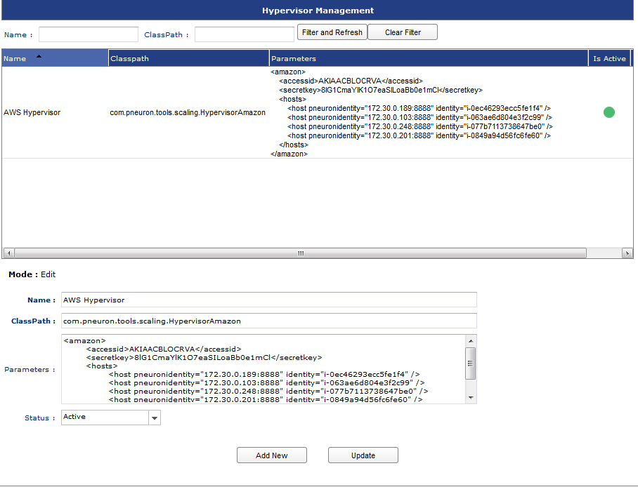

##Schedule Management Overview
Schedule Management allows administrators the ability to configure a time of day at which defined document indexes will be updated. It also provides a feature to allow an administrator to start the indexing process manually.

In order to create and maintain indexes for one or more directories of documents, you must first create a Directory Definition, Index Definition within the Alias Management area, and a Group Map in the Group Map Management area. See the Alias Management and Group Map Management sections above for details on setting up these definitions.

###Configure Directory Schedule Management
To set a document index schedule or start the index process manually:

1. Click on **Sources > Schedule Management**.
2. Enter the days in the **Days of Month** field.
3. Enter a time of day in the **Execution time** field.
4. Enter a start and end date.
5. Enter an interval and select an interval type in the respective fields.
6. Enter a number of times the index should run for in the Run for field.
7. Click **Save**.

    **OR**

8. Click the **Index Now** button to manually initiate the document indexing process on the server.

    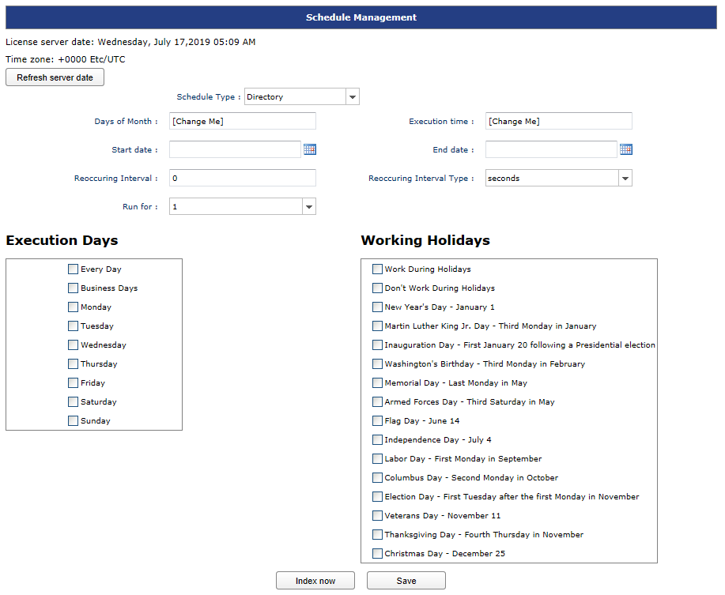

##User Variables Management Overview
User Variables Management provides a central location where user variables used by Projects in Design Studio can be created and managed by administrators. This option within Pneuron Administration saves user variables in the same manner and location as the User Variables menu command in Design Studio.

###Adding A User Variable
To add a User Variable:

1. Click on Sources > User Variables Management.
Add New will be the default mode when entering the area.
2. Enter a Name for the variable. Names must be unique and may not contain any spaces.
3. Select a Project from the drop down to associate the variable to a project.
4. Choose the data type of the variable from the Type dropdown field.
5. Enter a Value to initialize the variable.
6. Click Save.
7. To add additional variables, click the Add New button and repeat Steps 2 through 6.

    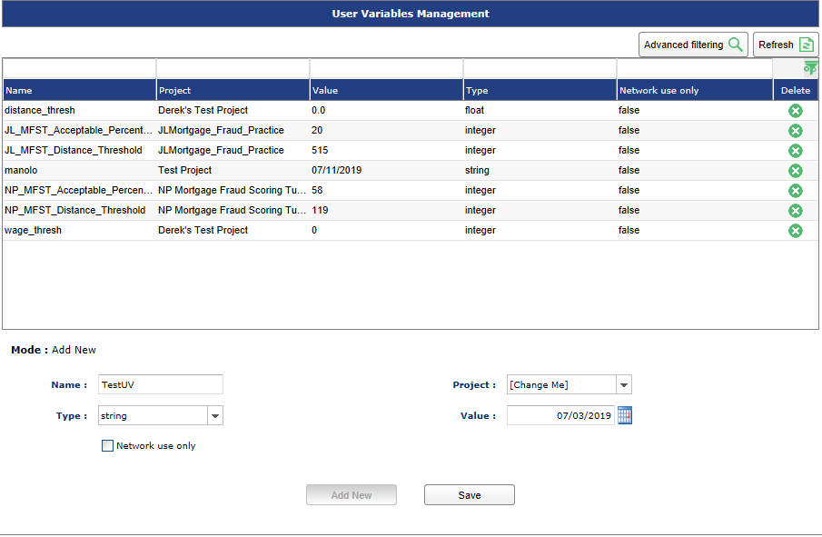

###Editing A User Variable
To edit a User Variable:

1. From the **User Variable Management** screen, click the variable that you want to change.
2. Edit the desired fields and click **Update**.

Once a User Variable has been created, you can edit the Value field only. If you desire to change any of the other field values, you must delete the user variable and use the **Add New** button to recreate.

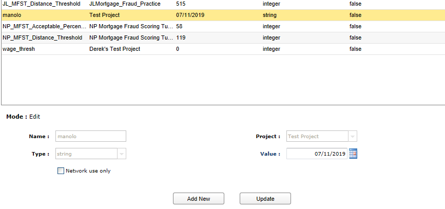

###Deleting A User Variable
To delete a User Variable:

1. From the User Variable Management screen, select the variable you want to delete and click the green icon in that row.
2. Click **OK** to confirm the deletion.

##Templates Management
Templates Management provides a central location where templates created and used by File Pneurons can be managed by the Administrator. When a Network Designer creates a template, the system assigns a unique alphanumeric name to the template. Templates Management can be used to rename the templates to more business-friendly names, and it can also be used to view examples of the data processed by the template.

To access the Templates Management screen, choose **Templates Management** from the **Sources** menu. The screen will be displayed as below.

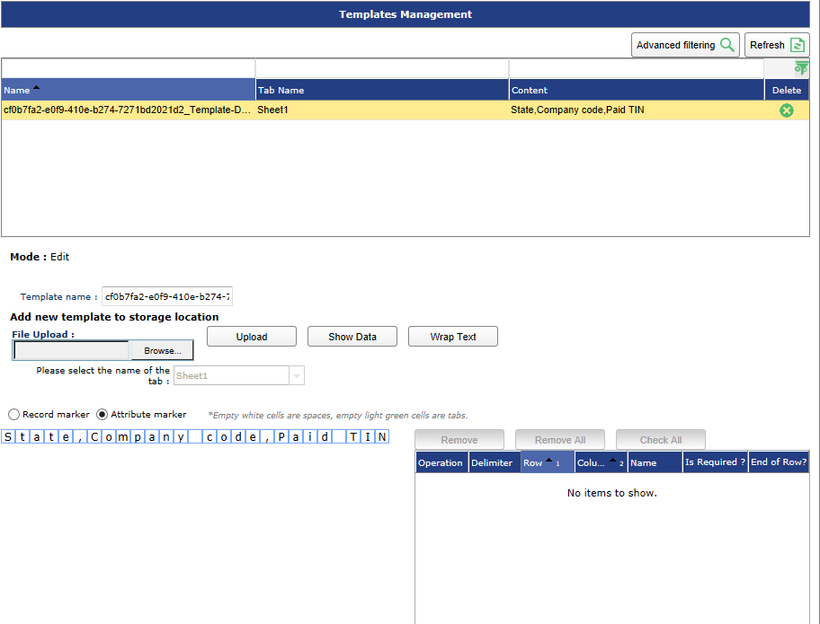

Use the **Advanced Filtering** button to filter the list of templates by name and tab name.

###Viewing Template Information
To view/edit a Template:

1. Click on **Sources > Templates Management**. A list of templates in the system will be displayed.
2. Click on a template in the grid. The Edit mode is activated and the template details are displayed for the selected template below the grid.
3. Edit the name to change it, if desired, click **Update**.
4. Sample data can be viewed in the **Content** field when in Edit mode for a selected template.
5. To clone a template, select a template and click the **Clone** button.

###Deleting A Template
To delete a Template:

1. Click on **Sources > Templates Management**. A list of templates in the system will be displayed
2. Click the Icon to remove a specific template.
3. Click **OK** to confirm the deletion of the selected template.
4. The template will be deleted.

##Data Format Management Overview
Data Format Management is used by Administrators to manage custom data formats that are created by users in the ECM module. Using the Data Format Management option, Administrators can edit existing formats, remove data formats, or add new data formats which can be accessed by all users.

Pneuron is installed with a set of commonly used formats. The system formats cannot be removed, but any custom Data Formats added by Administrators or users can be removed by clicking the icon on the Data Format item to be removed.

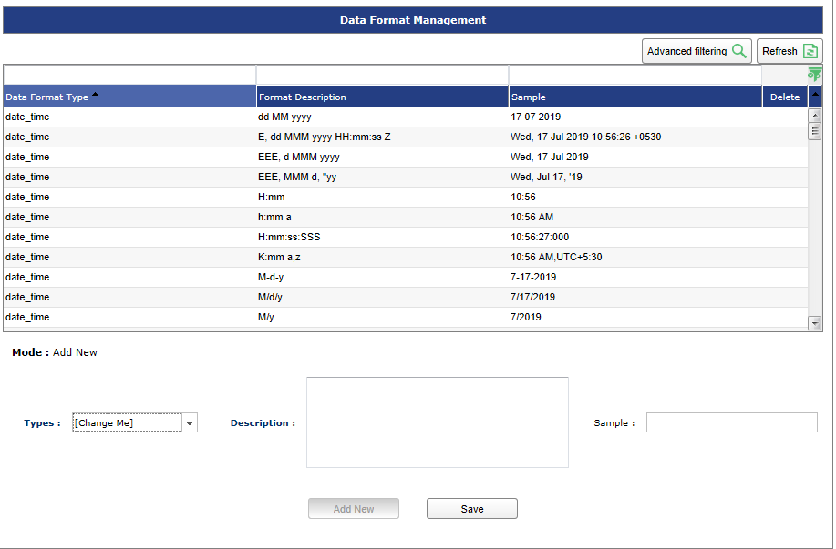

###Adding New Data Format Information
To add a new data format:

1. Click on Sources > Data Format Management. A list of Data Formats in the system will be displayed. The default Add New mode will be active when you enter the Data Format Management screen.
2. Select a Data Format Type.
3. Enter a description. The sample field will dynamically display the entered description as a sample.

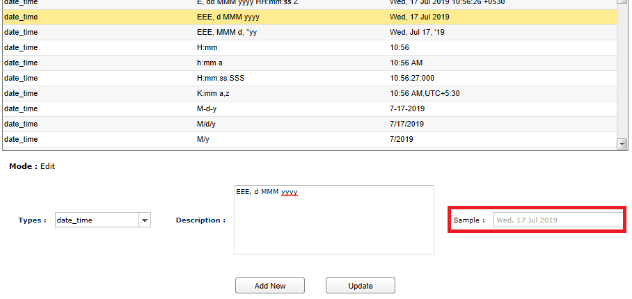

4. Click Save.

###Viewing/Editing Data Format Information
To view or edit an existing data format:

1. Click on **Sources > Data Format Management**. A list of Data Formats in the system will be displayed. The default Add New mode will be active when you enter the **Data Format Management** screen.
2. Click on a Data Format in the grid. The edit mode will activate and the Data Format details will be displayed for the select item.
3. Edit the Data Format Type and/or Description in the given fields.
4. Click **Update** to save the changes.

##Global Panel Management Overview
Global Panel Management allows an administrator to create Design Studio Panels which all users can see and utilize. The Global Panels are indicated in Design Studio by their icon.

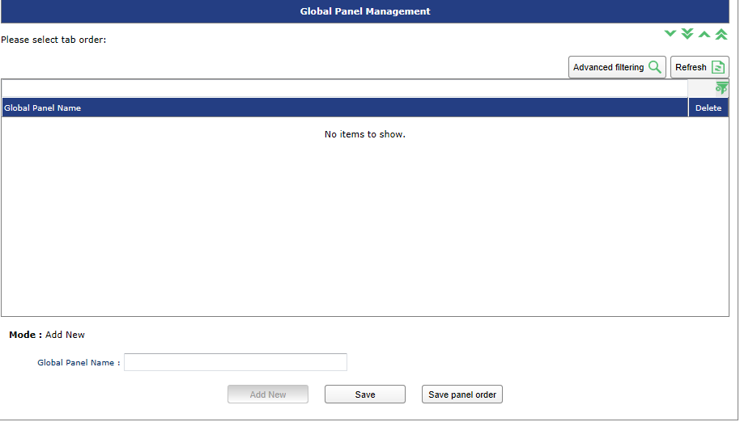

###Viewing/Editing GLobal Panels
To view or edit an existing Global Panel:

1. Click on **Sources > Global Panel Management**.
When present, a list of Global Panels will be displayed. The default Add New mode will be active when you enter the Global Panel Management screen.
2. Click on a Global Panel in the window. The Edit Mode will activate and the Global Panel details will be displayed for the select item.
3. Edit the Global Panel and/or change the order it will be displayed as desired.
4. Click **Update** to save the changes.

##Refresh All Projects
This option is available on the main menu and is used to refresh all projects so that they reflect the changes that have been made in the Admin module.

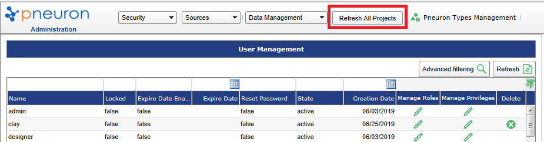

A dialog box appears as shown below:

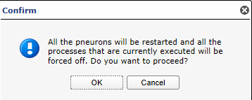

##Pneuron Types Management
The **Pneuron Types Management** option from the main menu enables you to manage the Pneuron types in the system.

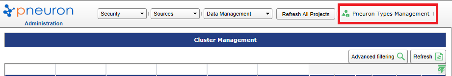

When clicked, a dialog box appears as shown below.

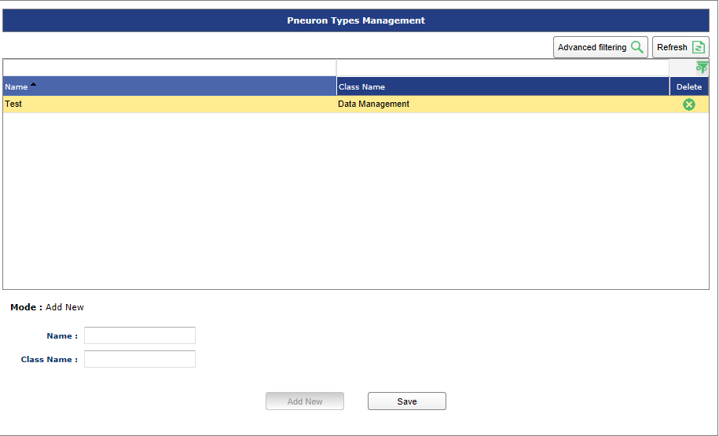

To add a new Pneuron type,

1. Enter the Name and the Class Name of the pneuron in the respective fields.
2. Click Save.
3. To update a Pneuron type, select it in the table and click Update after making changes.

##SSO
With Version 2.0, a new feature allowing Single Sign On integration has been added. Single Sign On allows the ECM, DS and Admin sections to be integrated with Active Directory or other popular LDAP capable services.

SSO Configuration Documentation is available upon request.
