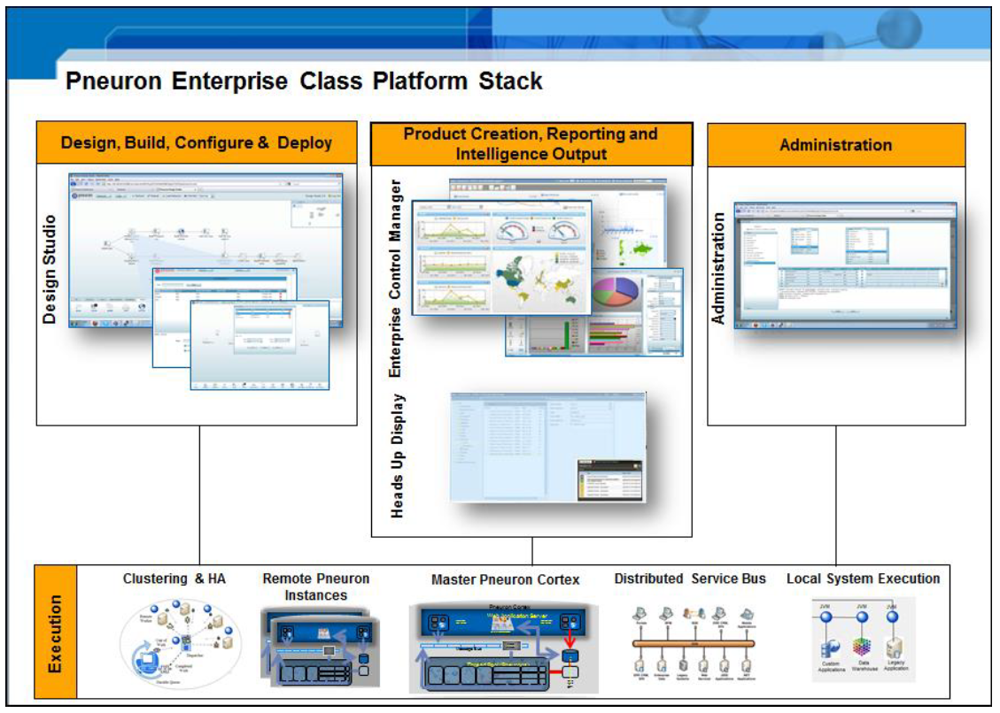
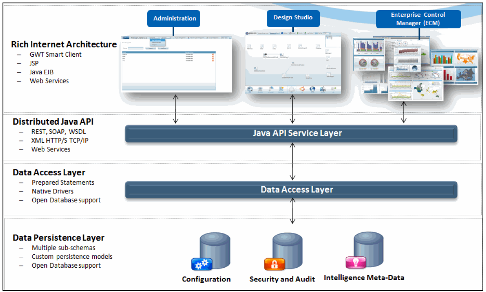

[[_TOC_]]

#Overview
In simplest terms, the Pneuron server is a container of Pneurons, providing the needed infrastructure which allows pneurons to function. The Pneuron server is implemented as a Java 6 standalone program which is able to run in multiple of today's server operating systems. It is expected that multiple Pneuron servers will be deployed in a large scale or distributed environment. To support this any given Pneuron server can contain large numbers of Pneurons and communicate with remote Pneuron servers seamlessly.

#Overview of Solution Stack

#System Architecture

The Pneuron platform utilizes **Rich Internet Architecture (RIA)** and contains three layers that interact with the adjacent layer to support the function of the Pneuron applications. These layers are:
- **Distributed Java API Service Layer** The “Distributed Java API Service layer” handles all communication within the Pneuron applications, such as web services requests, dispatcher sending information to a worker node, communication between Pneurons, and more. The Distributed Java API Service layer interfaces with the Pneuron applications and Data Access layer.
- **Data Access Layer** The “Data Access layer” resides on top of the database and allows all applications and APIs to interact with the database. The Data Access layer interfaces with the Distributed Java API Service layer and the Data Persistence layer.
- **Data Persistence Layer** The “Data Persistence layer” stores all information in the database, such as messages, configuration and security settings, audit trails, etc. The Data Persistence layer interfaces with the Data Access layer.

#Reference Architecture
Business as service” solution focused on agility, real-time process distribution, low intrusion, and light footprint, all while respecting enterprise standards in platform utilization and security compliance.

#Deployment Architecture
Distributed low footprint overlay processing across target systems utilizing internal cloud, network and current legacy technology, databases and processing capacity. 

##Deployment Options
- Agent: Direct on targeted systems with remote instances encapsulated in a JVM.  
- Agentless: Remote and access systems using TCP/IP, HTTP, JDBC and API access

#Scalability Architecture
Fully leveraged vertical and horizontal infrastructure scalability, combined with a patent-pending deployment mechanism that implements instruction-level parallel pipelines across multiple self managing nodes – all optimized for real time, high impact business value. 

##Small, Dynamic, Distributed Deployment Footprint
- Small, low footprint divisible instruction sets chained together as instruction pipelines (networks) across multiple nodes maximizing resource usage

- Dynamically clone,  abbreviate and terminate instruction pipelines based on results received, reducing processing resources

- Store intelligence in scalable, in-memory distributed cache, with messages broken into chunks.  

- Pneurons execute sub-tasks as fibers at the thread level

- Process target data from native source, obtaining only the data required without ETL and normalization

##Horizontal and Vertical Demand Driven for Concurrency and Elasticity
- Horizontal scale, combining work distribution and loading models with automatic provisioning to new nodes and dynamic cluster reforming.

- Vertical/horizontal scale and load distribution seamlessly utilizing all available technology assets, calling upon and releasing assets based on demand.

- Real time optimization realignment and redeployment from Design Studio without programmatic changes.

- End to end distributed parallel processing across all nodes. Dynamic load management, elasticity and clustering at the instruction level.

##Real Time Vertical, Concurrency & Asset Utilization

- Scale up and down vertically through dynamically provisioning resources to a single node in a system

- Federation services automatically consolidate multiple data feeds from disparate systems

- Software Transactional Memory (STM) with real time locking services for concurrency control. 

- Data acquisition and processing segmented into independent parts, allowing simultaneous processing  

##Dynamic, Horizontal Elasticity. Load Balancing, & Clustering

- Clustering and breaking up of large or complex processing requirements and distributing to multiple workers

- Enhanced MapReduce clustering and workload algorithms for distributable problems and computational processing across disparate systems with large numbers of computers (nodes) in configurable clusters. 

- Execute user-defined methods in parallel on  selected sets of objects and combine the results using data federation merge algorithms

#Pneurons
A Pneuron is a small lightweight java class which implements a small bit of logic or function. This
Pneuron sits idle until a message containing all of the data it needs to run is provided to it, at the point the Pneuron will execute its logic, then lay dormant until the next message. During execution, the Pneuron may or may not forward the message to the Pneurons it is connected to, this message may or may not be altered with data. In this way, not only legacy data but META data can be added to the message and forwarded to connected Pneurons. As an example, a Pneuron can execute a bit of JavaScript to determine a customer has exceeded their credit limit and add flag noting the credit limit overage or execute predefined SQL query to fetch some data from a legacy system.

##Anatomy of a Pneuron
A Pneuron is a simple java program which implements the INeuron interface and extends the NeuronBase abstract class. The INeuron interface forces the implementation of methods that allows the server to dynamically load and unload the neuron. In addition, the interface also allows server to pass messages sent from other neurons. The extension of the NeuronBase provides convenience methods which facilitate message processing.

###Required Methods
A Pneuron is required to implement a small number of methods to allow the Pneuron server to control and communicate with Pneurons hosted by the server. The methods are listed below, for more details please see the provided Java Documentation. 

**onLoad** - Called once when the Pneuron is loaded to provide a chance to do any configuration and setup tasks. 

**onMessage** - Called every time a messages is received and needs attention from the Pneuron

###Pneuron Base Class
The Pneuron NeuronBase provides convenience methods which facilitate message processing. Function to create, parse and send messages are provided.

##Configuration Pneuron
The configuration neuron is a special purpose Pneuron which is used to load and unload all other
neurons in the server. The configuration neuron is the only neuron which is not dynamically loaded; it is loaded during server startup. The configuration database is the repository of all neurons in the neural network and their configurations.

##Inter Pneuron Communication
Messages sent between neurons are all XML based, they are all constructed and parsed by the convince methods provide by the NeuronBase abstract class. Each neuron adds it’s data fields to the data section and the convince methods populate the remaining fields.

###Sample Message
<message>

<from>Db Query</from>
<created>11-13-2009 04:00:31 PM EST</created>
<GUID>00000176_124EF58E851_7F000001_B692</GUID>
<data>
<id type="Integer">87</id>
<name type="String">Shawn O'Brien</name>
<last_bill type="Integer">2000</last_bill>
<this_bill type="Integer">0</this_bill>
<value_driven type="Integer">1</value_driven>
<toys_guy type="Integer">1</toys_guy>
<moving_to_text type="Integer">0</moving_to_text>
<impluse_buyer type="Integer">1</impluse_buyer>
<lead_created type="Integer">0</lead_created>
</data>
</message>`

#Pneuron Server
The Pneuron Server has been written as a scalable and generic container of Pneurons. The Pneuron also ships with a light weight Java application service which is used to provide support WEB applications and WEB services.

##Security
Security for the Pneuron service is based flexible privilege and role design, it is intended to run in a standalone mode or integrated with an enterprise directory service. Security is enforce exclusively during network design time and not runtime thus not impacting run time performance. The goal of the security subsystem is to keep unauthorized people from making changes to the Pneuron system and provide a read only environment for people with limited access.

##Web Services
The server also exports several remote procedure calls via Web services which are used by applications to communicate with the Pneuron server. Currently three separate services are provided, one to configure neurons, the second to manage data sources and receive message from remote systems.

###Configuration WEB Service
The neuron configuration service allows for the addition, deletion and modification of neurons. All connections between neurons are also managed via this service.

###Licensing Web Services
The license service allows remote systems to manage the licensing server.

###Lock Manager Web Services
The locking services allows remote systems to manage locks on the server.

###Message WEB Services
The message service allows remote systems to add messages directly onto the servers internal message queue.

###Monitor Web Services
The monitor services allows remote systems to manage monitor statistics on the server.

###Robot Web Services
The robot web services allows remote systems to monitor web scraper.
