#Managing Pneuron Security
The Security menu within Pneuron Administration enables administrators to set up user accounts with specific roles and privileges. Privileges are associated with roles, and roles are associated with user accounts. The following diagram shows the hierarchy of the security configuration model. Each hierarchical component can be customized.

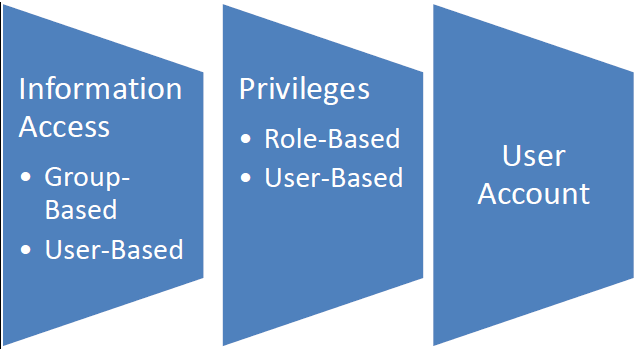

##Managing User Accounts
###Overview
The **User Management** option is available under **Security** > **Users** > **User Management**. It enables administrators to create, modify, and delete user accounts for the Pneuron applications. Individual user accounts are associated with a password and are assigned specific roles and privileges. The System Administrator for the Pneuron applications must provide the initial account information in order for the users to access the Pneuron applications and change their password.

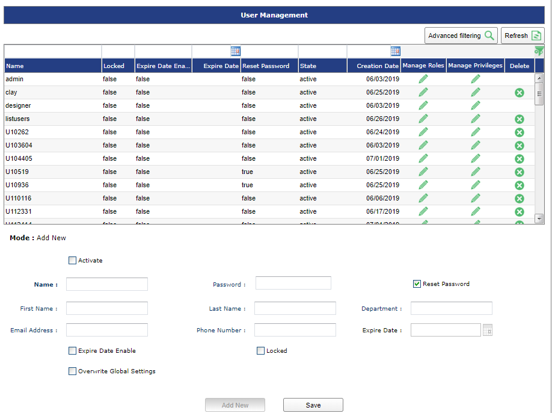

###Adding a new user account
To add a new user account:

The Add New screen will display below the User Management section with a section title of **Mode: Add New**.

1. Click on **Security > Users > User Management**.
2. In the **Name** field of the User Management screen, enter a name for the new user account that is being created. Name is a required field.
3. In the **Password** field, enter a password associated with this new user account. Password is a required field.
4. In the **First Name** field, enter the first name for the new user account. First Name is optional.
5. In the **Last Name** field, enter the last name for the new user account. Last Name is optional.
6. In the **Department** field, enter the associated department for the new user account. Department is optional.
7. In the **Phone Number** field, enter the associated phone number for the new user account. Phone Number is optional.
8. In the **Email Address** field, enter the associated email address for the new user account. Email Address is optional.
9. Click the **Locked** checkbox to lock the user and restrict them from logging in. Locked is optional.
10. Click the **Reset Password** checkbox to require the user to change their password after the first successful login to the application. The user will be presented with popup asking them to change their password when they first log in. Reset Password is optional.
11. Click the **Expire Date Enable** to establish a user access expiration date. Expire Date is optional.

    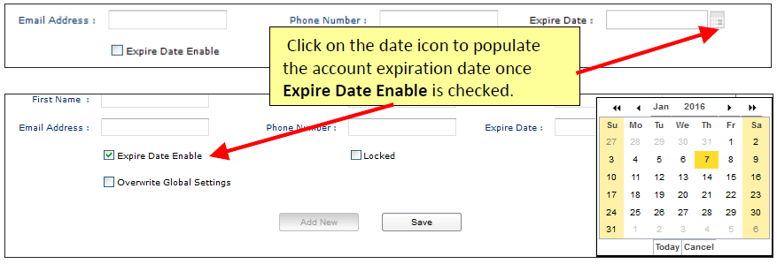

12. Click Save.
13. Repeat Steps 2 through 12 to add more user accounts.

###Editing a User Account
To edit a user account:

1. From the User Management screen, select the user account.
2. The selected user information screen will be displayed in the section below the User Management with a section title of Mode: Edit.
3. Modify the user account fields and click **Update** to save the information changes.
4. To lock an account and prevent them from logging in, select the locked check box.
5. To override global settings and use unique settings, check the Overwrite Global settings option.

###Deleting a User Account
To delete a user account:

1. Within the **User Management screen**, select and highlight the user account to be deleted. Click the green X icon at the end of the row.
2. Click **OK** to confirm the deletion.

    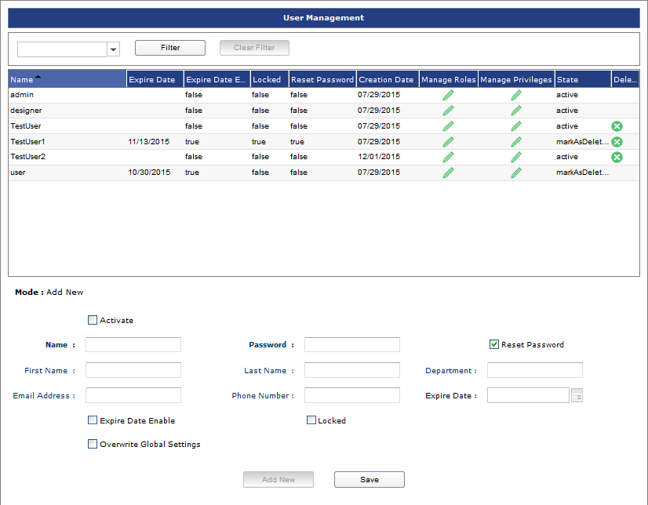

###Assigning Privileges to a User Account
After a user account is created, administrators have two options for assigning privileges to a user:

- Assign a previously created role to the user account
- Assign privileges directly to the user account

The following section discusses assignment of a role to a user account.

To assign a role to a user account:

1. From within the User Management screen, select the user account and then click on the Manage Roles icon within the row.

    

2. A list of all existing roles and the choice “None” appears beneath the User Management screen.

    Roles are collections of defined privileges within the Pneuron applications. By assigning a role to a user, administrators can streamline the user permission setup process and group multiple users under the same role for consistent access based on their job functions.

    Pneuron provides three default roles:

    - The ECM Designer role is configured with all privileges for the Enterprise Design Studio application.
    - The Net Designer role is configured with all privileges for the Design Studio application.
    - The Admin role is configured with all privileges for all applications including the Administration application.

    New roles can be added through Roles Management. User-based privileges are assigned a role of “None”.
    The default roles cannot be modified. If administrators modify one of the default roles, they will be asked to either save the changed role as a new role or convert from a role to a user-based privilege model. If the administrator selects the user-based privilege model, the user will be assigned to the “None” role.

3. Select the role using the drop-down menu.

    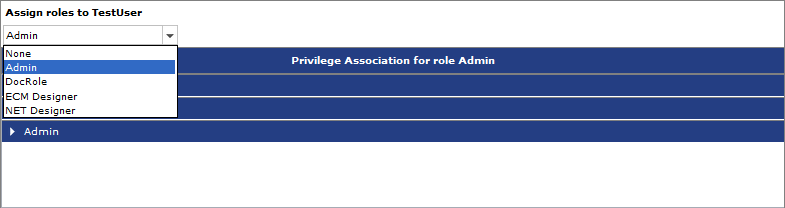

4. You can either click **Save** at the bottom of the section to complete the role management for a user account or you can customize the privileges.
5. To modify the privileges for the assigned role, click on one or more of the sections under the Privilege Association for Role Admin.
6. Clicking on the section will expand and present the list of available privileges for the application.

    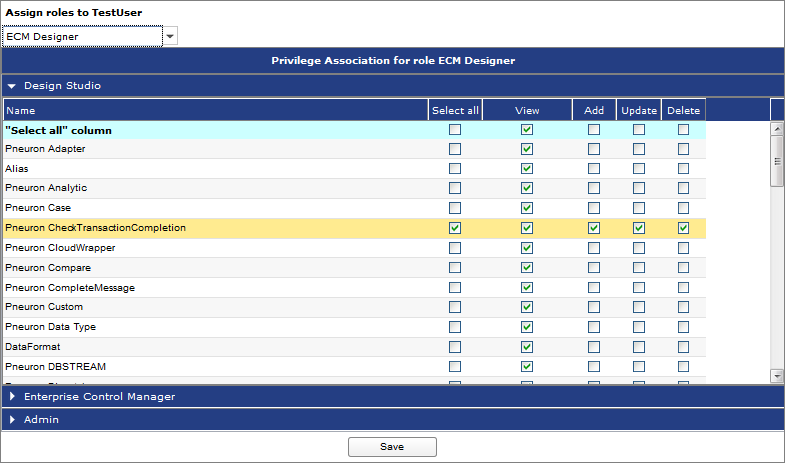

7. Click **Save** to modify the privileges within each section.
8. If the role has been modified, the administrator will be presented with the popup shown below.

    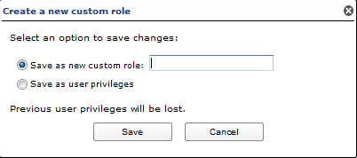

9. Click the OK to create a new role. The Create a new custom role window will appear. Enter the new role name and click Save. The role assignment for the user account is complete.
10. If the administrator does not intend to create a new role, click Cancel.
11. When saving as user privileges, the settings are applied to the user and not a role.

##User Report Overview
Pneuron Administrators can view details for all users. This is helpful when managing accounts and getting an overall view of user activity within the system

| **Fields** | **Description** |
|--|--|
| **Username** | The username of the user. |
| **User State** | The state of the user: **active**, **inactive**, or **markAsDeleted**. |
| **#DaysLeft** | The number of days left until expiration. |
| **Activation/Deactivation Date** | Date activated or deactivated |
| **Creation Date** | Date the user was created |
| **Last Login Date** | Date the user last logged in. |
| **Expire Date(()) | Current expiration date. |

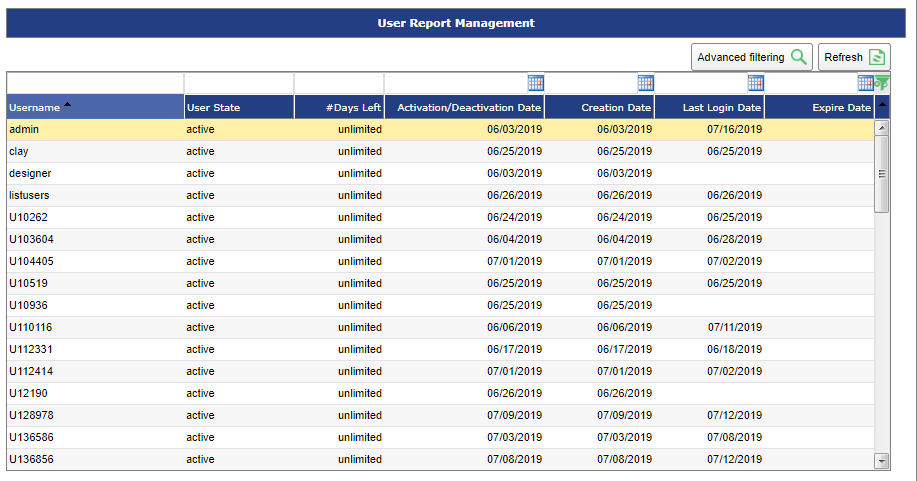

##Password Policy Management Overview
Pneuron has implemented password configuration and management capabilities in order for administrators to establish and enforce password rules across the Pneuron system. Password management enables administrators to configure the following characteristics:

- Minimum length for the password
- Maximum length for the password
- Requirement for upper case and / or lower-case characters in password value
- Options to include alpha, alphanumeric, and special characters in the password value

When the password configuration is modified, all existing Pneuron users will be requested by the system to reset their password and will be forced to conform their password to the new password rules. New users will have to conform to the updated password rules during configuration of the original password and anytime the password is reset.

The default settings within password management are password length between one and 10 characters and allowing alphanumeric and special characters.

###Modifying Password Management
To modify password management:

1. Click on **Security>Users>Password Policy Configuration**. The Password Management screen is displayed. The default Pneuron system password management is displayed if no changes have been applied.

    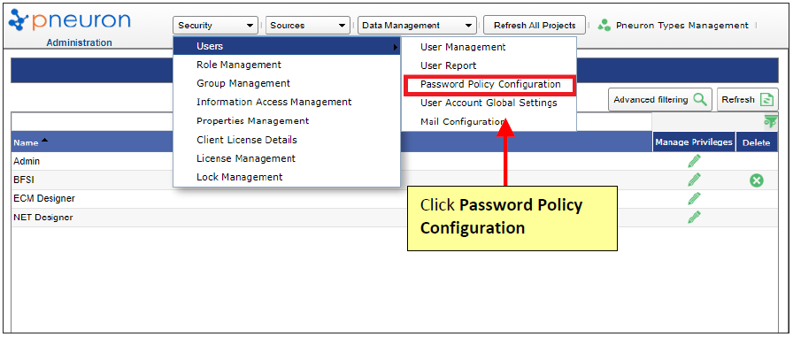

    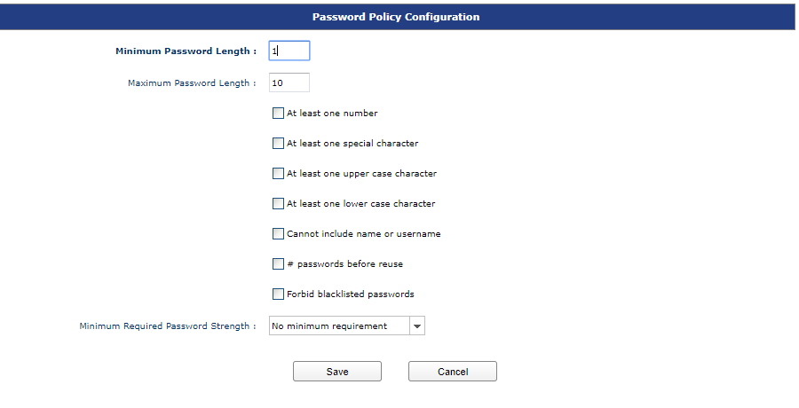

2. In the Minimum Password Length field, enter the minimum value for the password length.
3. In the Maximum Password Length field, enter the maximum value for the password length.
4. Click the checkbox At Least One Number to enforce at least one number in all user passwords.
5. Click the checkbox At least one special character to enforce at least one special character in all user passwords.
6. Click the checkbox password require At least one upper case character to enforce at least one upper case character in all user passwords.
7. Click the checkbox At least one lower case character to enforce at least one lower case character in all user passwords.
8. Click the checkbox password Cannot include name or username to prevent names and usernames in all user passwords.
9. Click the checkbox # passwords before reuse to prevent the same passwords from being reused. Enter the number of passwords required before reuse.
10. Click the Forbid blacklisted passwords checkbox to prevent blacklisted passwords from being used.
11. From the Minimum Required Password Strength dropdown list, select the option for the password strength requirement. This is an optional field.
12. Click the Save button to save the modified password configuration.

###Updating Password Maximum Login Attempts
To update the setting for password maximum login attempts:

1. Reference Managing Properties section.
2. Click on **Security > Properties Management**. The Properties Management screen is displayed.
3. Click on the property maximumFailedLoginAttempts.

##Mail Configuration Overview
**Mail Configuration** allows the administrator to pre-define email messages that can be used for various reports, alerts or notifications when triggered.

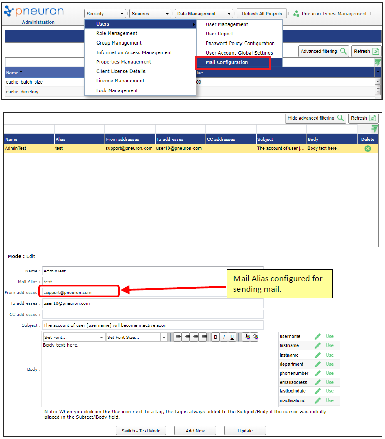

##Managing Roles Overview
Pneuron Administration contains three pre-configured default role types: Admin, ECM Designer and NET Designer. Each role has its own set of specific privileges that describe the functions the user can perform and access within the Pneuron applications. The default roles cannot be modified in Role Management. If an administrator clicks on Manage Privileges for one of the default roles, the user will be presented “view only” access.

New roles created using default roles as a template are visible within the Roles Management window.

###Adding a New Role
To add a new role:

1. Click on **Security > Role Management**. The Role Management Screen will be displayed.

    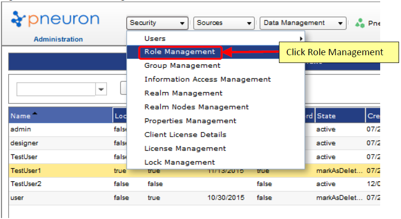

2. From the Role Management screen, enter the name for the new role in the text box titled **Name** and click **Save**.

    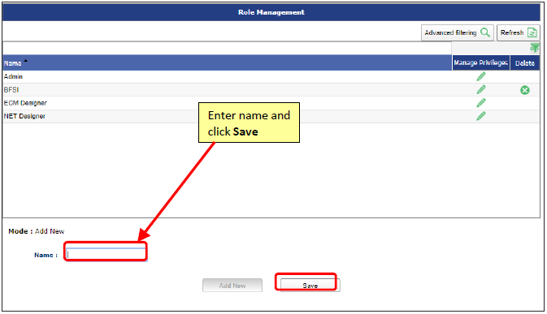

    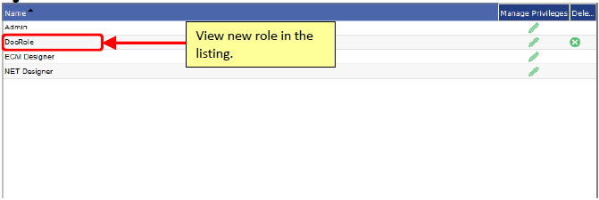

3. Repeat Step 2 to add additional roles.

###Assigning Privileges To A Role
After creating a new role, administrators can assign desired privileges to the role.

To assign privileges to a role:

1. From the Role Management screen, select and highlight the role and then click on the **Manage Privileges** icon within the row.

    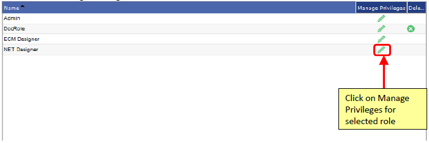

2. Privileges Associated for role is displayed beneath the Role Management screen.

    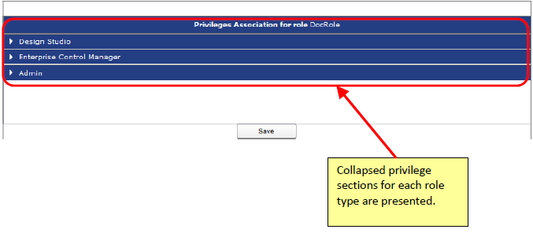

    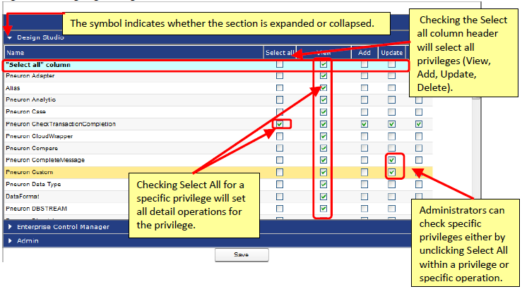

###Deleting A Role
To delete a role:

1. Within the Role Management screen, administrators can click the green icon at the end of the row to delete a particular role.

    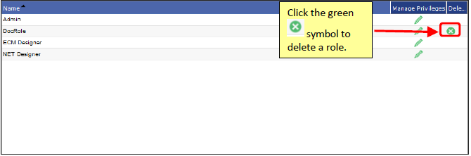

2. A pop-up window is presented to confirm the deletion. Click **OK** to confirm the deletion. The role is deleted and removed from the role listing.

    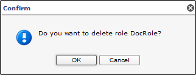

##Managing Groups Overview
Organizations perform specific functions and generally have access to specific information. By using groups and assigning them different information access permissions, administrators can organize Pneuron users into functional groups and manage access and privileges for groups of users easily. Additionally, by configuring the appropriate information access permissions, the administrator can control access to information within the application for groups of users.

The **Group Management** option enables administrators to create, modify, and delete groups within Pneuron Administration. Groups represent collections of Pneuron users. Once configured, groups can be assigned access permissions through Information Access. This approach enables administrators to configure and align all members within the group to common and consistent access to selected Pneuron projects, data sources, and dashboards.

Pneuron users can be associated with one or more groups. Each of the groups can be assigned specific information access permissions. A user’s total access is determined by combining all of their group-information access assignments together. The level of access is also determined in combination with the user’s privileges previously configured within the application.

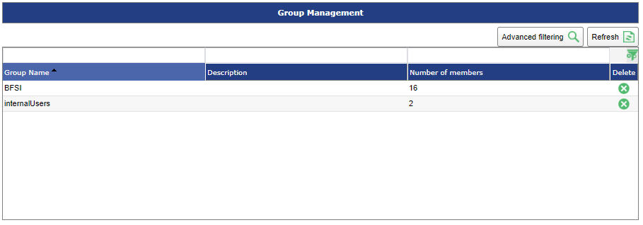

###Adding A New Group
To add a new group:

1. Click on **Security > Group Management**. The Group Management screen is displayed.

    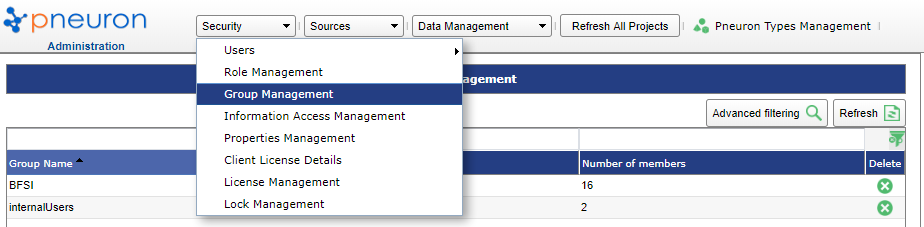

    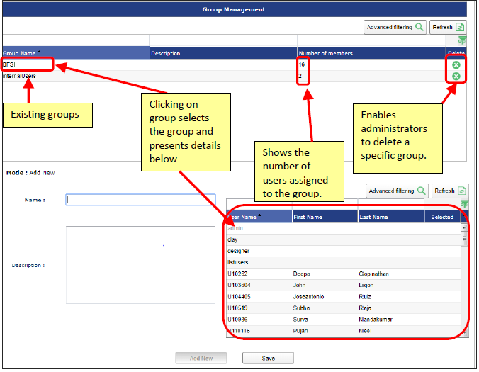

2. In the **Name** field of the Group Management screen, enter a name for the new group to be created. Name is a required field.
3. In the **Description** field, enter a description associated with this new group. Description is an optional field.
4. In the section to the right of the Description, a list of all application users will be displayed. Click the check box to the left of the user name to assign the member to a group.
5. Click the **Save** button to create the group.
6. Repeat Steps 2 through 5 to add more groups.

###Editing a Group
To edit a group:

1. From the **Group Management** screen, select the group to edit.
2. All information related to the selected group is displayed in the lower section of Group Management.
3. Modify the group fields and click **Update** to save the information changes.

###Deleting A Group
To delete a group:

1. From the Group Management screen, click the green icon at the end of row for the group to be deleted.
2. Click **OK** to confirm the deletion.

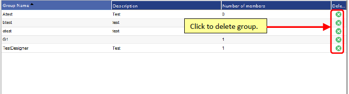

##Managing Information Access
Information Access allows administrators to assign access to resources and artifacts created in the Pneuron applications. Pneuron resources include Projects, Aliases, Defined Queries, User Variables, and Dashboards with Widgets. Access permissions can be assigned either at the user or group level. After selecting the desired Pneuron resource, administrators have the ability to configure specific access permissions, which include view, add, update, or delete operations on the selected resource.

Privileges and information access are combined to evaluate which actions a user can perform and on what Pneuron resource the action is permissible. Pneuron establishes evaluation rules to provide a consistent model for complete system access and information management. The following rules are applied during evaluation:

- If the user has been configured with privileges for view, add, update, and delete functions on selected system resources and has been configured within information access with view only on selected projects, then user will have only the view privilege on the selected projects. In this case, the information access permissions take precedence in determining the access to the specific projects.
- If the user has been established with view privileges on selected system capabilities and has been configured within information access to view, add, update, and delete on selected projects, then the user will have only the view privilege on the selected projects. In this case, user privileges take precedence in determining the level of access granted to the specific projects.
- If the user is assigned to one or more groups and information access permissions have been configured for each of the groups, the system will combine all information access permissions together and apply the maximum permissions to the user. It is possible a user could be assigned view projects within one group and assigned view, add, and update on the same projects within another group. In this case, the user will have view, add, and update permissions on the projects.

1. Click on Security > Information Access Management. The Information Access Management screen is displayed. The default view presents users.

    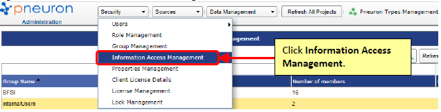

2. Click on a user in the list to select. Click on the Information Access sections to expand and present the details.

    

###Adding Information Access Permissions To a User
To add information access to a user:

1. Click on **Security > Information Access Management**. The Information Access Management screen is displayed. The default view presents users.
2. Click on a user in the list below to select. Click on the Information Access sections to expand and present the details.

    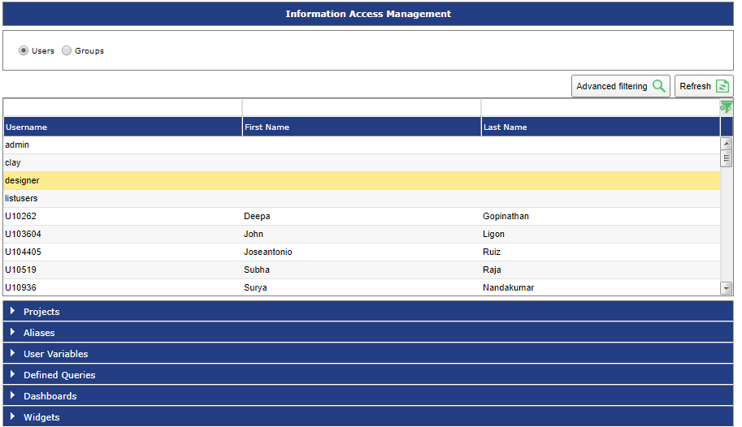

    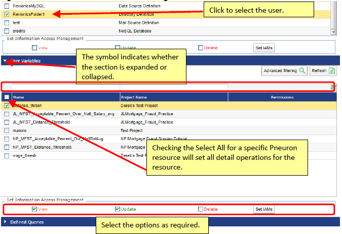

3. Expand the information access sections. Check or uncheck relevant permissions associated with individual resources.
4. Click the **Set IAMs** button to complete the user information access assignments. Administrators will receive system confirmation to indicate that the changes to the information access have been saved.

    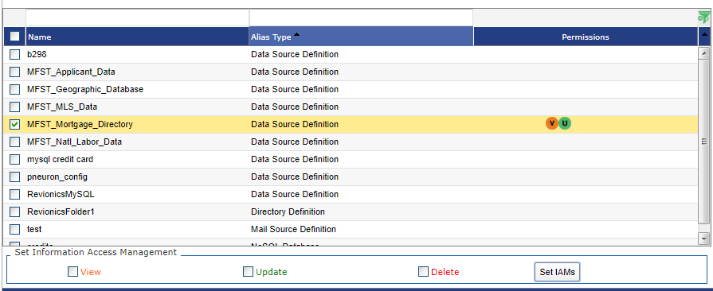

5. Repeat Steps 2 through 4 to select and assign additional users information access permissions.

###Editing Information Access Permissions For A User
To edit user information access permissions:

1. From the Information Access Management screen, select the user for whom you would like to modify the information access.
2. The selected user and assigned information access permissions screen will be displayed in the section below the Information Access Management.
3. Modify the information access permissions and click **Set IAMs** to save the changes.

###Removing Information Access Permisions For A User
To remove information access permissions for a user, edit and unselect all permissions. Reference the section Editing Information Access Permissions for a User.

###Adding Information Access Permissions To Group
To add information access to a group:

1. Click on **Security > Information Access Management**. The Information Access Management screen is displayed.

    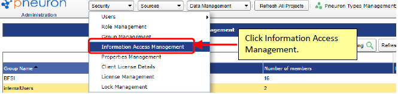

2. The default view presents users. Click on the Groups in the radial control option. All configured groups will be displayed below:

    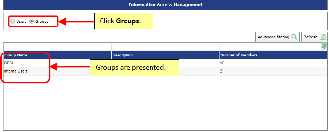

3. Click the group to select. Click on the Information Access sections to expand the detailed information access permissions.

    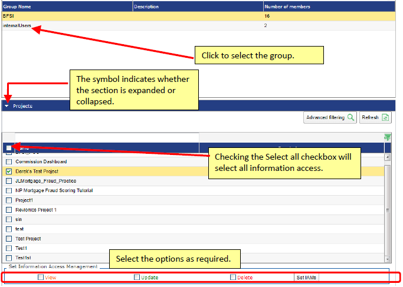

4. Expand the information access sections. Check or uncheck relevant permissions associated with individual resources.
5. Click the **Set IAMs** button to complete the group information access assignments.

    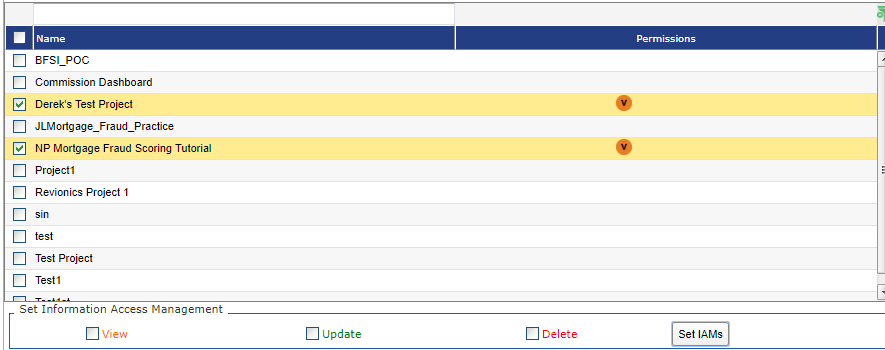

    Administrators will receive system confirmation to indicate that the changes to the information access have been saved in the configuration.

6. Repeat Steps 3 through 5 to select and assign additional group information access permissions.

###Editing Information Access Permissions For A Groups
To edit group information access permissions:

1. From the Information Access Management screen, select the group to be modified.
2. The selected group and assigned information access permissions screen will be displayed in the section below the Information Access Management.
3. Modify the information access permissions and click **Set IAMs** to save the information changes.

###Removing Informtion Access Permissions For A Group
To remove information access permissions for a group, edit and unselect all permissions. Reference the section Editing Information Access Permissions for a Group.

##Properties Management Overview
The Properties Management option enables administrators to edit Pneuron configuration properties. These properties define system processing characteristics and must be modified by users with sufficient knowledge about the system.

1. Click on **Security > Properties Management**.

    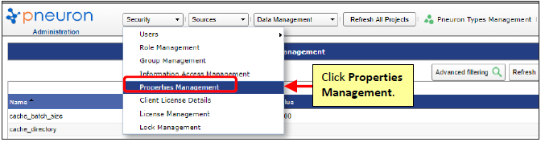

    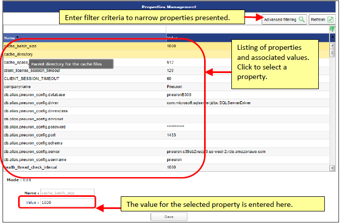

    To edit a configuration property:

2. From the **Properties Management** screen, select the property to be modified.
3. Edit the value of the property and click **Update**.

##Client License Details Overview
Pneuron establishes client license terms based upon the negotiated business relationship and terms of use. License configuration uses a separate Pneuron license generation tool to configure and generate a secure license file. The license key is installed as part of the client installation. As part of the Pneuron installation, Pneuron installs the License Manager application. The Pneuron License Manager application runs continuously and checks the status of each user logging into the application, the number and type of licenses, and the current licenses in use.

License terms can be modified between Pneuron and its clients. When the license terms are modified, Pneuron provides an updated license key, which can be imported directly into the Pneuron application. Upon import, the license key is updated with the new license terms and requires a Pneuron server restart.

###Viewing Client License Details
To view client license details:

1. Click on **Security > Client License Details**. The Client License Details screen is displayed with the specific details for the Pneuron applications and Pneurons.

    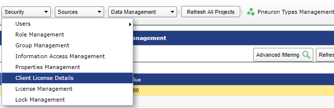

    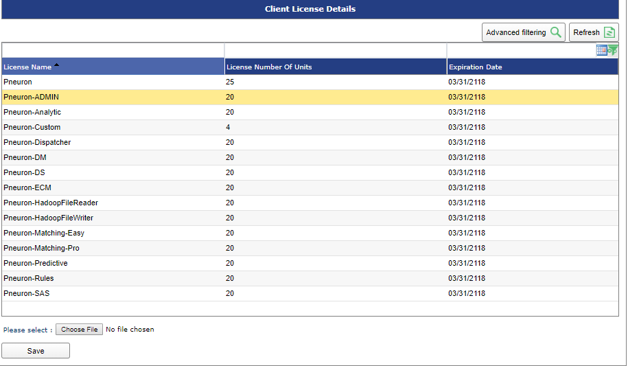

2. Administrators can view all license terms.

###Updating Client License Terms
The process to update client license terms are as follows:

1. Contact Pneuron to request an updated license.
2. Receive updated license file from Pneuron.
3. Import the new license key into Client License Details.
4. Click the **Browse** button to locate the license file. The Upload File Window will be displayed.

    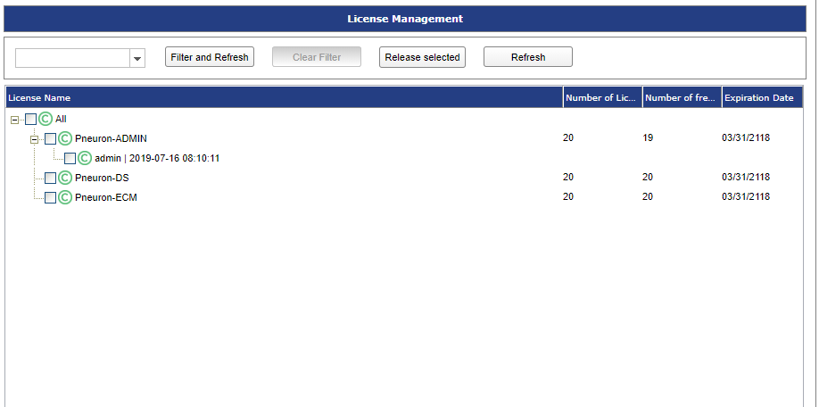

    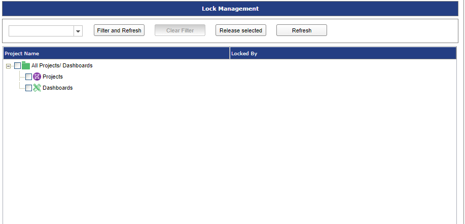

5. Select the file. Click the **Open** button. Click the **Save** button to complete the license file update. You will receive confirmation the license file upload completed.
6. Click **OK** to continue
7. Restart the Pneuron server to activate the new license.

##License Management Overview
The **License Management** option shows the number of licenses that an install is allowed to allocate based upon user logins. Number of licenses indicates the total number allotted based upon the Pneuron License negotiated between Pneuron and clients. The number of free licenses indicate the number of unused licenses available. The expiration date indicates when those licenses will expire.

##Lock Management Overview
**Lock Management** gives the administrators the ability to view and release locks on projects and dashboards. A user may not log out of the Design Studio or Enterprise Control Manager properly leaving a project or Dashboard locked. Another user will not be able access some options of a project or Dashboard when it is locked such as Firing, Moving Pneurons or editing them. Removing the locks will allow a user to access these options.

