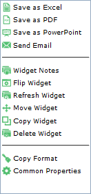
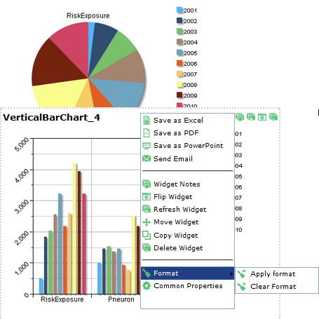

#Understanding Pneuron Enterprise Control Manager
This section describes the functions within Pneuron Enterprise Control Manager™.

##General Overview And Layout
The ECM includes several key functional concepts:

- Dashboards are one or more widgets organized together to provide visualization analysis.
- Each widget accesses data sources and presents visualization results.
- Widgets can be linked in a parent-child configuration and present drill-down analysis by clicking on selected information within a parent widget.
- Widgets can be configured and linked to Pneuron projects (networks). Widgets can be ‘flipped’ allowing access to parameters that can be modified and in turn, the Pneuron project can be immediately re-executed to update the visualization results.

A general overview and layout of the ECM application is presented.

Top Level Navigation provides access to the primary ECM functions.

The Widget library allows you to drag and drop different types of widgets into a dashboard and configure their data access and visualization form.

The active dashboard and any associated tabs are displayed in the section below the top-level navigation.

The dashboard and its widgets are presented within the center canvas section. The canvas and presentation section can be changed using the mode top-level menu option.

When a widget is either dragged into the dashboard or clicked on within the dashboard, its properties are presented in the rightmost section for configuration. Pneuron establishes a set of default values for each widget and allows modification of these values via controls in this section.

The bottom right section enables you to create  and modify network toggle parameters, data sources and user variables.

##Top Navigation Functions
The following graphics and tables explain the top navigation functions of Pneuron Enterprise Control Manager™.

##Actions Menu

| **Menu Name** | **Description** |
|--|--|
| **Add New Dashboard** | Creates a new dashboard to display one or more widgets or collections of widgets in tabs. |
| **Rename Dashboard** | Rename the selected dashboard. |
| **Save Dashboard** | Save changes made to the currently selected dashboard. |
| **Copy Dashboard** | Copy the currently selected dashboard. A prompt will appear allowing you to change the name of the duplicate dashboard. |
| **Delete Dashboard** | Delete the currently selected dashboard. |
| **Common Properties** | A set of configurable widget properties that apply to all widgets on the current dashboard tab. |

###Using Common Properties
The Common Properties feature allows the user to set attributes such as color, sizing, and other visual properties of all widgets on the current working tab.

| **Menu Name** | **Description** |
|--|--|
|  | The Tab Management option in the Actions menu is used to add, delete, rename and modify tabs in the Pneuron dashboard. |
| **Add New** | Click **Add New** in the **Tab Management** window to add a new tab to the dashboard. |
| **Set as Default** | In the **Set as default** column, select a checkbox to set a tab as the default tab. Only one tab can be a default tab in a dashboard. |
| **Delete** | To delete a tab, click the X icon in the Delete column of the required row. |

To reorder tabs, you can use the green arrows (chevrons) at the top right corner of the Tab Management window.

The **Copy tab** option in the **Actions** menu enables a user to select a dashboard, copy a tab with the widgets under it, and rename the tab as required.

| **Menu Name** | **Description** |
|--|--|
| **Dashboard** | In the Dashboard dropdown list, select the dashboard in which the tab has to be copied. |
| **Tab** | Select the [Change Me], Add Prefix or Add Suffix option to rename a tab after copying it. Figure shown below. |
| **Widget** | **Edit Individually**, **Add Prefix** or **Add Suffix** options are available in the **Widget** dropdown list to modify the Widgets in the tab to be copied. Figure shown below. |
| **Apply** | Click **Apply** to add the prefix or suffix to the **Tab** and **Widget** names as specified in the respective dropdown lists. |
| **Clear Values** | Clears the changes that you have made in the above dropdown lists and does not apply them. |
| **OK** | Click OK in the Copy Tab window to make the changes to the copied tab. |
| **Cancel** | Exits without copying the tab. |

Other Options in Actions Menu

| **Menu Name** | **Description** |
|--|--|
| **Alias Management** | Create and manage data sources and mail aliases. |
| **Possible Values Management** | Create and manage possible values of variables. |
| **Toggle Networks Management** | Add, edit and delete network controls such as firing a network without logging in to the Pneuron Design Studio™. These controls will display as buttons on the back of a widget |
| **Binding Controls** | Controls can be bound to databases with this option. |

##Import/Export Menu

| **Menu Name** | **Description** |
|--|--|
| **Import** | Import a dashboard XML file into Pneuron ECM. |
| **Export** | Export a dashboard as an XML file. The dashboard XML file can subsequently be imported into other Pneuron environments. |
| **Save as Excel** | Exports the active dashboard, associated widgets, and specified data to Excel worksheets. |
| **Save as PDF** | Generates a PDF for the active dashboard and selected widgets. |
| **Save as PowerPoint** | Generates PowerPoint slides for the active dashboard and selected widgets. |
| **Send Email** | Generates an e-mail with widgets as attachments. The active dashboard and selected widgets will be included. This requires a Mail Driver to be configured by either using the Pneuron Administration module or accessing the Alias Manager from the **Send Email** button on the widget or the **Actions** > **Alias Management** menu. User permission is required to use the Alias Manager from ECM. |
| **Print Preview** | Generates a print preview of the dashboard with the widgets. The active dashboard (default tab) and selected widgets are displayed. There are checkboxes next to each tab in the **Print Preview** window where a user can select the tabs to be displayed in the print preview as shown below. |

The figures on the left show the Print Preview window with the tabs in the dashboard that a user can select to preview the dashboard.
The image on the right shows the window after the Preview button has been clicked.
Click Print to print the preview
Click Cancel to close the Print Preview window.

##Display Menu
The Display menu is next on the toolbar of the Pneuron ECM.

| **Menu Name** | **Description** |
|--|--|
| **Mode** | The two modes are **Edit** and **View**. In Edit mode, a user can add dashboards, tabs, widgets and all the related information. In View mode, these options are not available and a user can only view the dashboard with the various tabs. |
| **Drawing** | **Drawing** option in the dashboard, **Enable** or **Disable**. In Drawing mode, the objects in the Shapes section are available to be placed on the widget. The **Dashlet Properties** window is not visible if this option is enabled. Also, widgets cannot be added to the dashboard if enabled. |
| **Background Image** | **Background image** option in the dashboard, **Enable** or **Disable**. Background image displays a grey background for the canvas and side panels |
| **Layout** | Dynamic Mode or other options. Select how many columns of widgets to display on the canvas. You can select 1 to 9 columns (panels), or select the default setting as Dynamic Mode, which allows the creation of any layout of widgets on the canvas. |
| **Grid** | **Grid** option in the dashboard, **Enable** or **Disable**. Enabling this option allows a user to view a grid in the background to place the widgets with precision. The Grid feature in the Display drop-down displays dots on a grid in the dashboard area. This grid enables you to move widgets to specific points on the grid for a more organized appearance. When you click and drag a widget to an open area of the dashboard, the widget will “snap” into place to the nearest dot when the mouse button is released. Pneuron ECM automatically resizes the widget to fit inside the new area. |
| **Inner Child** | Set as Inner Child to the parent Widget, Enable or Disable. |
| **Animation** | When enabled, upon widget refresh, the data is displayed in a visually animated fashion. |

##Dashboard Menu

Here you can select a dashboard from a drop down menu.

##Other Main Navigation Features

| **Menu Name** | **Description** |
|--|--|
| **Save** | Save the current dashboard confirmed by a pop-up notification. |
| **Find** | Opens a search tool that allows the user to search for a particular dashboard, tab, or widget by name. |
| **Help** | Displays the available Help options.|
| **Log Out [username]** | Log the current user out of ECM. |

#Overview of the ECM Canvas and Functions

##ECM Dashboard

The following illustration shows a Pneuron ECM dashboard that contains configured widgets based on the selections made in the widget and the queries configured through the ECM Report Builder.

##Widget Overview

Widgets provide several functions for managing their display and accessing their data.

Widgets have control buttons available on the title bar. Designers have the option to display or hide the control buttons on each widget. In the Dashlet properties for the widget, the **Show Buttons** option will toggle on or off the buttons on the widget on the title bar. This can also be managed for all widgets under **Actions** > **Common Properties**, Show buttons. See the figure on the next page for a description of each button.

####Export to Excel
When the Excel button is selected, the data associated with the widget will be exported as an Excel spreadsheet, which can be viewed and/or saved.

####Export to PDF
Clicking the PDF button will generate a PDF document showing an image of the current dashboard in its current state.

####Export to PowerPoint
Clicking on the Save as PowerPoint button will export the selected widget to PowerPoint.

####Send mail
Clicking the Send mail button opens a panel allowing the user to enter information and send an email directly from the ECM. This requires the user to have previously configured the Email Driver in the Pneuron Admin tool or permission to create and edit Mail Aliases from ECM.

####Add Note to Widget
Clicking the Note button opens a window that allows the user to attach custom notes or instructions to the widget. These notes are viewable by opening the Note tool again. Add a new note by entering information into the bottom box and clicking the Save button.

####Refresh Widget
The Refresh button refreshes the widget. If the underlying data behind the graph has changed, the visualization will immediately reflect the changes.

####Flip Widget Feature
Clicking on the Flip button will flip the widget and expose configured parameters and/or controls that have been configured for the widget. Examples include parameters, network firing buttons and what-if controls.

##Dashlet Properties Panel
The following illustration shows the dashlet property panel, which is located to the right of the dashboard. The dashlet properties panel allows the configuration of widgets by specifying their appearance attributes such as colors, sizing, titles, labels, and refresh rate.

The options under the Widgets Properties Panel can be different for each widget type. However, the general structure of options and parameters is the same for all widgets.

##Table Widget Pagination
Table widgets have a feature that allows large data sets to be paginated for performance. Pagination allows the designer to reduce or expand the visible number of rows per page returned from the query. If the number defined in the PageSize property in the Chart Properties Section is less than the total number of rows returned, the widget will automatically calculate the number of pages. By default, the PageSize property is set to 15.

Using the Jump To button will take you directly to the page specified unless the page number specified is higher than what is available. In this case, an “Invalid Page Number” error will be displayed. The end user can also navigate using the arrows. Note that exporting a paginated table will only export the current visible page selected. See figures below.

##Widgest Tabs and Configuration Settings
The bottom of the widget properties panel contains tabs used for editing data sources, parent widgets, user variables, and networks for the selected widget.

The following table describes each tab at the bottom of the widget properties panel. Not all tabs are available for all widgets (for example, the color tab is not available on the table widget since it does not have any colors to set).

| **Menu Name** | **Description** |
|--|--|
| **Toggle Network** | Add, edit and delete network controls such as firing a network without logging in to the Pneuron Design Studio™. These controls will display as buttons on the back of a widget. |
| **User Variable** | Add, edit, and delete user variables associated with the selected widget. Any changes made to user variables within ECM automatically update the user variables in Pneuron Design Studio. From within User Variable, a parameter from a query can be linked to a user variable. |
| **Data Source** | Add, edit, and delete data sources associated with the selected widget. |
| **Data Source Group** | Add, edit, and delete multiple data sources that are grouped together for grouped widgets. |
| **Select Parent** | Enables the selection of a parent widget that can be linked to the selected child widget. A child widget displays data based on the data from the parent widget. |
| **Data Format** | Allows the formatting of numeric, date/time, and string values within table widgets. There are standard formats and the ability to create custom formats. |
| **Color** | Modify the color maps for the widget legend and results. |

##Dashlet Menu Properties
Each widget has a menu accessible by right clicking in the Title area. Some of these items are the same as the buttons displayed when the Show Buttons option in the Chart Properties is selected. In this instance, there are a few more options such as Move Widget, Copy Widget, Copy/Apply Format and Common Properties.

**Move Widget** allows a designer to move a widget to another Dashboard and Tab. If the widget has a Parent/Child relationship, the parent or child can be moved with it. Once the widget is moved, the widget will be removed from the current dashboard.

**Copy Widget** allows the designer to make a copy of the widget. The copy process will also allow you to copy a parent/child relationship if one exists. Unlike the Move Widget, the copy leaves the original widget in place.

**Copy Format** allows the designer to copy the basic format of the widget and apply it to another widget. The **Copy Format** option copies the basic properties of the widget such as Height, Width, Bold font of the widget title, Italic font of the widget title, TitleSize, BackgroundColor, WidgetColor, ChartTitleFontColor, ChartTitleTop, ChartTitleLeft, ChartTitleFontSize.

Once **Copy Format** has been selected, right click in the title of another widget and click **Format / Apply Format**.

Clear Format allows the designer to clear the copied format from memory if the designer wants to copy another widget. If the format is applied to a widget, it is a manual process to undo the change or make further changes.

The Widget Common Properties panel displays the common properties that have been applied to this widget. Changing an item here will not change it for all widgets, just the individual widget. For example, if a theme had been applied to this widget, the theme name would be listed. Changing the theme will change the theme for this one widget if it is done from this screen. Use **Common Properties** from the **Actions** menu to change the theme for all widgets.

The other options on the menu when right clicking in the Title section are the same as the buttons described in this section.

##Adjust Canvas
The **Adjust Canvas** feature allows you to adjust the size of the main canvas working area.

